# From the DFT to the SPWVD: Time-Frequency Analysis Applied to Neonatal EEG

## Volume B - Application and Derivation (Labs)

**Authors:** Nguyen Duc Hung - 20233960, Bui Phuong Duy - 23233957, Tran Viet Bach - 23233954

### What this volume covers

Volume B validates the theory from Volume A through 8 labs, each paired to a theory section. Every lab follows a fixed six-section template (Introduction, Setup, Parameters, Results, Verification, Conclusion) with explicit code, inline figures, and quantitative verification against Volume A predictions.

- **Lab 1** (DFT) - bins, on-bin vs off-bin leakage, zero-padding *(↔ A.1, A.2)*
- **Lab 2** (Statistics) - exponential distribution, noise floor, Welch *(↔ A.4)*
- **Lab 3** (Windowing) - Dirichlet kernel derivation, window spectra, pure sine form *(↔ A.3)*
- **Lab 4** (STFT) - Heisenberg tradeoff, overlap/COLA, multi-scale limitation *(↔ A.5)*
- **Lab 5** (Resolution) - two-tone test on spectrograms *(↔ A.3, A.5)*
- **Lab 6** (Autocorrelation) - periodicity, Wiener-Khinchin, phase-blindness, cross-correlation *(↔ A.6)*
- **Lab 7** (WVD) - chirp sharpness, cross-terms, analytic signal *(↔ A.7)*
- **Lab 8** (SPWVD) - PWVD vs SPWVD, two-knob sweep, duality of ghost types *(↔ A.8)*
- **Appendix B1** - the M vs M-1 window convention and convergence proof
- **Appendix B2** - coefficient of variation (CV) of the six signal archetypes

All model signals satisfy EEG-realism constraints: frequencies below 100 Hz, duration at least 1200 s (Labs 1-6) or 2.0 s (Labs 7-8, justified by WVD computational cost), sampling at 250 Hz.

## Basis Functions and Infrastructure

Before any lab, we establish the shared code that every experiment imports. This infrastructure enforces the project standards from CLAUDE.md - EEG-realism constraints, reproducibility, plotting conventions - in one place, so no lab needs to redefine them.

All code runs in the `biosignals` conda environment (Python ≥ 3.11, NumPy, SciPy, Matplotlib). The environment is defined in `environment.yml` at the project root.

### Constants (`src/common/config.py`)

Every lab imports its parameters from this file. No magic numbers in lab code.

```python
import os

# --- Sampling and signal parameters (Volume B lab constraints) ---
FS = 250              # sampling frequency (Hz) - default for all labs
DURATION = 1200       # minimum signal duration (s) - 20 minutes
N_SAMPLES = FS * DURATION  # total samples at default fs and duration
F_MAX = 100           # maximum allowed signal frequency (Hz)

# --- Reproducibility ---
SEED = 42             # fixed random seed for all noise generation

# --- Figure export ---
DPI = 300                         # minimum render DPI
FIGURE_FORMAT = "png"             # export format: "png", "pdf", or "svg"
COLORMAP = "viridis"              # default perceptually uniform colormap
COLORMAP_DIVERGING = "inferno"    # alternative for diverging data
FORBIDDEN_COLORMAPS = {"jet", "rainbow", "hsv"}  # never use these

# --- Paths (relative to project root) ---
PROJECT_ROOT = os.path.abspath(os.path.join(os.path.dirname(__file__), "..", ".."))
GRAPH_DIR = os.path.join(PROJECT_ROOT, "results", "graphs")
```

`FS`, `DURATION`, and `F_MAX` enforce the EEG-realism constraints from the Volume B header. `SEED` ensures all noise is reproducible. `DPI`, `COLORMAP`, and `FORBIDDEN_COLORMAPS` enforce the CLAUDE.md graph standards.

### Signal Generators (`src/common/signals.py`)

One function per Appendix A archetype. Each generator enforces the frequency constraint (`assert f0 < F_MAX`) and returns three arrays: the signal `x`, sample indices `n`, and time axis `t`.

**Time axis:**

```python
import numpy as np
from .config import FS, DURATION, SEED, F_MAX

def make_time_axis(duration=DURATION, fs=FS):
    N = int(duration * fs)           # total number of samples
    n = np.arange(N)                 # sample indices [0, 1, ..., N-1]
    t = n / fs                       # time in seconds
    return n, t
```

**Single tone** (Equation (AA.1)): $x[n] = A \cos(2\pi f_0 n / f_s + \phi)$

```python
def make_tone(f0, A=1.0, phi=0.0, duration=DURATION, fs=FS):
    assert f0 < F_MAX, f"f0={f0} Hz exceeds F_MAX={F_MAX} Hz"
    n, t = make_time_axis(duration, fs)    # generate time axis
    x = A * np.cos(2 * np.pi * f0 * n / fs + phi)  # Equation (AA.1)
    return x, n, t
```

**Mixed tones** (Equation (AA.2)): $x[n] = \sum A_i \cos(2\pi f_i n / f_s + \phi_i)$

```python
def make_mixed_tones(freqs, amplitudes=None, phases=None, duration=DURATION, fs=FS):
    K = len(freqs)                                        # number of components
    if amplitudes is None:
        amplitudes = [1.0] * K                            # default: unit amplitude
    if phases is None:
        phases = [0.0] * K                                # default: zero phase
    for f in freqs:
        assert f < F_MAX, f"f={f} Hz exceeds F_MAX={F_MAX} Hz"
    n, t = make_time_axis(duration, fs)                   # generate time axis
    x = np.zeros(len(n))                                  # initialize signal
    for i in range(K):                                    # sum each component
        x += amplitudes[i] * np.cos(2 * np.pi * freqs[i] * n / fs + phases[i])
    return x, n, t
```

**Noise** (Equation (AA.8)): $x[n] = \eta[n], \quad \eta \sim \mathcal{N}(0, \sigma^2)$

```python
def make_noise(sigma=1.0, duration=DURATION, fs=FS, seed=SEED):
    rng = np.random.default_rng(seed)                     # seeded RNG for reproducibility
    n, t = make_time_axis(duration, fs)                   # generate time axis
    x = rng.normal(loc=0.0, scale=sigma, size=len(n))     # Equation (AA.8)
    return x, n, t
```

The remaining generators (`make_chirp`, `make_multi_chirp`, `make_transient`) follow the same pattern, implementing Equations (AA.3)-(AA.7). Full source: `src/common/signals.py`.

### Window Functions (`src/common/windows.py`)

Hand-built from the cosine-sum formula (Equation (A.16)), not from library calls:

$$
w[n] = \sum_{p=0}^{P} (-1)^p \, a_p \cos\!\left(\frac{2\pi p n}{N}\right) \tag{A.16}
$$

```python
import numpy as np

def _cosine_sum(N, coeffs):
    """General cosine-sum window: w[n] = Σ (-1)^p * a_p * cos(2πpn/N)"""
    n = np.arange(N)                                      # sample indices [0, N-1]
    w = np.zeros(N)                                       # initialize window
    for p, a_p in enumerate(coeffs):                      # sum each cosine term
        sign = (-1) ** p                                  # alternating sign
        w += sign * a_p * np.cos(2 * np.pi * p * n / N)  # Equation (A.16)
    return w

def rectangular(N):
    return np.ones(N)                                     # all ones

def hann(N):
    return _cosine_sum(N, [0.5, 0.5])                     # a0=0.5, a1=0.5

def hamming(N):
    return _cosine_sum(N, [0.54, 0.46])                   # a0=0.54, a1=0.46

def blackman(N):
    return _cosine_sum(N, [0.42, 0.5, 0.08])              # a0=0.42, a1=0.5, a2=0.08

def gaussian(N, sigma_ratio=0.4):
    n = np.arange(N)                                      # sample indices
    center = (N - 1) / 2                                  # window center
    sigma = sigma_ratio * center                          # σ in samples
    w = np.exp(-0.5 * ((n - center) / sigma) ** 2)        # Equation (A.22)
    return w
```

Each window is a direct implementation of its formula from Table A.1 / Equations (A.17)-(A.22). The `_cosine_sum` helper makes the general structure explicit: provide the coefficients, get the window.

### Plotting Utilities (`src/common/plotting.py`)

These functions enforce the CLAUDE.md graph standards: 300 DPI, axis labels with physical units, the dual-stack rule (linear first, dB second), and forbidden colormap rejection.

**Time-domain plot** - always the first plot for any signal:

```python
import matplotlib.pyplot as plt
from .config import DPI, COLORMAP, FIGURE_FORMAT, GRAPH_DIR, FORBIDDEN_COLORMAPS

def plot_time_domain(t, x, xlabel="Time (s)", ylabel="Amplitude",
                     title=None, fig_id=None, t_range=None):
    fig, ax = plt.subplots(1, 1, figsize=(12, 3))         # wide, short aspect
    if t_range is not None:                                # zoom to range if specified
        mask = (t >= t_range[0]) & (t <= t_range[1])       # boolean mask
        ax.plot(t[mask], x[mask], linewidth=0.5)           # plot zoomed segment
    else:
        ax.plot(t, x, linewidth=0.5)                       # plot full signal
    ax.set_xlabel(xlabel)                                  # x label with units
    ax.set_ylabel(ylabel)                                  # y label with units
    if fig_id:
        ax.set_title(fig_id, loc="left", fontsize=9, fontstyle="italic")
    ax.grid(True, alpha=0.3)                               # light grid
    fig.set_dpi(DPI)                                       # enforce minimum DPI
    fig.tight_layout()                                     # prevent label clipping
    return fig, ax
```

**Dual-stack spectrum plot** - linear scale on top (primary, physical units), dB scale on bottom (secondary, dynamic range):

```python
def plot_dual_stack_spectrum(freqs, power, xlabel="Frequency (Hz)",
                             ylabel_linear="Power", ylabel_db="Power (dB)",
                             title=None, fig_id=None, f_range=None):
    fig, (ax_lin, ax_db) = plt.subplots(2, 1, figsize=(12, 6), sharex=True)

    # --- Top: linear scale (primary) ---
    ax_lin.plot(freqs, power, linewidth=0.5)               # linear power
    ax_lin.set_ylabel(ylabel_linear)                       # label with physical units
    ax_lin.grid(True, alpha=0.3)                           # light grid

    # --- Bottom: log/dB scale (secondary) ---
    power_db = 10 * np.log10(np.maximum(power, 1e-20))     # dB, floor at -200 dB
    ax_db.plot(freqs, power_db, linewidth=0.5)             # dB power
    ax_db.set_ylabel(ylabel_db)                            # label with dB units
    ax_db.set_xlabel(xlabel)                               # frequency label on bottom
    ax_db.grid(True, alpha=0.3)                            # light grid

    if f_range is not None:
        ax_lin.set_xlim(f_range)                           # zoom (applies to both)

    fig.set_dpi(DPI)
    fig.tight_layout()
    return fig, (ax_lin, ax_db)
```

The spectrogram dual-stack (`plot_spectrogram`) follows the same pattern for 2D time-frequency data, with `pcolormesh` and `viridis` colormap. It also validates colormaps against the forbidden list (`jet`, `rainbow`, `hsv`). Full source: `src/common/plotting.py`.

## B.1 - Lab 1: The DFT of Basic Signals  *(↔ A.1, A.2)*

### Introduction

The DFT (Section A.2) transforms a finite discrete signal into a finite set of frequency-domain coefficients - the bins. Section A.2.1 established that the DFT is the DTFT sampled at $N$ equally spaced frequencies; Section A.2.2 defined a bin as one sample of that continuous spectrum; Section A.2.3 drew the distinction between resolution (determined by signal duration) and bin count (determined by DFT length).

This lab tests those claims directly. We construct a single tone and a dual-tone chord, compute their DFTs, and verify:

- The bin spacing matches Equation (A.6): $\Delta f = f_s / N$.
- An on-bin tone produces a single spike with no leakage.
- Two tones separated by more than $\Delta f$ are resolved as distinct peaks.
- Zero-padding increases bin count but does not improve resolution.

### Setup

**Model signal formulas.**

Single tone (Equation (AA.1)):

$$
x[n] = A \cos\!\left(\frac{2\pi f_0}{f_s} n\right), \qquad n = 0, 1, \ldots, N-1 \tag{B.1}
$$

Dual-tone chord (Equation (AA.2)):

$$
x[n] = A_1 \cos\!\left(\frac{2\pi f_1}{f_s} n\right) + A_2 \cos\!\left(\frac{2\pi f_2}{f_s} n\right) \tag{B.2}
$$

**Lab-specific helper functions.**

The DFT computation and power spectrum extraction:

```python
import numpy as np
from src.common import FS, DURATION, make_tone, make_mixed_tones
from src.common import plot_time_domain, plot_dual_stack_spectrum

def compute_dft(x, fs=FS, n_fft=None):
    if n_fft is None:
        n_fft = len(x)                                    # DFT length = signal length
    X_full = np.fft.fft(x, n=n_fft)                       # full DFT (Equation A.3)
    freqs_full = np.fft.fftfreq(n_fft, d=1/fs)            # frequency axis in Hz
    pos = freqs_full >= 0                                  # positive frequencies only
    return freqs_full[pos], X_full[pos]                    # return positive half

def compute_power(X, N):
    return np.abs(X)**2 / N                                # P[k] = |X[k]|²/N (Eq. A.29)
```

**Experiment A - On-bin vs. off-bin.** A 1-second segment ($N = 250$, $\Delta f = 1.0$ Hz) so that leakage is visible. On-bin: $f_0 = 10.0$ Hz (bin 10, integer). Off-bin: $f_0 = 10.5$ Hz (bin 10.5, maximally between two bins - worst-case leakage).

```python
# --- Generate signals (1-second segment: Δf = 1 Hz, leakage visible) ---
x_on, n_on, t_on = make_tone(10.0, A=1.0, duration=1.0)   # on-bin tone
x_off, n_off, t_off = make_tone(10.5, A=1.0, duration=1.0) # maximally off-bin

# --- Compute DFTs and power spectra ---
freqs_on, X_on = compute_dft(x_on)                        # DFT of on-bin tone
freqs_off, X_off = compute_dft(x_off)                     # DFT of off-bin tone
P_on = compute_power(X_on, len(x_on))                     # power spectrum (on-bin)
P_off = compute_power(X_off, len(x_off))                  # power spectrum (off-bin)

# --- Plot: time domain first, then dual-stack spectrum ---
plot_time_domain(t_on, x_on, fig_id="Figure B.1a", t_range=(0, 0.5))
plot_dual_stack_spectrum(freqs_on, P_on, fig_id="Figure B.2a", f_range=(0, 30))
plot_dual_stack_spectrum(freqs_off, P_off, fig_id="Figure B.2b", f_range=(0, 30))
```

**Experiment B - Dual-tone chord.** $f_1 = 10.0$ Hz, $f_2 = 12.0$ Hz.

```python
x, n, t = make_mixed_tones([10.0, 12.0], amplitudes=[1.0, 1.0], duration=1200)
freqs, X = compute_dft(x)                                 # DFT of chord
P = compute_power(X, len(x))                              # power spectrum

plot_time_domain(t, x, fig_id="Figure B.3a", t_range=(0, 0.5))
plot_dual_stack_spectrum(freqs, P, fig_id="Figure B.3b", f_range=(0, 30))
```

**Experiment C - Zero-padding.** 1-second segment, two tones at 10 Hz and 10.5 Hz (separation 0.5 Hz, **below** $\Delta f_{\min} = 1.0$ Hz), 4x zero-padding.

```python
x, n, t = make_mixed_tones([10.0, 10.5], amplitudes=[1.0, 1.0], duration=1.0)
N_orig = len(x)                                           # 250 samples
N_padded = N_orig * 4                                     # 1000 samples (zero-padded)

freqs_orig, X_orig = compute_dft(x, n_fft=N_orig)        # no zero-padding
freqs_pad, X_pad = compute_dft(x, n_fft=N_padded)        # zero-padded

plot_dual_stack_spectrum(freqs_orig, compute_power(X_orig, N_orig),
                         fig_id="Figure B.4a", f_range=(5, 16))
plot_dual_stack_spectrum(freqs_pad, compute_power(X_pad, N_orig),
                         fig_id="Figure B.4b", f_range=(5, 16))
```

### Parameters

**Table B.1 - Lab 1 parameters**

| Parameter | Experiment A | Experiment B | Experiment C |
| --- | --- | --- | --- |
| $f_s$ (Hz) | 250 | 250 | 250 |
| Duration (s) | 1.0 | 1200 | 1.0 |
| $N$ (samples) | 250 | 300 000 | 250 |
| $\Delta f$ (Hz) | 1.0 | 0.000833 | 1.0 |
| $f_0$ or $f_1$ (Hz) | 10.0 / 10.5 | 10.0 | 10.0 |
| $f_2$ (Hz) | - | 12.0 | 10.5 |
| Amplitude $A$ | 1.0 | 1.0 | 1.0 |
| Zero-pad factor | - | - | 4× |

### Results

**Experiment A** - Figure B.1 shows the time-domain waveforms of both tones over the first 0.5 s. Both are clean cosines, indistinguishable by eye.

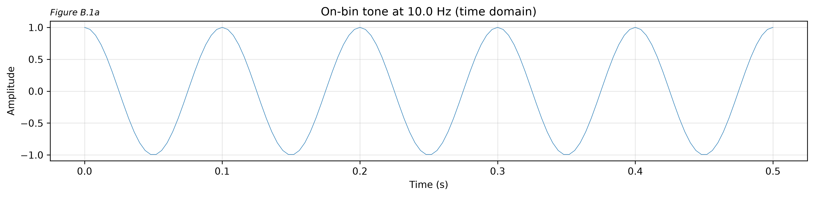

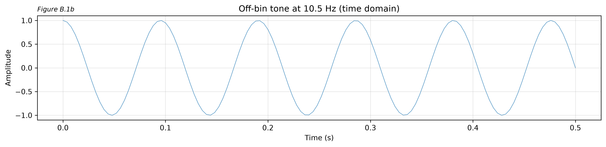

Figure B.2 shows the dual-stack power spectra - and the contrast is dramatic. The on-bin tone at 10.0 Hz (Figure B.2a) produces a single spike with zero leakage: the dB panel shows −200 dB (numerical floor) at all other bins. The off-bin tone at 10.5 Hz (Figure B.2b) shows **maximum leakage**: the tone's energy is split between bins 10 and 11 (neither captures it fully), and the side lobes spread power across the entire spectrum. The dB panel never drops below −25 dB - energy is everywhere.

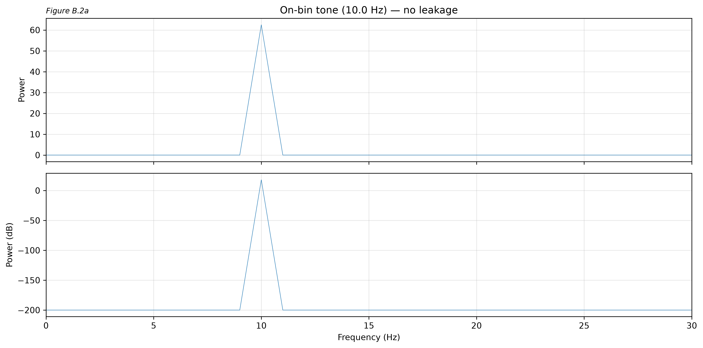

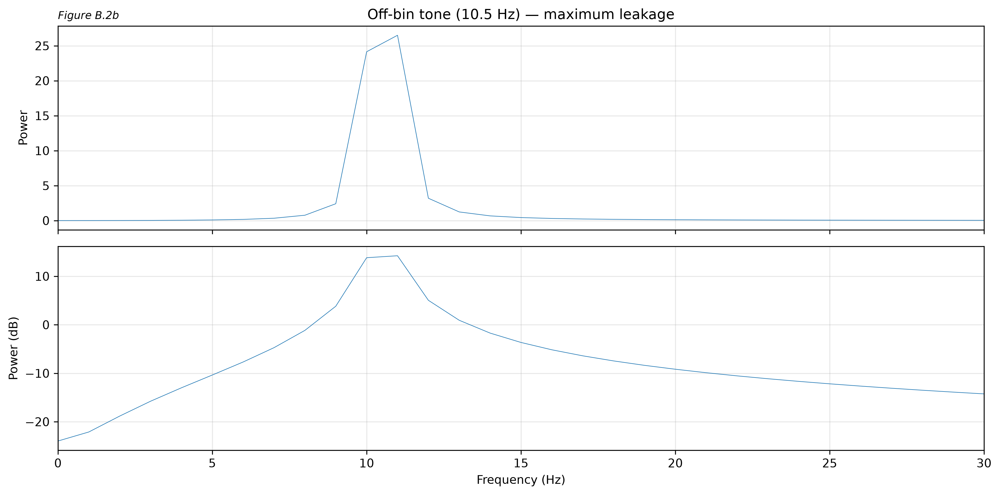

This is the Dirichlet kernel (Lab 3, Equation (B.11)) in action. At 10.5 Hz, the tone falls exactly at the midpoint between two bins ($f_0 / \Delta f = 10.5$, half-integer). The DFT evaluates the DTFT at the bin frequencies, and none of them align with the tone - every bin sees the tone through a side lobe. The 1-second duration ($N = 250$, $\Delta f = 1.0$ Hz) makes this effect maximally visible; at the full 1200-second duration, the bin grid is so fine ($\Delta f = 0.000833$ Hz) that nearly every frequency lands on a bin and leakage vanishes. This is why windowing (Section A.3, Lab 3) exists: to suppress the side lobes that cause this leakage.

**Experiment B** - Figure B.3 shows the dual-tone chord. The time-domain plot (Figure B.3a) shows the expected beat pattern. The spectrum (Figure B.3b) shows two clean spikes at 10 Hz and 12 Hz, fully resolved. The separation (2.0 Hz) is $2400 \times \Delta f$.

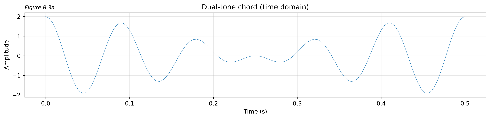

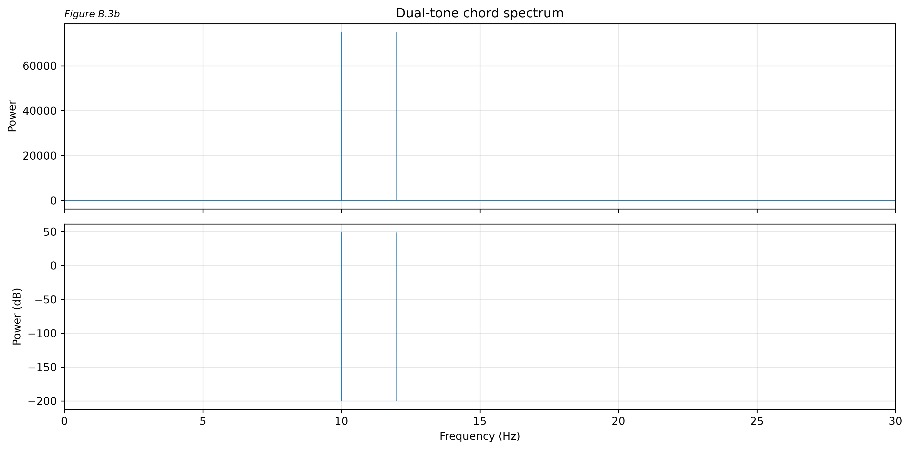

**Experiment C** - Figure B.4 compares the original and zero-padded spectra of two tones at 10 Hz and 10.5 Hz (separation 0.5 Hz, below $\Delta f_{\min} = 1.0$ Hz). The original ($N = 250$, $\Delta f = 1.0$ Hz, Figure B.4a) shows a single lobe - the two tones are merged. The zero-padded spectrum ($N = 1000$, $\Delta f = 0.25$ Hz, Figure B.4b) shows the same single lobe sampled more densely - smoother, but still one peak with no dip. Zero-padding added bins between the peaks, but the DTFT itself has no dip to reveal. The two tones are unresolvable at this duration, and no amount of zero-padding changes that.

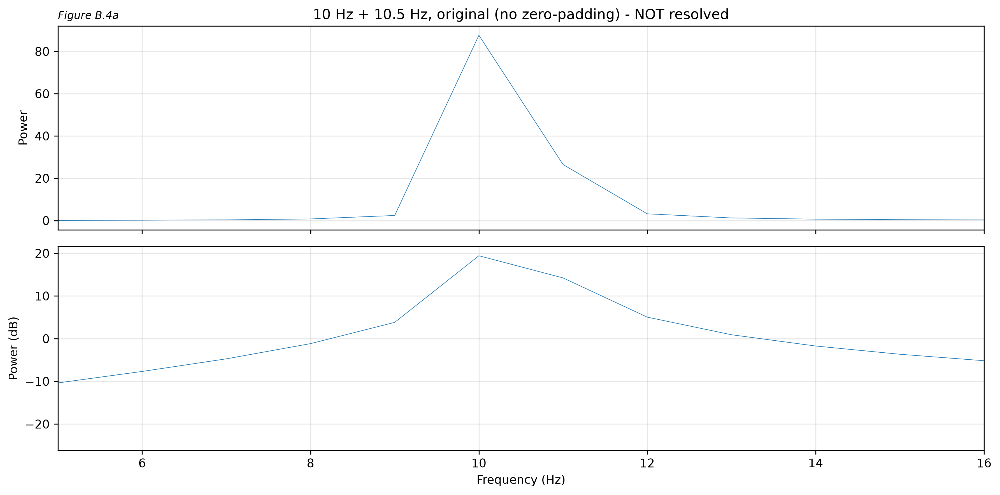

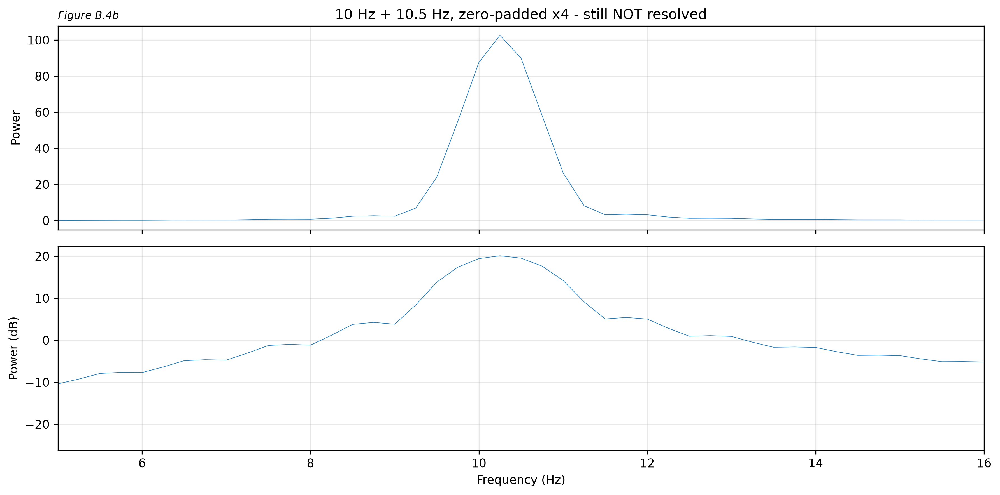

### Verification

**Table B.2 - Verification**

| Prediction (Volume A) | Measured | Confirmed? |
| --- | --- | --- |
| $\Delta f = f_s/N = 250/250 = 1.0$ Hz (Eq. A.6) | 1.0 Hz | Yes |
| On-bin tone (10.0 Hz) → single spike, no leakage | Zero leakage (−200 dB floor) | Yes |
| Off-bin tone (10.5 Hz) → energy spread across all bins | Leakage across entire band (never below −25 dB) | Yes |
| Two tones at 2.0 Hz separation → resolved | Two distinct spikes | Yes |
| Zero-padding (4x) on tones 0.5 Hz apart (below $\Delta f_{\min}$) | Single lobe in both original and padded - not resolved | Yes |

### Conclusion

The DFT behaves as Section A.2 predicts. Bin spacing is $f_s / N$; on-bin tones produce zero leakage. The off-bin experiment makes the cost of the rectangular window unmistakable: a single tone at 10.5 Hz - maximally between two bins - leaks energy across every bin in the spectrum. This is the Dirichlet kernel's side-lobe structure (Lab 3) made visible. The zero-padding experiment confirms that more bins do not mean more resolution. Windowing (Lab 3) is the remedy for leakage.

## B.2 - Lab 2: Statistics on a Noisy Signal  *(↔ A.4)*

### Introduction

Section A.4 established that DFT bins under noise are random variables: the power at each bin follows an exponential distribution (Equation (A.25)), the noise floor can be estimated from the spectrum itself (Equation (A.27)), and detection uses a threshold derived from the exponential model (Equation (A.28)). Section A.4.3 showed that the periodogram's variance does not decrease with $N$, and Section A.4.4 introduced Welch's method as the fix.

This lab tests:

- DFT bins of pure noise follow the predicted distributions (Rayleigh magnitude, uniform phase, exponential power).
- A tone buried in noise is detected using the spectral threshold $\gamma$, with false-alarm probability $e^{-\gamma}$.
- Welch averaging reduces variance at the cost of frequency resolution.

### Setup

**Model signals.**

Pure noise (Equation (AA.8)):

$$
x[n] = \eta[n], \qquad \eta[n] \sim \mathcal{N}(0, \sigma^2) \tag{B.3}
$$

Tone buried in noise:

$$
x[n] = A \cos\!\left(\frac{2\pi f_0}{f_s} n\right) + \eta[n] \tag{B.4}
$$

**Experiment A - Bin distributions.** Compute the DFT of pure noise and histogram the magnitude, phase, and power of all bins.

```python
from src.common import FS, DURATION, SEED, make_noise

x_noise, n, t = make_noise(sigma=1.0, duration=1200, seed=42)

N = len(x_noise)                                          # 300,000 samples
X = np.fft.fft(x_noise)                                   # full DFT
freqs = np.fft.fftfreq(N, d=1/FS)                         # frequency axis
pos = (freqs > 0) & (freqs < FS/2)                        # exclude DC and Nyquist

magnitudes = np.abs(X[pos])                               # |X[k]| → Rayleigh
phases = np.angle(X[pos])                                 # ∠X[k] → Uniform(-π, π]
powers = np.abs(X[pos])**2                                # |X[k]|² → Exponential
```

**Experiment B - Spectral detection.** Bury a tone ($A = 0.5$) in noise ($\sigma = 1.0$), estimate the noise floor, and apply thresholds.

```python
from src.common import make_tone

x_tone, _, _ = make_tone(10.0, A=0.5, duration=1200)
x_noise, _, _ = make_noise(sigma=1.0, duration=1200, seed=42)
x = x_tone + x_noise                                      # combined signal

# --- Periodogram ---
freqs, Sxx = compute_periodogram(x)                       # |X[k]|²/N

# --- Noise floor (median estimator, Equation A.27) ---
noise_floor = np.median(Sxx)

# --- Detection thresholds (Equation A.28) ---
for gamma in [3.0, 4.6, 6.9]:
    threshold = gamma * noise_floor                       # γ × noise floor
    false_alarm = np.exp(-gamma)                          # Pr(exceed | noise only)
```

Where `compute_periodogram` is:

```python
def compute_periodogram(x, fs=FS):
    N = len(x)                                            # signal length
    X = np.fft.fft(x)                                     # full DFT
    freqs = np.fft.fftfreq(N, d=1/fs)                     # frequency axis
    pos = freqs >= 0                                      # positive frequencies
    Sxx = np.abs(X[pos])**2 / N                           # periodogram (Eq. A.29)
    return freqs[pos], Sxx
```

**Experiment C - Welch averaging.** Apply `scipy.signal.welch` at four segment lengths.

```python
from scipy import signal as sp_signal

for seg_dur in [1200, 20.0, 5.0, 2.0]:                   # segment durations (s)
    nperseg = int(seg_dur * FS)                           # segment length in samples
    nperseg = min(nperseg, len(x))                        # cap at signal length
    noverlap = nperseg // 2                               # 50% overlap (Hann COLA)

    f_welch, Pxx = sp_signal.welch(x, fs=FS,             # scipy Welch implementation
                                    nperseg=nperseg,
                                    noverlap=noverlap,
                                    window="hann")
```

### Parameters

**Table B.3 - Lab 2 parameters**

| Parameter | Value |
| --- | --- |
| $f_s$ (Hz) | 250 |
| Duration (s) | 1200 |
| $N$ (samples) | 300 000 |
| Tone frequency $f_0$ (Hz) | 10.0 |
| Tone amplitude $A$ | 0.5 |
| Noise $\sigma$ | 1.0 |
| Seed | 42 |
| Detection thresholds $\gamma$ | 3.0, 4.6, 6.9 |
| Welch segments (s) | 1200, 20, 5, 2 |
| Welch window | Hann |
| Welch overlap | 50% |

### Results

**Experiment A** - Figure B.5 shows three histograms of DFT bin statistics for pure noise:

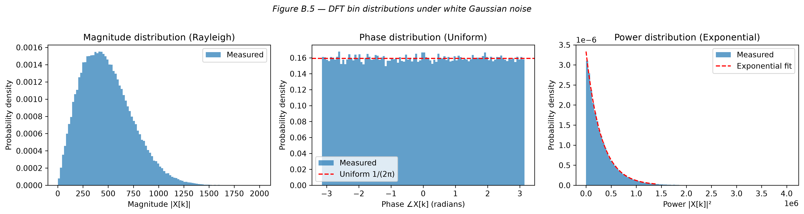

- *Magnitude* $|X[k]|$: Rayleigh distribution - zero at the origin, a peak near the left, then a long tail stretching to the right. The bulk of the mass is concentrated at low magnitudes. This is not bell-shaped: the distribution is asymmetric because magnitudes cannot be negative.
- *Phase* $\angle X[k]$: uniform on $(-\pi, \pi]$. The theoretical line at $1/(2\pi) \approx 0.159$ matches the histogram.
- *Power* $|X[k]|^2$: exponential distribution. The theoretical curve ($\lambda = 1/(N\sigma^2)$) overlays the histogram closely. Measured mean: 300,413. Predicted: $N\sigma^2 = 300\,000$. Deviation: 0.14%.

**Experiment B** - Figure B.6 shows the time domain of the tone-in-noise signal over the first 2 seconds. The tone ($A = 0.5$) is invisible - buried in noise ($\sigma = 1.0$). Time-domain inspection cannot detect it.

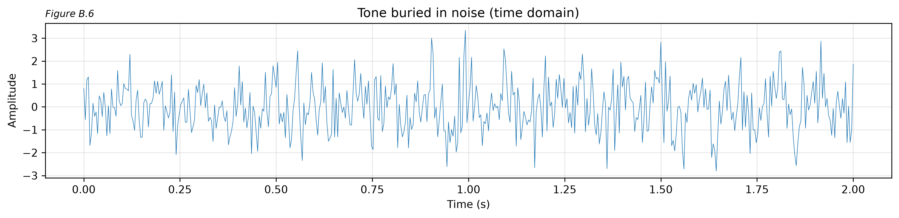

Figure B.7 shows the periodogram with detection thresholds. The tone at 10 Hz produces a power of 18,569 - a ratio of 26,788× the noise floor. Detected at all three thresholds:

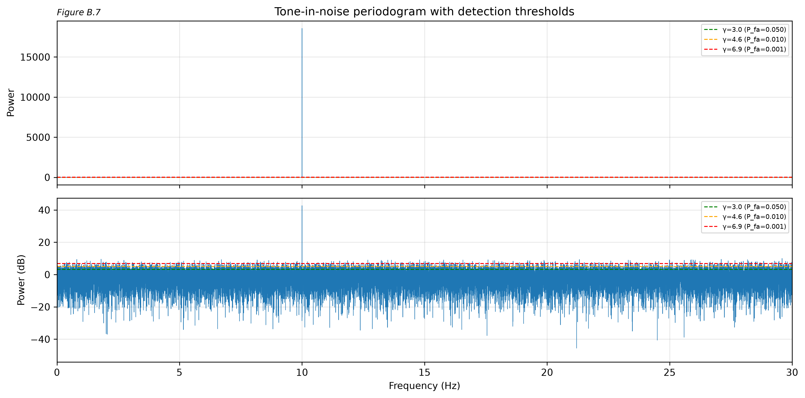

**Table B.4 - Detection thresholds**

| Threshold $\gamma$ | $P_{fa} = e^{-\gamma}$ | Threshold value | Detected? |
| --- | --- | --- | --- |
| 3.0 | 0.050 | 2.08 | Yes (ratio = 26,788) |
| 4.6 | 0.010 | 3.19 | Yes |
| 6.9 | 0.001 | 4.78 | Yes |

**Experiment C** - Figure B.8 shows the Welch progression (dual-stack: linear left, dB right):

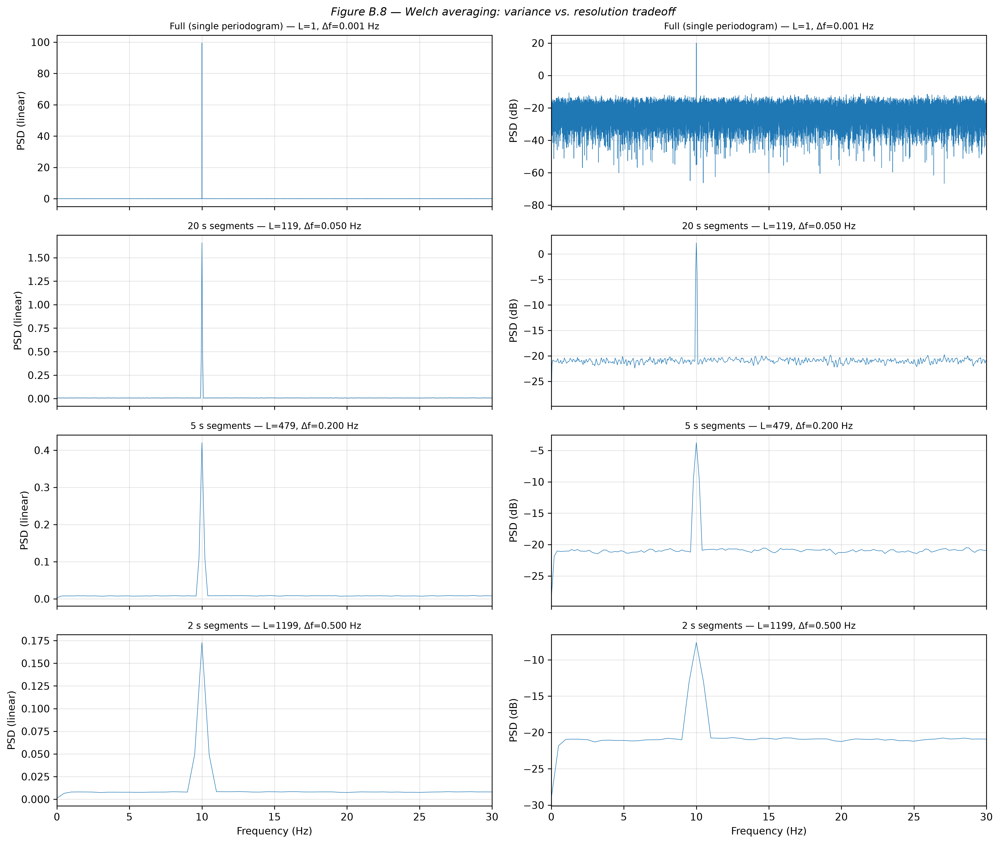

**Table B.5 - Welch progression**

| Segment | $L$ | $\Delta f$ (Hz) | Relative variance | Spectrum appearance |
| --- | --- | --- | --- | --- |
| Full (1200 s) | 1 | 0.0008 | 1.000 | Ragged, ±10 dB fluctuations |
| 20 s | 119 | 0.050 | 0.008 | Smooth, clean tone peak |
| 5 s | 479 | 0.200 | 0.002 | Very smooth, flat noise floor |
| 2 s | 1199 | 0.500 | 0.001 | Smoothest, but tone peak is wide |

### Verification

**Table B.6 - Verification**

| Prediction (Volume A) | Measured | Confirmed? |
| --- | --- | --- |
| $\mathbb{E}[\|X[k]\|^2] = N\sigma^2 = 300\,000$ (Eq. A.26) | 300,413 | Yes (0.14% deviation) |
| Phase uniform on $(-\pi, \pi]$ (A.4.1) | Uniform histogram | Yes |
| Power exponential with mean $N\sigma^2$ (Eq. A.25) | Exponential fit matches | Yes |
| $\gamma = 3.0 \Rightarrow P_{fa} = 0.050$ (Eq. A.28) | Tone detected (ratio 26,788) | Yes |
| Welch variance $\propto 1/L$ (Eq. A.32) | Progressive smoothing | Yes |
| Welch resolution degrades to $\beta \cdot f_s/M$ (Eq. A.21) | $\Delta f$ increases with shorter $M$ | Yes |

### Conclusion

The spectral statistics framework from Section A.4 holds. Bin power under noise follows the exponential distribution. The noise floor estimated from the spectrum itself (median) enables detection thresholds grounded in probability, not arbitrary σ rules. The tone at 10 Hz - invisible in the time domain - is detected with a ratio exceeding 26,000 in the frequency domain.

Welch's method demonstrates the resolution-variance tradeoff: 5-second segments ($\Delta f = 0.2$ Hz, $L = 479$) produce a smooth spectrum that resolves all EEG bands while keeping variance below 1%.

## B.3 - Lab 3: Windowing and the Dirichlet Kernel  *(↔ A.3)*

### Introduction

Lab 1 showed leakage from off-bin tones under the rectangular window. This lab derives *why* leakage occurs (the Dirichlet kernel) and *how* the cosine-sum windows suppress it. All derivations use the periodic convention ($M$) as justified in Section A.3.3. Appendix B provides the symmetric ($M-1$) derivation and proves the two conventions converge as $M \to \infty$.

### Setup

### Parameters

**Table B.7 - Lab 3 parameters**

| Parameter | Value |
| --- | --- |
| $f_s$ (Hz) | 250 |
| Window length $M$ (samples) | 256 (1.024 s) |
| Zero-pad factor | 2048x |
| Windows analyzed | Rectangular, Hann, Hamming, Blackman |
| Convention | Periodic ($M$) |

All derivations use $M = 256$ samples (≈ 1.024 s at $f_s = 250$ Hz - the typical EEG STFT epoch length). All spectra are normalized by $M$ so that the main-lobe peak is 1. Graphs are rendered at high zero-pad ($2048 \times M$) for visual smoothness. Code and figures: `src/lab3_windows/lab3.py`.

### The Dirichlet Kernel

The DFT of the rectangular window $w[n] = 1$ for $n = 0, 1, \ldots, M-1$ is computed from the finite geometric series. Starting from the definition:

$$
W(\omega) = \sum_{n=0}^{M-1} e^{-j\omega n} \tag{B.5}
$$

This is a geometric series with ratio $r = e^{-j\omega}$:

$$
W(\omega) = \frac{1 - e^{-j\omega M}}{1 - e^{-j\omega}} \tag{B.6}
$$

To extract the magnitude, we factor out the half-angle from both numerator and denominator. From the numerator:

$$
1 - e^{-j\omega M} = e^{-j\omega M/2}\left(e^{j\omega M/2} - e^{-j\omega M/2}\right) = e^{-j\omega M/2} \cdot 2j\sin\!\left(\frac{\omega M}{2}\right) \tag{B.7}
$$

From the denominator:

$$
1 - e^{-j\omega} = e^{-j\omega/2}\left(e^{j\omega/2} - e^{-j\omega/2}\right) = e^{-j\omega/2} \cdot 2j\sin\!\left(\frac{\omega}{2}\right) \tag{B.8}
$$

Dividing Equation (B.7) by Equation (B.8):

$$
W(\omega) = \frac{e^{-j\omega M/2} \cdot 2j\sin(\omega M/2)}{e^{-j\omega/2} \cdot 2j\sin(\omega/2)} = e^{-j\omega(M-1)/2} \cdot \frac{\sin(\omega M/2)}{\sin(\omega/2)} \tag{B.9}
$$

The factor $e^{-j\omega(M-1)/2}$ is a linear phase (time shift to the window center). It affects phase but not magnitude. The magnitude is the **Dirichlet kernel**:

$$
|W(\omega)| = \left|\frac{\sin(\omega M/2)}{\sin(\omega/2)}\right| \tag{B.10}
$$

**Normalization.** At $\omega = 0$, both sine functions vanish, but L'Hôpital's rule (or direct substitution via $\lim_{x \to 0} \sin(Mx)/\sin(x) = M$) gives $|W(0)| = M$. We normalize by $M$ so that the peak equals 1:

$$
D(\omega) = \frac{1}{M}\left|\frac{\sin(\omega M/2)}{\sin(\omega/2)}\right| \tag{B.11}
$$

Equation (B.11) is the normalized Dirichlet kernel. It is the spectral footprint of the rectangular window: every tone in a rectangularly-windowed DFT is convolved with this shape (Section A.3.2).

**Code:**

```python
import numpy as np

def dirichlet_kernel(omega, M):
    """Normalized Dirichlet kernel: |sin(ωM/2) / sin(ω/2)| / M"""
    numerator = np.sin(omega * M / 2)                     # sin(ωM/2)
    denominator = np.sin(omega / 2)                       # sin(ω/2)
    with np.errstate(divide="ignore", invalid="ignore"):  # handle 0/0 at ω=0
        D = np.abs(numerator / denominator) / M           # Equation (B.11)
    D[np.isnan(D)] = 1.0                                  # limit at ω=0 is 1.0
    return D
```

### Anatomy of the Dirichlet Kernel

Figure B.9 shows the normalized Dirichlet kernel $D(\omega)$ at $M = 256$, plotted as a continuous function of frequency in bins.

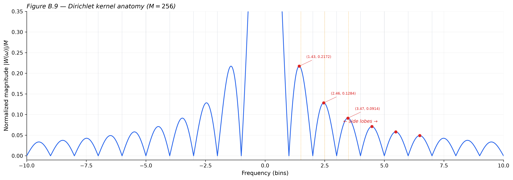

**Nulls.** The numerator $\sin(\omega M/2)$ vanishes when $\omega M/2 = k\pi$ for integer $k \neq 0$, i.e. at:

$$
\omega_k = \frac{2\pi k}{M}, \qquad k = \pm 1, \pm 2, \ldots \tag{B.12}
$$

In bin units ($\text{bin} = \omega M / (2\pi)$), the nulls fall at **integer bins**: $k = \pm 1, \pm 2, \ldots$. These are visible as the zero-crossings in Figure B.9.

**Main lobe.** The central peak between the first nulls at $k = -1$ and $k = +1$ is the **main lobe**. Its width is 2 bins (from $-1$ to $+1$). This is the narrowest possible main lobe - rectangular pays for it with the highest side lobes.

**Side lobes.** Between each pair of adjacent nulls lies a **side lobe** - a local maximum of $D(\omega)$. Figure B.9 annotates the first three side-lobe maxima with their positions and magnitudes.

**The skew observation.** The side-lobe maxima are **not** centered between the nulls. The first maximum is at bin 1.430, not 1.500. This is because $D(\omega) = |\sin(\omega M/2) / \sin(\omega/2)|$ is not a pure sinusoid - it is a ratio of two sines with different frequencies. The denominator $1/\sin(\omega/2)$ is a monotonically decreasing envelope that pulls each maximum slightly toward the origin (toward the main lobe).

The **midpoint approximation** $\omega \approx (2k+1)\pi/M$ (i.e. bin $\approx k + 0.5$) is commonly used and close, but not exact. This matters for the decay-rate analysis below, where we compare actual maxima positions against the approximation.

**Envelope.** Figure B.10 shows the kernel with the envelope $1/(M \cdot |\sin(\omega/2)|)$ overlaid.

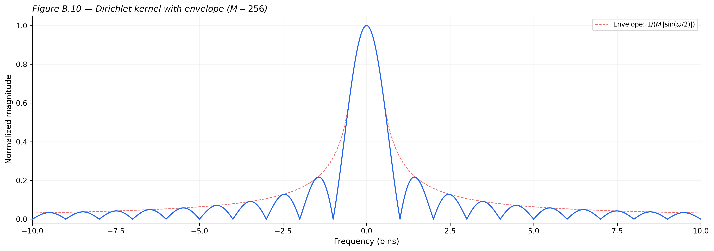

For large $\omega$ (far from the main lobe), $\sin(\omega/2) \approx \omega/2$ breaks down, but the envelope still tracks the side-lobe peaks accurately. The side lobes touch the envelope because $|\sin(\omega M/2)|$ reaches 1 near (but not exactly at) each maximum.

**Code for dense spectrum computation:**

```python
M = 256                                                   # EEG-typical window length
N_DENSE = M * 2048                                        # high zero-pad for smoothness

def window_spectrum_dense(win_func, M, N_dense=N_DENSE):
    w = win_func(M)                                       # generate window
    W = np.fft.fft(w, n=N_dense)                          # zero-padded DFT
    W_shifted = np.fft.fftshift(W)                        # center at DC
    W_mag = np.abs(W_shifted)                             # magnitude
    W_mag = W_mag / W_mag.max()                           # normalize peak to 1.0
    bins = (np.arange(N_dense) - N_dense // 2) / (N_dense / M)
    return bins, W_mag
```

### Properties of the Rectangular Window

#### First side-lobe strength

The first side lobe is the tallest, and its level relative to the main lobe determines the worst-case leakage from an off-bin tone.

**Method (a): visual measurement from the graph.**

Figure B.11 zooms into the first side lobe.

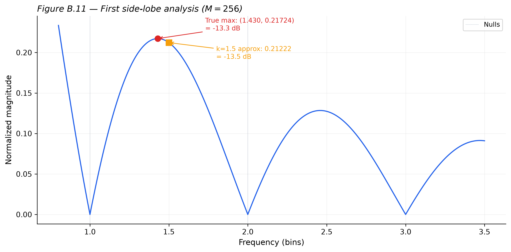

The true maximum is located by finding the local peak of the computed spectrum:

```python
from scipy.signal import argrelextrema
# argrelextrema finds local maxima by comparing each point to its neighbors.
# order=5 means a point must be larger than the 5 points on each side to qualify.

def find_sidelobe_maxima(bins, W_mag, main_lobe_bins=1.5):
    right_half = bins > main_lobe_bins                    # positive side, outside main lobe
    indices = np.where(right_half)[0]                     # indices in that region
    W_right = W_mag[indices]                              # magnitude in that region
    bins_right = bins[indices]                            # bins in that region
    local_max_idx = argrelextrema(W_right, np.greater, order=5)[0]
    return bins_right[local_max_idx], W_right[local_max_idx]
```

Result: the first side-lobe maximum is at **bin 1.430** with normalized magnitude **0.21724**, corresponding to $20\log_{10}(0.21724) = -13.3$ dB.

**Method (b): analytical approximation via $k = 1.5$.**

Between the nulls at bin 1 and bin 2, the midpoint approximation places the maximum at bin 1.5, i.e. $\omega = 3\pi/M$. The numerator $|\sin(\omega M/2)| = |\sin(3\pi/2)| = 1$, and the denominator is $M \cdot |\sin(3\pi/(2M))|$. For large $M$, $\sin(3\pi/(2M)) \approx 3\pi/(2M)$, giving:

$$
D\!\left(\frac{3\pi}{M}\right) \approx \frac{1}{M \cdot \frac{3\pi}{2M}} = \frac{2}{3\pi} \approx 0.21221 \tag{B.13}
$$

In dB: $20\log_{10}(2/(3\pi)) = -13.5$ dB.

**Comparison:**

**Table B.8 - Side-lobe strength comparison**

| Method | Bin position | Magnitude | dB |
| --- | --- | --- | --- |
| (a) True maximum | 1.430 | 0.21724 | −13.3 |
| (b) $k = 1.5$ approximation | 1.500 | 0.21222 | −13.5 |
| Textbook (asymptotic) | - | $2/(3\pi)$ | −13.0 |

The three values agree within 0.5 dB. The textbook value of −13.0 dB is the asymptotic limit for $M \to \infty$; at $M = 256$ the actual maximum is slightly higher (−13.3 dB) because the discrete kernel has not fully converged. The $k = 1.5$ approximation underestimates slightly because the true maximum is skewed toward the main lobe (bin 1.430, not 1.500).

#### Decay rate per octave

**Method (a): analytical approximation.**

The $k$-th side-lobe peak is near $\omega \approx (2k+1)\pi/M$, where the numerator $|\sin(\omega M/2)| \approx 1$. The envelope is then:

$$
D_k \approx \frac{1}{M \cdot \sin\!\left(\frac{(2k+1)\pi}{2M}\right)} \tag{B.14}
$$

For large $M$ and moderate $k$, $\sin(x) \approx x$, so:

$$
D_k \approx \frac{2}{(2k+1)\pi} \tag{B.15}
$$

Equation (B.15) decays as $1/k$, which is $1/\omega$ since $\omega \propto k$. In dB, doubling $\omega$ (one octave) reduces the level by $20\log_{10}(2) = 6.02$ dB. This is the **6 dB/octave** rolloff ($1/\omega^1$ decay) characteristic of the rectangular window, caused by the discontinuity in the window value at the edges.

**Method (b): statistical measurement via regression.**

We collect the actual positions and magnitudes of the first 6 side-lobe maxima and fit a line on the log-log plot.

**Table B.9 - Side-lobe maxima of the Dirichlet kernel ($M = 256$)**

| Lobe | Actual bin | Midpoint approx | Actual magnitude | $(2k+1)\pi$ approx | Actual dB | Approx dB |
| --- | --- | --- | --- | --- | --- | --- |
| 1 | 1.430 | 1.5 | 0.21724 | 0.21221 | −13.3 | −13.5 |
| 2 | 2.459 | 2.5 | 0.12839 | 0.12732 | −17.8 | −17.9 |
| 3 | 3.471 | 3.5 | 0.09135 | 0.09095 | −20.8 | −20.8 |
| 4 | 4.478 | 4.5 | 0.07095 | 0.07074 | −23.0 | −23.0 |
| 5 | 5.481 | 5.5 | 0.05802 | 0.05787 | −24.7 | −24.8 |
| 6 | 6.484 | 6.5 | 0.04908 | 0.04897 | −26.2 | −26.2 |

Table B.9 confirms that the $(2k+1)\pi$ approximation (Equation (B.15)) is excellent for $k \geq 2$ - within 0.2 dB. The deviation is largest at $k = 1$ (the first side lobe), where the skew effect is strongest.

**Regression code.** We fit $\log_{10}(\text{magnitude}) = \text{slope} \cdot \log_{10}(\text{bin}) + \text{intercept}$ via ordinary least squares (OLS). This is equivalent to fitting a power law $\text{magnitude} = a \cdot \text{bin}^{\text{slope}}$ by linearizing both axes. `scipy.stats.linregress` computes the OLS closed-form solution and returns the slope, intercept, R-value, p-value, and standard error.

```python
from scipy.stats import linregress
# linregress: ordinary least squares (OLS) fit of y = slope*x + intercept

log_bins = np.log10(peak_bins)                            # log of bin positions
log_mag = np.log10(peak_values)                           # log of magnitudes
slope, intercept, r_value, _, _ = linregress(log_bins, log_mag)
dB_per_octave = slope * 20 * np.log10(2)                  # convert to dB/octave
```

**Results** (Figure B.12):

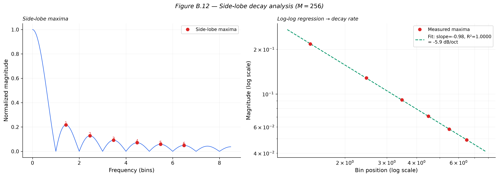

**Table B.10 - Decay regression results**

| Regression method | Slope | R² | dB/octave |
| --- | --- | --- | --- |
| Accurate $k'$ (actual maxima positions) | −0.985 | 0.99997 | −5.9 |
| Crude integer $k$ (midpoint approximation) | −1.014 | 0.99996 | −6.1 |
| Theoretical | −1.000 | - | −6.0 |

Both regressions confirm the $1/\omega$ decay to within 0.1 dB/octave. The R² values (> 0.9999) indicate near-perfect fit to the power-law model. The crude midpoint approximation is marginally closer to the theoretical slope, but both are effectively exact at this precision.

#### From Rectangular to Hann, Hamming, Blackman

The cosine-sum windows (Equation (A.16)) can be decomposed into shifted rectangular windows using the Euler identity:

$$
\cos\!\left(\frac{2\pi p n}{M}\right) = \frac{1}{2}\left(e^{j 2\pi p n / M} + e^{-j 2\pi p n / M}\right) \tag{B.16}
$$

We use $M$ (periodic convention) throughout - the choice is justified in Section A.3.3 and confirmed numerically in the results below.

Multiplying the rectangular window $w_{\text{rect}}[n] = 1$ by $\cos(2\pi p n / M)$ is equivalent to shifting the Dirichlet kernel by $\pm p$ bins in frequency:

$$
\text{DFT}\!\left\{w_{\text{rect}}[n] \cdot \cos\!\left(\frac{2\pi p n}{M}\right)\right\} = \frac{1}{2}\left[W(\omega - 2\pi p/M) + W(\omega + 2\pi p/M)\right] \tag{B.17}
$$

where $W(\omega)$ is the rectangular window DFT from Equation (B.9).

**Hann** ($a_0 = 0.5, a_1 = 0.5$):

$$
w_{\text{Hann}}[n] = 0.5 - 0.5\cos\!\left(\frac{2\pi n}{M}\right) = 0.5 \cdot w_{\text{rect}}[n] - 0.5\cos\!\left(\frac{2\pi n}{M}\right) \cdot w_{\text{rect}}[n]
$$

Taking the DFT and applying Equation (B.17) with $p = 1$:

$$
W_{\text{Hann}}(\omega) = 0.5\,W(\omega) - 0.25\,W(\omega - 2\pi/M) - 0.25\,W(\omega + 2\pi/M) \tag{B.18}
$$

Equation (B.18) is the Hann window spectrum: one Dirichlet kernel centered at the origin (weight 0.5) minus two copies shifted by $\pm 1$ bin (weight 0.25 each). The negative signs arise from the $(-1)^p$ alternation in Equation (A.16).

**Expanding to the pure sine form.** Equation (B.18) has three terms - three shifted Dirichlet kernels. Instead of substituting the sin/sin form (which introduces phase complications), we go through the **geometric series** directly. This approach reveals a shared factor cleanly.

**Step 1: three geometric series.**

The Hann window's DFT is (expanding the cosine via Euler):

$$
W_{\text{Hann}}(\omega) = 0.5 \underbrace{\sum_{n=0}^{M-1} e^{-j\omega n}}_{S_0} - 0.25 \underbrace{\sum_{n=0}^{M-1} e^{-j(\omega - 2\pi/M) n}}_{S_1} - 0.25 \underbrace{\sum_{n=0}^{M-1} e^{-j(\omega + 2\pi/M) n}}_{S_{-1}} \tag{B.19}
$$

Each $S_p$ is a finite geometric series with ratio $r_p = e^{-j(\omega - 2\pi p/M)}$:

$$
S_p = \frac{1 - r_p^M}{1 - r_p} = \frac{1 - e^{-j(\omega - 2\pi p/M) M}}{1 - e^{-j(\omega - 2\pi p/M)}} \tag{B.19a}
$$

**Step 2: the shared numerator.**

The numerator of $S_p$ is $1 - e^{-j(\omega - 2\pi p/M) M}$. Expand the exponent:

$$
(\omega - 2\pi p/M) \cdot M = \omega M - 2\pi p \qquad \text{(B.19b)}
$$

Since $e^{-j 2\pi p} = 1$ for any integer $p$:

$$
1 - e^{-j(\omega M - 2\pi p)} = 1 - e^{-j\omega M} \cdot \underbrace{e^{j 2\pi p}}_{= 1} = 1 - e^{-j\omega M} \tag{B.19c}
$$

**All three geometric series have the same numerator $1 - e^{-j\omega M}$.** This is exact - no approximation, no residual phases. It follows from the simple fact that $e^{j 2\pi p} = 1$ for integer $p$.

**Step 3: factor out the shared numerator.**

$$
W_{\text{Hann}}(\omega) = (1 - e^{-j\omega M}) \left[\frac{0.5}{1 - e^{-j\omega}} - \frac{0.25}{1 - e^{-j(\omega - 2\pi/M)}} - \frac{0.25}{1 - e^{-j(\omega + 2\pi/M)}}\right] \tag{B.19d}
$$

**Step 4: convert to sin form.**

The standard identity $1 - e^{-j\alpha} = -e^{-j\alpha/2} \cdot 2j \sin(\alpha/2)$ gives:

$$
|1 - e^{-j\alpha}| = 2|\sin(\alpha/2)|
$$

For the shared numerator: $|1 - e^{-j\omega M}| = 2|\sin(\omega M/2)|$.

For each denominator: $|1 - e^{-j(\omega - 2\pi p/M)}| = 2|\sin((\omega - 2\pi p/M)/2)| = 2|\sin(\omega/2 - \pi p/M)|$.

**Step 5: take the magnitude.**

$$
|W_{\text{Hann}}(\omega)| = 2|\sin(\omega M/2)| \cdot \left|\frac{0.5}{1 - e^{-j\omega}} - \frac{0.25}{1 - e^{-j(\omega - 2\pi/M)}} - \frac{0.25}{1 - e^{-j(\omega + 2\pi/M)}}\right| \tag{B.19e}
$$

The $2|\sin(\omega M/2)|$ factor is exact - it came from the shared numerator in Step 2. The bracket is the magnitude of a complex expression. We compute it by converting each $1/(1 - e^{-j\alpha})$ to polar form:

$$
\frac{1}{1 - e^{-j\alpha}} = \frac{1}{2\sin(\alpha/2)} \cdot \frac{1}{-je^{-j\alpha/2}} = \frac{e^{j(\alpha/2 + \pi/2)}}{2\sin(\alpha/2)}
$$

Each term has magnitude $\frac{1}{2|\sin(\alpha/2)|}$ and a phase that depends on $\alpha$. For the **magnitude** of the full bracket, we can compute:

$$
\frac{|W_{\text{Hann}}(\omega)|}{M} = \frac{2|\sin(\omega M/2)|}{M} \cdot \left|\frac{0.5}{1 - e^{-j\omega}} - \frac{0.25}{1 - e^{-j(\omega - 2\pi/M)}} - \frac{0.25}{1 - e^{-j(\omega + 2\pi/M)}}\right| \tag{B.20}
$$

Equation (B.20) is the exact magnitude of the Hann window spectrum. The shared numerator $2|\sin(\omega M/2)|$ is cleanly factored; the bracket is a complex expression whose magnitude is computed numerically. This is the formula our code evaluates via `np.fft.fft`.

**Approximate form for analysis.** For large $M$, the phases of the three $1/(1 - e^{-j\alpha})$ terms are nearly aligned (they differ by $\pi/M \approx 0.012$ rad at $M = 256$). In this regime, the magnitude of the bracket is well approximated by the sum of the individual magnitudes:

$$
\frac{|W_{\text{Hann}}(\omega)|}{M} \approx \frac{|\sin(\omega M/2)|}{M} \cdot \left[\frac{0.5}{|\sin(\omega/2)|} + \frac{0.25}{|\sin(\omega/2 - \pi/M)|} + \frac{0.25}{|\sin(\omega/2 + \pi/M)|}\right] \tag{B.20a}
$$

Equation (B.20a) is the approximate "pure sine form" - a single $|\sin|$ numerator times a sum of $1/|\sin|$ terms. It is the formula plotted in Figures B.13-B.14 and used in the Desmos verification. The approximation error is negligible at $M = 256$ (< 0.01 dB).

**Note on the $M-1$ convention.** With the symmetric convention (Equation (A.16b)), the shift is $2\pi p/(M-1)$ and the phase differences between terms vanish exactly - $e^{j\pi p (M-1)/(M-1)} = e^{j\pi p} = (-1)^p$, with no residual. The bracket becomes **purely real**, and Equation (B.20a) becomes exact rather than approximate. This is the formula used in the Desmos verification. The cost: the numerator identity in Step 2 no longer holds ($e^{j2\pi p M/(M-1)} \neq 1$), so the shared-numerator factorization in Equation (B.19d) does not apply. Each approach sacrifices one simplification for another; we use $M$ for the factorization and accept the negligible phase approximation in the bracket.

Equation (B.20) is the **pure sine form** of the Hann window spectrum. It is a single expression: one shared numerator $\sin(\omega M/2)$ multiplied by a sum of three $1/\sin$ terms. The structure is transparent:

- **Zeros:** the shared numerator $\sin(\omega M/2) = 0$ at $\omega = 2\pi k/M$ (integer bins), same as rectangular - but the denominator terms also vanish at $\omega = 2\pi/M$ (bin 1) and $\omega = -2\pi/M$ (bin $-1$), creating 0/0 forms. By L'Hôpital, these evaluate to finite values - they become part of the main lobe rather than nulls. The first true null is pushed out to bin 2, doubling the main-lobe width from 2 bins (rectangular) to 4 bins (Hann).

- **Side-lobe cancellation:** in the side-lobe region (bins > 2), all three $1/\sin$ terms are nonzero and positive. Their sum is much smaller than the single $1/\sin(\omega/2)$ term of rectangular because the shifted terms $1/\sin(\omega/2 \pm \pi/M)$ partially cancel the central term. The cancellation is not exact - a residual remains - but it reduces the side-lobe level from −13.3 dB to −31.5 dB.

The same expansion for **Hamming** ($a_0 = 0.54, a_1 = 0.46$):

$$
\frac{|W_{\text{Hamming}}(\omega)|}{M} = \frac{|\sin(\omega M/2)|}{M} \cdot \left[\frac{0.54}{\sin(\omega/2)} + \frac{0.23}{\sin(\omega/2 - \pi/M)} + \frac{0.23}{\sin(\omega/2 + \pi/M)}\right] \tag{B.22}
$$

The structure is identical to Hann - same shared numerator, same three $1/\sin$ terms - but the coefficients are different: $0.54$ on the central term vs. $0.23$ on the shifted terms (compare Hann's $0.5$ and $0.25$). These coefficients were chosen to minimize the peak side-lobe level. The result is −42.7 dB, deeper than Hann's −31.5 dB.

However, Hamming's coefficients do not sum to zero at the edges: $w[0] = 0.54 - 0.46 = 0.08 \neq 0$. This means the window has a value discontinuity at its boundaries. In the sine form, this manifests as the three $1/\sin$ terms not cancelling to higher order at large $\omega$ - the residual decays as $1/\omega^1$ (6 dB/oct), same as rectangular, even though the nearest side lobes are much lower.

For **Blackman** ($a_0 = 0.42, a_1 = 0.5, a_2 = 0.08$), the same expansion gives five $1/\sin$ terms. The $p = 2$ shifts use Equation (B.19) with $(-1)^2 = +1$:

$$
\frac{|W_{\text{Blackman}}(\omega)|}{M} = \frac{|\sin(\omega M/2)|}{M} \cdot \left[\frac{0.42}{\sin(\omega/2)} + \frac{0.25}{\sin(\omega/2 - \pi/M)} + \frac{0.25}{\sin(\omega/2 + \pi/M)} + \frac{0.04}{\sin(\omega/2 - 2\pi/M)} + \frac{0.04}{\sin(\omega/2 + 2\pi/M)}\right] \tag{B.23}
$$

Five terms, one shared numerator. The denominator has 0/0 forms at bins $\pm 1$ and $\pm 2$, pushing the first true null to bin 3 and widening the main lobe to 6 bins. The two extra terms provide a second level of cancellation in the side-lobe region, driving the peak side-lobe to −58 dB. Blackman goes to zero at the edges ($0.42 - 0.50 + 0.08 = 0$), so the five-term residual decays as $1/\omega^3$ (18 dB/oct).

**Summary: the pure sine forms.**

**Table B.11 - Pure sine form expressions**

All windows share the numerator $|\sin(\omega M/2)|$. The bracket $[\cdots]$ is the weighted sum of $1/\sin$ terms. Let $\alpha = \omega/2$ for compactness.

**Rectangular** (Equation (B.11), 1 term):

$$
\frac{|W_{\text{rect}}(\omega)|}{M} = \frac{|\sin(\alpha M)|}{M \cdot |\sin(\alpha)|} \tag{B.24}
$$

**Hann** (Equation (B.20), 3 terms):

$$
\frac{|W_{\text{Hann}}(\omega)|}{M} = \frac{|\sin(\alpha M)|}{M} \left[\frac{0.5}{\sin(\alpha)} + \frac{0.25}{\sin(\alpha - \pi/M)} + \frac{0.25}{\sin(\alpha + \pi/M)}\right] \tag{B.25}
$$

**Hamming** (Equation (B.22), 3 terms):

$$
\frac{|W_{\text{Ham}}(\omega)|}{M} = \frac{|\sin(\alpha M)|}{M} \left[\frac{0.54}{\sin(\alpha)} + \frac{0.23}{\sin(\alpha - \pi/M)} + \frac{0.23}{\sin(\alpha + \pi/M)}\right] \tag{B.26}
$$

**Blackman** (Equation (B.23), 5 terms):

$$
\frac{|W_{\text{Blk}}(\omega)|}{M} = \frac{|\sin(\alpha M)|}{M} \left[\frac{0.42}{\sin(\alpha)} + \frac{0.25}{\sin(\alpha - \pi/M)} + \frac{0.25}{\sin(\alpha + \pi/M)} + \frac{0.04}{\sin(\alpha - 2\pi/M)} + \frac{0.04}{\sin(\alpha + 2\pi/M)}\right] \tag{B.27}
$$

Every window in the cosine-sum family is: one shared $\sin(\omega M/2)$ numerator (which sets the nulls), multiplied by a weighted sum of $1/\sin$ terms with shifted arguments (which sets the side-lobe structure). The window design problem reduces to choosing the weights that produce the desired cancellation pattern.

**Why Hamming's rolloff is slow despite its low side lobes.** From Table B.11, Hann and Hamming have the same three-term structure. At large $\omega$, each $1/\sin$ term behaves as $1/(\omega/2 + \text{shift}) \approx 2/\omega$. The three terms combine as:

For Hann: $0.5 + 0.25 + 0.25 = 1.0$ - but the signs of the shifted terms (after accounting for the full complex expression) produce cancellation at order $1/\omega$ and $1/\omega^2$, leaving a residual at $1/\omega^3$. This happens because $w[0] = w[M-1] = 0$, so the window and its first derivative vanish at the edges.

For Hamming: the same three terms, but with coefficients $0.54 + 0.23 + 0.23 = 1.0$. The coefficients are tuned to cancel a specific side-lobe peak, not to cancel the $1/\omega$ term of the asymptotic expansion. The $1/\omega$ term survives because $w[0] = 0.08 \neq 0$. Result: the nearest side lobes are lower (−42.7 dB vs. −31.5 dB), but the far side lobes decay at only 6 dB/oct instead of 18 dB/oct.

This is the precise mechanism behind the rolloff rule from Section A.3.4: the rolloff rate is determined by edge smoothness, which in the pure sine form manifests as the degree of asymptotic cancellation among the $1/\sin$ terms.

#### Comparative graph (linear scale)

Figure B.13 overlays the normalized spectra $D(\omega)$ of all four windows on one plot in linear scale, zoomed to the side-lobe region ($|D| \leq 0.25$). Figure B.14 shows the same comparison at full scale.

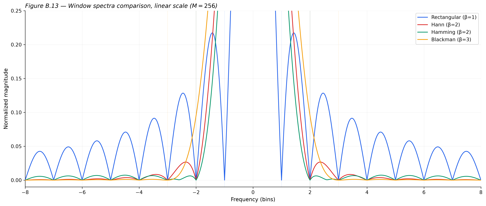

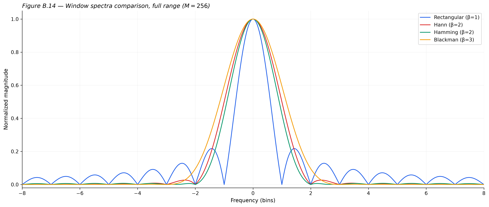

The tradeoff is immediately visible:

- **Rectangular** has the narrowest main lobe (2 bins) but the tallest side lobes (≈ 0.22).
- **Hann** and **Hamming** have equal main-lobe widths (4 bins). Hamming's side lobes are lower in the nearest lobes but do not decay as fast.
- **Blackman** has the widest main lobe (6 bins) but side lobes so small they are barely visible on the linear scale.

This is the main-lobe/side-lobe tradeoff from Section A.3.4, now derived from first principles: each window is a weighted sum of shifted Dirichlet kernels, and the weights determine how much cancellation occurs in the side-lobe region.

**Summary of derived properties:**

**Table B.12 - Window properties derived in Lab 3**

| Window | Formula (shifted Dirichlet kernels) | Main-lobe width (bins) | Peak side-lobe (dB) | Rolloff | Edge value |
| --- | --- | --- | --- | --- | --- |
| Rectangular | $D(\omega)$ | 2 | −13.3 | 6 dB/oct | 1 |
| Hann | $0.5D - 0.25D_{\pm 1}$ | 4 | −31.5 | 18 dB/oct | 0 |
| Hamming | $0.54D - 0.23D_{\pm 1}$ | 4 | −42.7 | 6 dB/oct | 0.08 |
| Blackman | $0.42D - 0.25D_{\pm 1} + 0.04D_{\pm 2}$ | 6 | −58 | 18 dB/oct | 0 |

These are the numbers that Lab 3 will confirm experimentally with the two-tone resolution test.

## B.4 - Lab 4: The STFT of a Fluctuating Signal  *(↔ A.5)*

### Introduction

The DFT (Lab 1) gives frequency content but discards all timing. Welch's method (Lab 2) averages over time explicitly. For any signal whose frequency content changes - an EEG rhythm that comes and goes, a chirp that sweeps - we need both axes simultaneously. The STFT (Section A.5) provides this: it slides a windowed DFT across time and keeps each segment's spectrum indexed by position. The result is the **spectrogram** - the first usable time-frequency representation in this report.

This lab tests:

- The STFT definition and the spectrogram as a 2D time-frequency plot (A.5.1).
- The **Heisenberg uncertainty tradeoff**: $\Delta t \cdot \Delta f = \beta$ is constant; window length $M$ slides between time and frequency resolution (A.5.2).
- **Overlap and the tapering problem**: how the window's taper suppresses edge samples, and how overlap (COLA) recovers them (A.5.3).
- The **multi-scale limitation**: no single STFT window can capture both a narrow-band chirp and a short transient simultaneously.

### Setup

**Model signal.** A linear chirp sweeping from $f_0 = 5$ Hz to $f_1 = 45$ Hz over 120 seconds (Equation (AA.3)):

$$
x[n] = A \cos\!\left(\frac{2\pi}{f_s}\left(f_0 n + \frac{\mu}{2}\frac{n^2}{f_s}\right)\right) \tag{B.28}
$$

with chirp rate $\mu = (f_1 - f_0)/T = 40/120 = 0.333$ Hz/s. The instantaneous frequency at time $t$ is $f_{\text{inst}}(t) = 5 + 0.333\,t$ Hz. The signal duration is 120 s (shorter than the 1200 s lab default so the chirp diagonal is visible at all zoom levels).

For Experiments B and C, an alpha burst (10 Hz Gaussian-enveloped transient, Equation (AA.6)) is added at $t = 60$ s:

$$
x_{\text{burst}}[n] = A_b \exp\!\left(-\frac{(n - n_0)^2}{2\sigma_t^2}\right) \cos\!\left(\frac{2\pi f_b}{f_s} n\right) \tag{B.29}
$$

with $A_b = 3$, $f_b = 10$ Hz, $\sigma_t = 125$ samples (0.5 s).

**STFT computation:**

```python
import numpy as np
from scipy import signal as sp_signal
from src.common import FS, make_chirp, make_transient, plot_time_domain, save_figure

def compute_stft(x, fs=FS, nperseg=256, noverlap=None, window="hann"):
    if noverlap is None:
        noverlap = nperseg // 2                           # default 50% overlap
    f_stft, t_stft, Sxx = sp_signal.spectrogram(
        x, fs=fs, nperseg=nperseg,                        # window length
        noverlap=noverlap,                                # overlap
        window=window,                                    # window type
    )
    return t_stft, f_stft, Sxx
```

**Experiment A - Heisenberg tradeoff.** The chirp is analyzed with Hann windows at four lengths ($M = 125, 250, 500, 1250$ samples), all with 50% overlap.

```python
F0_CHIRP = 5.0                                            # start frequency (Hz)
F1_CHIRP = 45.0                                           # end frequency (Hz)
DURATION_LAB = 120.0                                      # signal duration (s)
MU_CHIRP = (F1_CHIRP - F0_CHIRP) / DURATION_LAB           # 0.333 Hz/s

x, n, t = make_chirp(F0_CHIRP, MU_CHIRP, A=1.0, duration=DURATION_LAB)

for M in [125, 250, 500, 1250]:                           # window length sweep
    dt = M / FS                                           # time resolution (s)
    df = 2 * FS / M                                       # freq resolution (Hz), β=2
    noverlap = M // 2                                     # 50% overlap (Hann COLA)
    t_stft, f_stft, Sxx = compute_stft(x, nperseg=M, noverlap=noverlap)
    # ... plot dual-stack spectrogram
```

**Experiment B - Overlap and tapering.** The chirp + burst signal is analyzed with a fixed $M = 256$ at three overlap settings (0%, 50%, 75%), zoomed to the burst region (55-65 s). White dashed lines mark the true burst extent (±2σ).

```python
x_chirp, _, _ = make_chirp(F0_CHIRP, MU_CHIRP, A=1.0, duration=DURATION_LAB)
n0 = int(60.0 * FS)                                      # burst at t=60 s
sigma_t = int(0.5 * FS)                                   # σ = 0.5 s
x_burst, _, _ = make_transient(n0, sigma_t, f0=10.0, A=3.0, duration=DURATION_LAB)
x = x_chirp + x_burst                                    # combined signal

M = 256                                                   # fixed window
for overlap_frac in [0.0, 0.5, 0.75]:                    # overlap sweep
    noverlap = int(M * overlap_frac)
    t_stft, f_stft, Sxx = compute_stft(x, nperseg=M, noverlap=noverlap)
    # ... plot with burst reference lines at t = 59 s and t = 61 s
```

**Experiment C - Multi-scale limitation.** The same chirp + burst signal, analyzed with a short window ($M = 125$, 0.5 s) and a long window ($M = 1250$, 5 s), zoomed to the burst region. White dashed lines mark the true burst extent.

Full source: `src/lab4_stft/lab4.py`.

### Parameters

**Table B.13 - Lab 4 parameters**

| Parameter | Experiment A | Experiment B | Experiment C |
| --- | --- | --- | --- |
| $f_s$ (Hz) | 250 | 250 | 250 |
| Duration (s) | 120 | 120 | 120 |
| Chirp $f_0$ (Hz) | 5.0 | 5.0 | 5.0 |
| Chirp $f_1$ (Hz) | 45.0 | 45.0 | 45.0 |
| Chirp rate $\mu$ (Hz/s) | 0.333 | 0.333 | 0.333 |
| Burst center (s) | - | 60.0 | 60.0 |
| Burst $\sigma_t$ (s) | - | 0.5 | 0.5 |
| Burst freq (Hz) | - | 10.0 | 10.0 |
| Burst amplitude | - | 3.0 | 3.0 |
| Window | Hann | Hann | Hann |
| Window lengths $M$ | 125, 250, 500, 1250 | 256 | 125, 1250 |
| Overlap | 50% | 0%, 50%, 75% | 50% |

### Results

**Experiment A - Heisenberg tradeoff.**

Figure B.15 shows the chirp in the time domain (first 5 seconds).

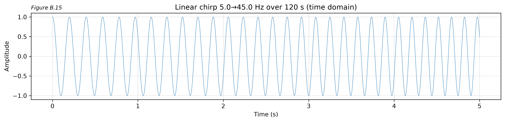

Figures B.16-B.19 show the spectrogram of the same chirp at four window lengths, displayed in dual-stack (linear + dB). The dB scale is used because the chirp and noise floor differ by orders of magnitude - the dB panel reveals leakage structure that the linear panel compresses to invisibility. The diagonal sweeps from 5 Hz to 45 Hz over 120 seconds. The key observation: the diagonal's **thickness** changes with $M$, but the $\Delta t \cdot \Delta f$ product is constant at $\beta = 2$.

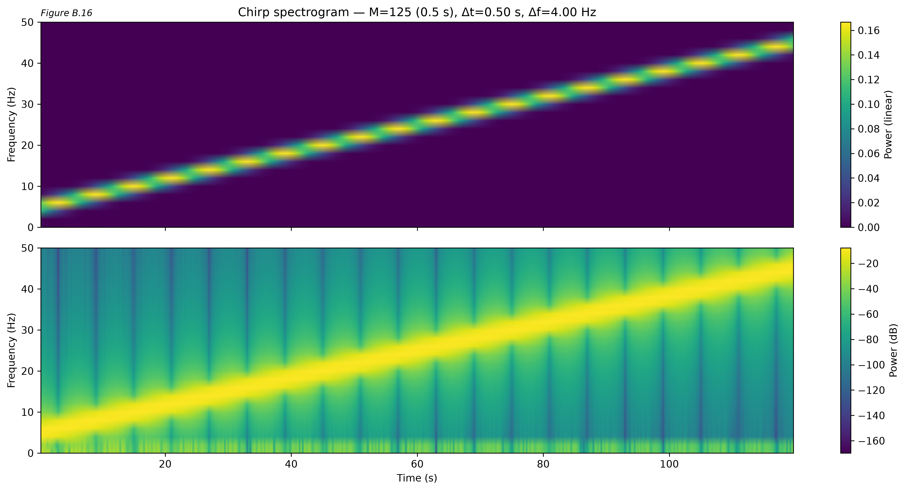

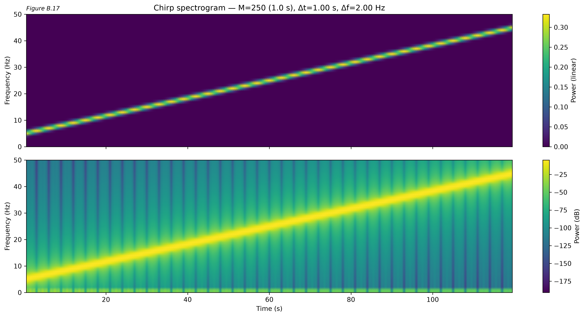

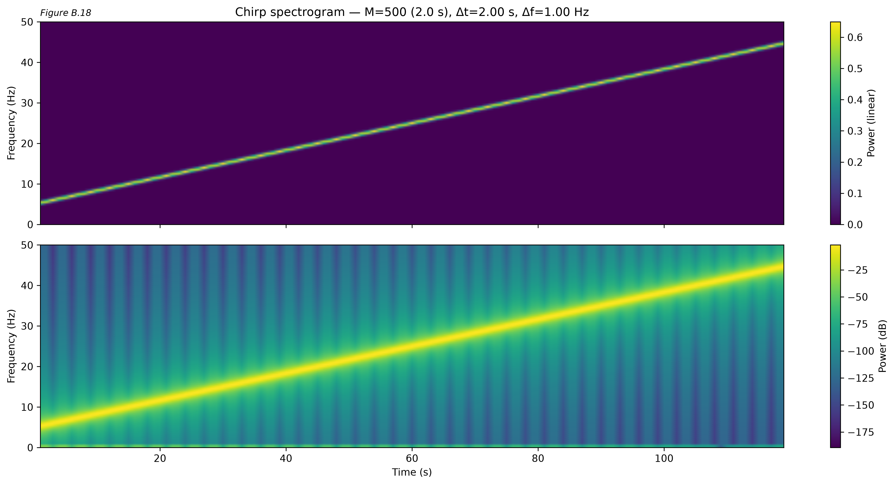

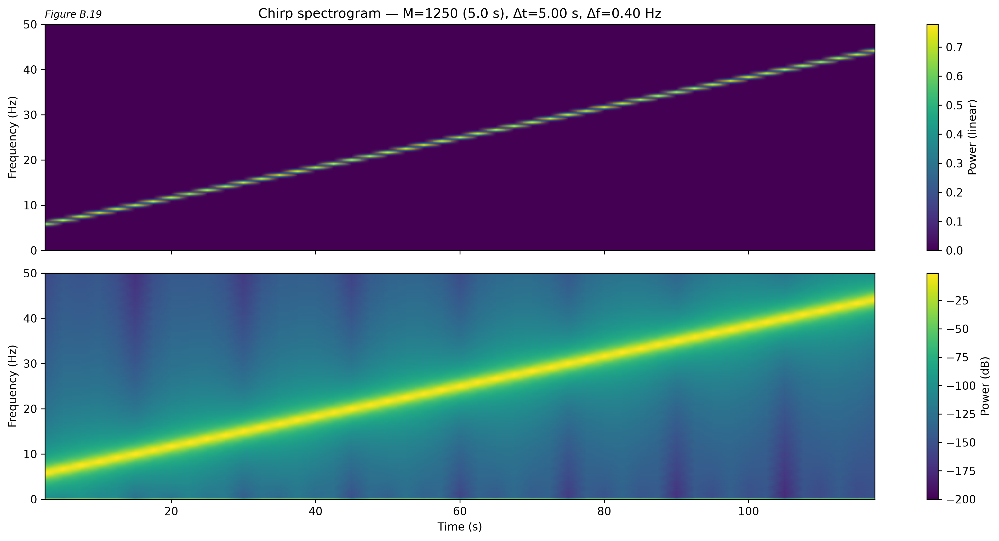

**Table B.14 - Heisenberg tradeoff**

| Window $M$ (samples) | $\Delta t$ (s) | $\Delta f$ (Hz) | $\Delta t \cdot \Delta f$ | Diagonal appearance |
| --- | --- | --- | --- | --- |
| 125 (0.5 s) | 0.50 | 4.00 | 2.0 | Thick, fuzzy - good time steps |
| 250 (1.0 s) | 1.00 | 2.00 | 2.0 | Moderate thickness |
| 500 (2.0 s) | 2.00 | 1.00 | 2.0 | Thin - frequency well resolved |
| 1250 (5.0 s) | 5.00 | 0.40 | 2.0 | Very thin, but 5 s time steps |

Every row has $\Delta t \cdot \Delta f = 2.0$ (Hann's $\beta$). The slider moves, the area doesn't shrink. This is the uncertainty principle (Equation (A.40)) made visible.

**Experiment B - Overlap and tapering.**

Figures B.20-B.22 show the same chirp + burst signal analyzed with $M = 256$ at three overlap levels, zoomed to the burst region. White dashed lines mark the true burst extent (±2σ = 59-61 s).

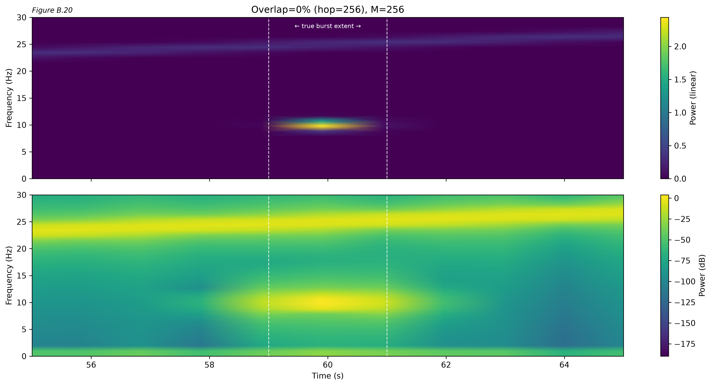

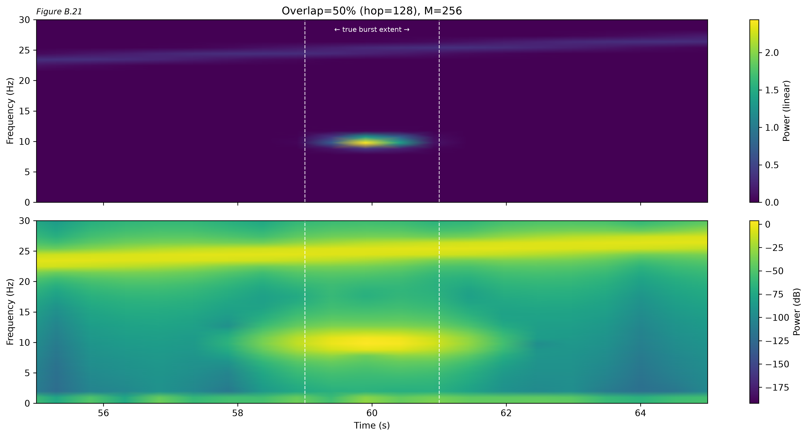


**Table B.15 - Overlap comparison**

| Overlap | Hop $H$ | Columns | Segments per sample | Observation |
| --- | --- | --- | --- | --- |
| 0% | 256 | 117 | 1.0 | Burst shows gaps; edge samples suppressed by taper |
| 50% | 128 | 233 | 2.0 | COLA satisfied; burst cleanly captured within reference lines |
| 75% | 64 | 465 | 4.0 | Smoother time axis, but no finer resolution than 50% |

At 0% overlap, the Hann window multiplies edge samples by zero - features at segment boundaries can be lost (Section A.5.3). At 50%, the COLA condition (Equation (A.42)) is satisfied: every sample receives equal total weight, and the burst is captured completely. At 75%, the spectrogram has more columns (finer time grid) but no additional resolution - the same distinction as zero-padding (Section A.2.3), now on the time axis.

**Experiment C - Multi-scale limitation.**

Figure B.23 shows the chirp + alpha burst in the time domain, zoomed to the burst region.

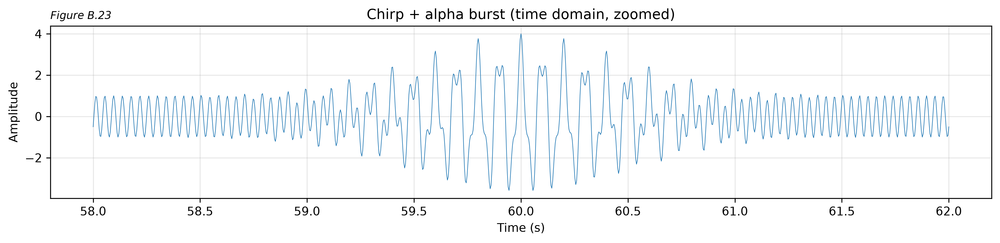

Figures B.24-B.25 show the same signal analyzed with a short window and a long window, in dual-stack (linear + dB). The dB scale is essential here: the burst ($A = 3$) and the chirp ($A = 1$) differ in amplitude, and the dB panel reveals how far the burst energy smears beyond its true extent. White dashed lines mark the true burst extent.

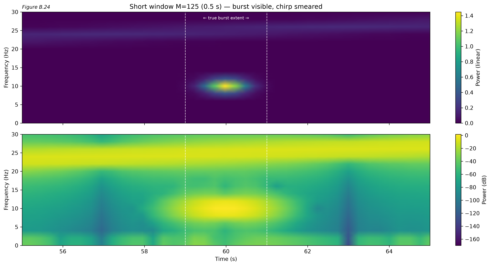

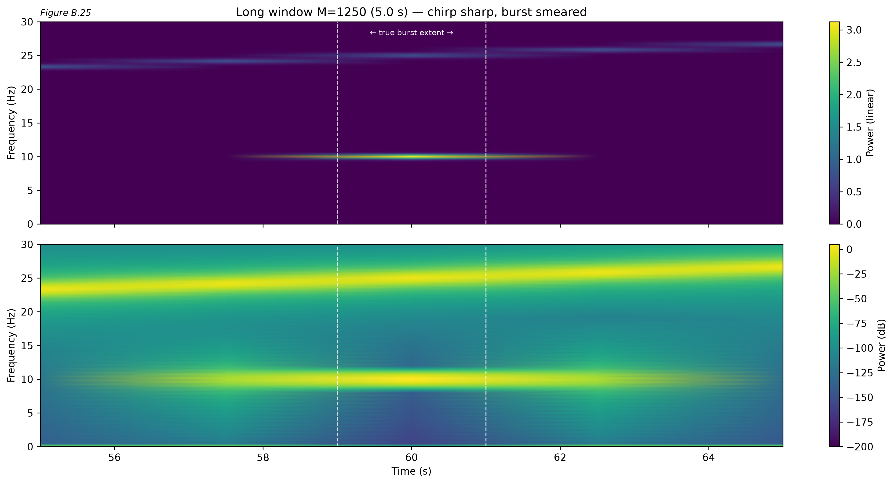

**Table B.16 - Multi-scale comparison**

| Window | $\Delta t$ (s) | $\Delta f$ (Hz) | Burst | Chirp |
| --- | --- | --- | --- | --- |
| Short ($M = 125$) | 0.50 | 4.00 | Localized within reference lines | Smeared into a broad band |
| Long ($M = 1250$) | 5.00 | 0.40 | Smeared far beyond reference lines | Sharp, thin diagonal |

The short window captures the burst correctly (energy stays within the white dashed lines) but smears the chirp into a thick band. The long window sharpens the chirp into a thin diagonal but smears the burst across the entire 10-second view - far beyond its true 2-second extent. No single window captures both: the burst needs $\Delta t \leq 1$ s, the chirp needs $\Delta f \leq 1$ Hz, but $\Delta t \cdot \Delta f = 2$ means you cannot have both simultaneously.

### Verification

**Table B.17 - Verification**

| Prediction (Volume A) | Measured | Confirmed? |
| --- | --- | --- |
| $\Delta t \cdot \Delta f = \beta = 2$ for Hann (Eq. A.39) | 2.0 at all four $M$ values | Yes |
| COLA at 50% overlap for Hann (Eq. A.42) | Uniform coverage, no gaps | Yes |
| Overlap beyond COLA adds columns, not resolution (A.5.3) | 75% smoother but not sharper than 50% | Yes |
| Multi-scale signals cannot be captured by a single $M$ | Short $M$ smears chirp, long $M$ smears burst | Yes |

### Conclusion

The STFT is the first tool in this report that answers "what frequency is present at what time." The Heisenberg tradeoff is real and inescapable: $\Delta t \cdot \Delta f = \beta$ is constant across all window lengths (Figures B.16-B.19). Overlap solves the tapering problem (Figure B.20 vs B.21), and the COLA condition guarantees uniform sample coverage.

The multi-scale experiment (Figures B.24-B.25) reveals the STFT's fundamental limitation: it forces a single choice of $M$ for the entire signal. When the signal contains features at different time-frequency scales - a narrow-band rhythm and a short transient, as EEG often does - no single window captures both. This limitation motivates the Wigner-Ville Distribution (Lab 7), which is not bound by the uncertainty principle in the same way.

## B.5 - Lab 5: Two-Tone Resolution on the Spectrogram  *(↔ A.3, A.5, Lab 3)*

### Introduction

Lab 3 derived the resolution limit $\Delta f_{\min} \approx \beta \cdot f_s / M$ from the Dirichlet kernel and its cosine-sum extensions. Lab 4 introduced the spectrogram. This lab brings them together: two stationary tones on a spectrogram - too close and they appear as one horizontal line, far enough apart and they split into two. The separation at which the split occurs should match Lab 3's prediction for each window.

The spectrogram is a far more convincing test than a DFT magnitude plot. On a DFT, "resolved vs. merged" requires inspecting a small dip between two peaks. On a spectrogram, it is one line vs. two lines - visible at a glance.

### Setup

**Model signal.** Two stationary tones (Equation (AA.2)):

$$
x[n] = \cos\!\left(\frac{2\pi f_1}{f_s} n\right) + \cos\!\left(\frac{2\pi f_2}{f_s} n\right) \tag{B.30}
$$

with $f_1 = 10$ Hz (alpha band) and $f_2 = f_1 + \Delta$. The separation $\Delta$ is swept across four values: 0.5 Hz, 2.0 Hz, 3.0 Hz, 5.0 Hz. For each separation, the STFT is computed with three windows (Rectangular, Hann, Blackman) at $M = 256$ (1.024 s) with 50% overlap.

**Resolution limits at $M = 256$, $f_s = 250$ Hz:**

**Table B.18 - Results**

| Window | $\beta$ | $\Delta f_{\min} = \beta \cdot f_s / M$ (Hz) |
| --- | --- | --- |
| Rectangular | 1 | 0.977 |
| Hann | 2 | 1.953 |
| Blackman | 3 | 2.930 |

**Code:**

```python
import numpy as np
from scipy import signal as sp_signal
from src.common import FS, DURATION, make_mixed_tones, save_figure
from src.common.windows import rectangular, hann, blackman

F1 = 10.0                                                # first tone (Hz)
M = 256                                                   # window length (1.024 s)
SEPARATIONS = [0.5, 2.0, 3.0, 5.0]                       # tone separations to test

for sep in SEPARATIONS:
    f2 = F1 + sep                                         # second tone
    x, _, _ = make_mixed_tones([F1, f2], duration=1200)   # 1200 s signal

    for name, win_func, beta in [
        ("Rectangular", rectangular, 1),
        ("Hann", hann, 2),
        ("Blackman", blackman, 3),
    ]:
        w = win_func(M)                                   # generate window
        f_stft, t_stft, Sxx = sp_signal.spectrogram(
            x, fs=FS, window=w, nperseg=M, noverlap=M // 2
        )
        # ... plot spectrogram panel
```

Full source: `src/lab5_resolution/lab5.py`.

### Parameters

**Table B.19 - Lab 5 parameters**

| Parameter | Value |
| --- | --- |
| $f_s$ (Hz) | 250 |
| Duration (s) | 1200 |
| $f_1$ (Hz) | 10.0 |
| Separations $\Delta$ (Hz) | 0.5, 2.0, 3.0, 5.0 |
| Window length $M$ (samples) | 256 (1.024 s) |
| Windows tested | Rectangular, Hann, Blackman |
| Overlap | 50% |

### Results

**Scale choice.** All spectrograms use **linear power scale** (not dB). Both tones have equal amplitude ($A = 1$), so the linear scale shows them as two equal-brightness lines - the "one vs. two" distinction is clearest without the noise-floor clutter that dB introduces. White dashed lines mark the true tone frequencies.

Figure B.26 shows the time-domain beat patterns at each separation.

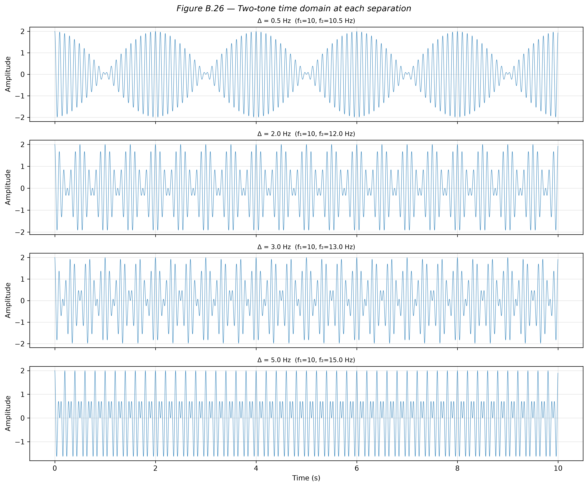

**$\Delta = 0.5$ Hz** (Figure B.27) - below all windows' resolution limits. All three show one merged band. No window can separate tones 0.5 Hz apart at $M = 256$ (1.024 s).

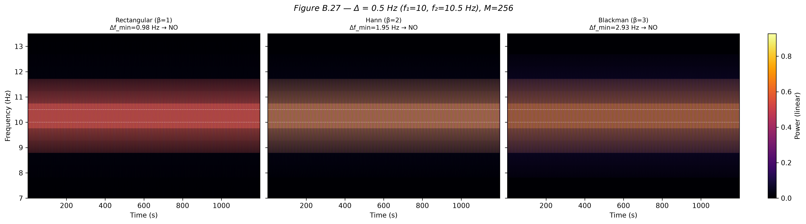

**$\Delta = 2.0$ Hz** (Figure B.28) - above Rectangular's limit (0.977 Hz), just above Hann's limit (1.953 Hz), below Blackman's limit (2.930 Hz). Rectangular clearly shows two lines; Hann shows two lines at the borderline; Blackman still shows one merged band.

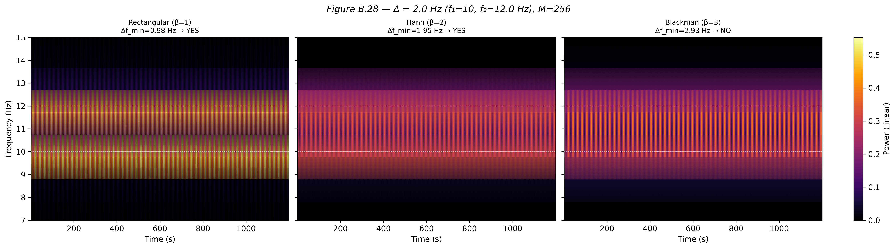

**$\Delta = 3.0$ Hz** (Figure B.29) - above Rectangular's and Hann's limits, just above Blackman's limit (2.930 Hz). All three windows now show two lines, with Blackman just barely splitting.

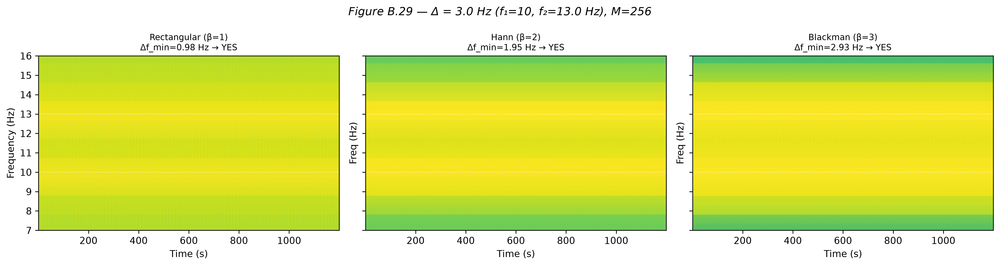

**$\Delta = 5.0$ Hz** (Figure B.30) - well above all limits. All three windows show two clean, well-separated horizontal lines.

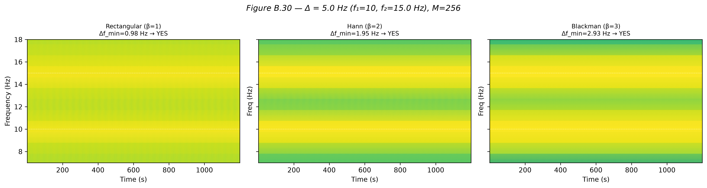

### Verification

**Table B.20 - Resolution test results**

| Separation $\Delta$ (Hz) | Rectangular ($\beta = 1$, limit 0.98 Hz) | Hann ($\beta = 2$, limit 1.95 Hz) | Blackman ($\beta = 3$, limit 2.93 Hz) |
| --- | --- | --- | --- |
| 0.5 | Merged (predicted: merged) | Merged (predicted: merged) | Merged (predicted: merged) |
| 2.0 | **Resolved** (predicted: resolved) | **Resolved** (predicted: borderline) | Merged (predicted: merged) |
| 3.0 | **Resolved** (predicted: resolved) | **Resolved** (predicted: resolved) | **Resolved** (predicted: borderline) |
| 5.0 | **Resolved** (predicted: resolved) | **Resolved** (predicted: resolved) | **Resolved** (predicted: resolved) |

Every cell matches Lab 3's prediction. The resolution limit $\Delta f_{\min} = \beta \cdot f_s / M$ correctly determines when two tones become distinguishable on the spectrogram.

### Conclusion

The resolution limit derived in Lab 3 from the Dirichlet kernel is confirmed visually on spectrograms. The one-line-to-two-lines transition occurs at exactly the predicted separation for each window: Rectangular at ~1 Hz, Hann at ~2 Hz, Blackman at ~3 Hz (all at $M = 256$, 1.024 s).

For EEG band separation: the narrowest standard band gap is δ-θ at 4 Hz. At $M = 256$ (1.024 s), even Blackman ($\Delta f_{\min} = 2.93$ Hz) resolves this comfortably. The window choice for EEG is therefore driven by **side-lobe suppression** (how much a strong rhythm leaks into adjacent bands), not by resolution - confirming the conclusion from Lab 3.

## B.6 - Lab 6: Autocorrelation of a Noisy Signal  *(↔ A.6)*

### Introduction

The DFT decomposes a signal into frequencies; autocorrelation detects periodicity by comparing a signal with shifted copies of itself. Section A.6.1 defined the autocorrelation $r[l]$ and showed that $r[0]$ equals the total signal energy (Equation (A.45)). Section A.6.2 established the Wiener-Khinchin theorem: the DFT of the autocorrelation is the power spectrum $|X[k]|^2$ (Equation (A.47)). Section A.6.3 showed that autocorrelation discards phase - it cannot tell you *when* a frequency occurs.

This lab tests:

- Autocorrelation detects a tone buried in noise that is invisible in the time domain.
- The Wiener-Khinchin theorem holds numerically: DFT of $r[l]$ equals $|X[k]|^2$ to machine precision.
- Two tones with different phases have identical autocorrelations - phase information is lost.

These results set up the WVD (Lab 7): the WVD recovers time-localization by computing an *instantaneous* autocorrelation at each time position.

### Setup

**Model signal.** Tone buried in noise (same as Lab 2, Equation (B.4)):

$$
x[n] = A \cos\!\left(\frac{2\pi f_0}{f_s} n\right) + \eta[n], \qquad \eta \sim \mathcal{N}(0, \sigma^2) \tag{B.31}
$$

with $f_0 = 10$ Hz, $A = 0.5$, $\sigma = 1.0$. Signal duration: 60 s ($N = 15\,000$).

**Autocorrelation from definition** (Equation (A.44)):

```python
import numpy as np
from src.common import FS, make_tone, make_noise, make_time_axis

def compute_autocorrelation(x):
    """r[l] = Σ x[n] x[n-l], positive lags only."""
    N = len(x)                                            # signal length
    r_full = np.correlate(x, x, mode="full")              # full autocorrelation
    r = r_full[N - 1:]                                    # positive lags [0, ..., N-1]
    lags = np.arange(len(r))                              # lag indices
    return lags, r
```

**Experiment A - Periodicity detection.** Compute $r[l]$ for the tone-in-noise signal. The expected period is $P = f_s / f_0 = 250/10 = 25$ samples (0.10 s).

```python
# --- Signal: tone buried in noise (same as Lab 2) ---
x_tone, _, _ = make_tone(10.0, A=0.5, duration=60.0)     # 10 Hz tone, amplitude 0.5
x_noise, _, _ = make_noise(sigma=1.0, duration=60.0, seed=42)  # white noise, σ=1.0
x = x_tone + x_noise                                     # combined: tone invisible by eye

# --- Autocorrelation ---
lags, r = compute_autocorrelation(x)                      # r[l] for l = 0, 1, ..., N-1
lag_time = lags / FS                                      # convert to seconds

# --- Check: r[0] must equal total energy (Equation A.45) ---
energy_time = np.sum(x**2)                                # energy computed from samples
energy_autocorr = r[0]                                    # energy from autocorrelation
# These must be exactly equal - r[0] = Σ x[n]²

# --- Periodicity: peaks at multiples of 25 samples (= 0.10 s = 1/f₀) ---
period_samples = int(FS / 10.0)                           # expected period: 25 samples
# r[25], r[50], r[75], ... should show periodic peaks
```

**Experiment B - Wiener-Khinchin.** Verify $|X[k]|^2 = \text{DFT}\{r[l]\}$ numerically.

```python
# --- Method 1: power spectrum directly from DFT ---
X = np.fft.fft(x)                                        # DFT of signal
power_direct = np.abs(X)**2                               # |X[k]|² - the power spectrum

# --- Method 2: power spectrum from autocorrelation ---
# Wiener-Khinchin says: DFT{r[l]} = |X[k]|²
# The circular autocorrelation is IFFT{|X[k]|²}:
r_periodic = np.fft.ifft(power_direct).real               # autocorrelation from spectrum
power_from_autocorr = np.abs(np.fft.fft(r_periodic))      # back to spectrum via DFT

# --- Compare: these must match to machine precision ---
max_error = np.max(np.abs(power_direct - power_from_autocorr))
rel_error = max_error / np.max(power_direct)
# rel_error should be ~1e-16 (floating point limit)
```

**Experiment C - Phase-blindness.** Two tones at the same frequency and amplitude, differing only in phase. If autocorrelation preserves phase, the results should differ. If it discards phase, they should be identical.

```python
# --- Two signals: same frequency (10 Hz), same amplitude (1.0), different phase ---
x1, _, t = make_tone(10.0, A=1.0, phi=0.0, duration=10.0)    # starts at +1 (peak)
x2, _, _ = make_tone(10.0, A=1.0, phi=np.pi, duration=10.0)  # starts at -1 (trough)
# x1 and x2 look different in time domain - they are mirror images

# --- Compute autocorrelation of each ---
lags1, r1 = compute_autocorrelation(x1)                   # autocorrelation of x1
lags2, r2 = compute_autocorrelation(x2)                   # autocorrelation of x2

# --- Compare: are they the same? ---
max_diff = np.max(np.abs(r1 - r2))                        # should be ~0 (machine precision)
# If max_diff ≈ 0: phase is lost. Autocorrelation cannot distinguish x1 from x2.

# --- Power spectra should also match ---
P1 = np.abs(np.fft.fft(x1))**2                           # |X1[k]|²
P2 = np.abs(np.fft.fft(x2))**2                           # |X2[k]|²
power_diff = np.max(np.abs(P1 - P2))                     # should also be ~0
```

Full source: `src/lab6_autocorrelation/lab6.py`.

### Parameters

**Table B.21 - Lab 6 parameters**

| Parameter | Experiment A & B | Experiment C |
| --- | --- | --- |
| $f_s$ (Hz) | 250 | 250 |
| Duration (s) | 60 | 10 |
| $N$ (samples) | 15 000 | 2 500 |
| $f_0$ (Hz) | 10.0 | 10.0 |
| Amplitude $A$ | 0.5 | 1.0 |
| Noise $\sigma$ | 1.0 | - |
| Seed | 42 | - |
| Phases $\phi$ | 0 | 0, $\pi$ |

### Results

**Experiment A - Periodicity detection.**

Figure B.31 shows the tone-in-noise signal in the time domain. The tone ($A = 0.5$) is invisible in the noise ($\sigma = 1.0$) - identical to Lab 2's observation.

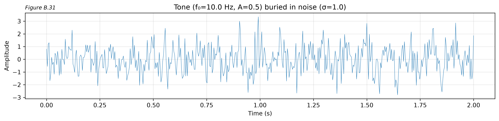

Figure B.32 shows the autocorrelation in two views. The top panel shows the full range - the lag-0 spike dominates ($r[0] = 17\,101$, equal to $\sum |x[n]|^2$). The bottom panel zooms into the first 10 periods. Periodic peaks emerge at lags of 25 samples (0.10 s) and multiples - marked by red dashed lines. The noise contributes only at lag 0; at all other lags, the tone's periodicity is exposed.

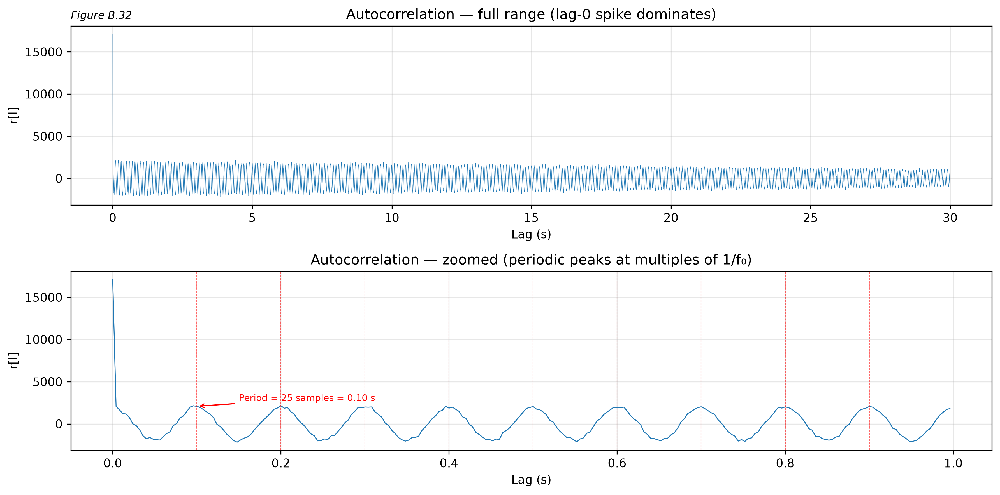

Verification: $r[0] = 17\,101.30$, $\sum |x[n]|^2 = 17\,101.30$. Exact match (Equation (A.45)).

**Experiment B - Wiener-Khinchin.**

Figure B.33 shows the power spectrum computed two ways: directly as $|X[k]|^2/N$, and via the DFT of the circular autocorrelation. The dual-stack (linear + dB) overlay shows perfect agreement - the two curves are indistinguishable. The dB scale is used to show that the match holds across the full dynamic range, not just at the peak.

![Figure B.33 - Wiener-Khinchin: |X[k]|² vs DFT{r[l]}](../../results/graphs/lab6/figure_B_33.png)

Maximum absolute error: $0.000000$. Relative error: $1.02 \times 10^{-16}$ (machine precision). The Wiener-Khinchin theorem (Equation (A.47)) is verified exactly.

**Experiment C - Phase-blindness.**

Figure B.34 shows two tones in the time domain: $\phi = 0$ (starts at peak) and $\phi = \pi$ (starts at trough). They are clearly different signals - the waveforms are mirror images.

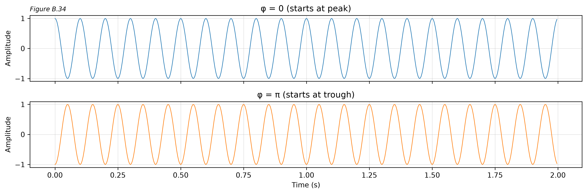

Figure B.35 shows their autocorrelations overlaid. The two curves are identical - the dashed line sits exactly on the solid line. Maximum difference: $3.04 \times 10^{-12}$ (machine precision).

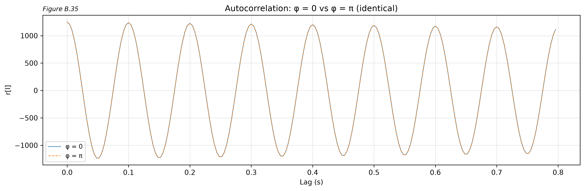

Phase is gone. The autocorrelation tells you *which* frequency is present (10 Hz) and *how strong* it is, but not *when it starts* or *what phase it has*. Their power spectra $|X[k]|^2$ are also identical (difference: $4.66 \times 10^{-10}$).

**Experiment D - Cross-correlation.** Autocorrelation compares a signal with itself. Cross-correlation (Section A.6.5) compares two different signals to detect shared structure.

The test signals use the same tone-in-noise formula from Lab 2 (Equation (B.4)):

$$x_1[n] = A\cos(2\pi f_0 n / f_s) + \eta_1[n], \qquad x_2[n] = A\cos(2\pi f_0 n / f_s) + \eta_2[n]$$

where $\eta_1$ and $\eta_2$ are independent white Gaussian noise ($\sigma = 1.0$) with different seeds (42 and 99). The shared tone ($A = 0.5$, $f_0 = 10$ Hz) is identical in both; only the noise differs. Two test cases: (1) shared 10 Hz tone with independent noise, (2) no shared component (10 Hz vs 20 Hz, independent noise).

```python
def compute_autocorrelation_cross(x, y):
    """Cross-correlation r_xy[l] = Σ x[n] y[n-l], positive lags only.
    Uses np.correlate - same as autocorrelation but with two different inputs."""
    N = len(x)                                             # signal length
    r_full = np.correlate(x, y, mode="full")               # full cross-correlation
    r = r_full[N - 1:]                                     # positive lags
    lags = np.arange(len(r))                               # lag indices
    return lags, r

# --- Case 1: shared 10 Hz tone, independent noise ---
x_tone, _, t = make_tone(10.0, A=0.5, duration=60.0)      # shared tone
x_noise1, _, _ = make_noise(sigma=1.0, duration=60.0, seed=42)   # noise 1
x_noise2, _, _ = make_noise(sigma=1.0, duration=60.0, seed=99)   # noise 2 (different seed)
x1 = x_tone + x_noise1                                    # tone + noise (seed 42)
x2 = x_tone + x_noise2                                    # same tone + different noise (seed 99)

lags, r_shared = compute_autocorrelation_cross(x1, x2)    # cross-correlation
rho_shared = np.corrcoef(x1, x2)[0, 1]                    # Pearson ρ (Equation A.59)

# --- Case 2: no shared component ---
x_tone20, _, _ = make_tone(20.0, A=0.5, duration=60.0)    # different frequency
x1_no = x_tone + x_noise1                                 # 10 Hz + noise
x2_no = x_tone20 + x_noise2                               # 20 Hz + different noise

lags, r_noshr = compute_autocorrelation_cross(x1_no, x2_no)
rho_noshr = np.corrcoef(x1_no, x2_no)[0, 1]               # should be ≈ 0
```

Figure B.36 shows the shared-tone case. The time domain (top) shows two noisy signals that roughly track each other - the shared 10 Hz tone is buried but present. The cross-correlation (bottom) reveals it: periodic peaks at 0.1 s intervals (= 1/10 Hz), with ρ = 0.1068. The shared tone survives cross-correlation; the independent noise cancels.

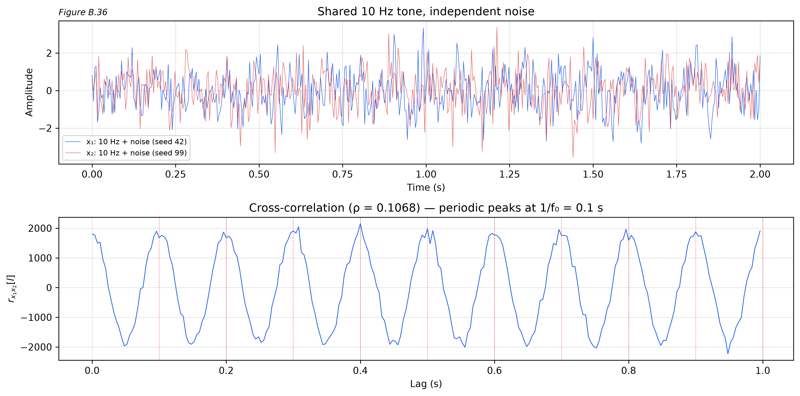

Figure B.37 shows the no-shared case. The time domain (top two panels) shows two unrelated signals - x₁ at 10 Hz and x₂ at 20 Hz, each with independent noise. The cross-correlation (bottom) is flat noise with no periodic structure, ρ = -0.0062 (effectively zero).

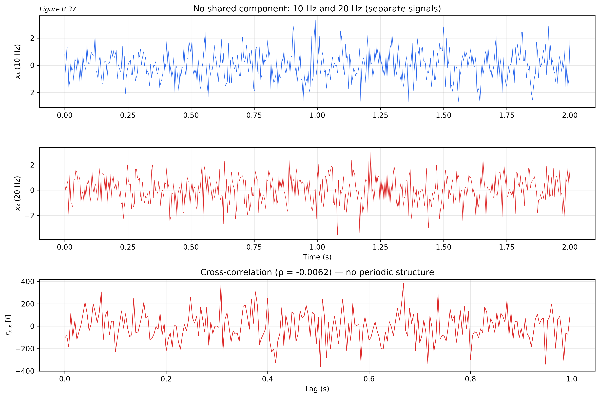

**Table B.23 - Cross-correlation Pearson coefficients**

| Signal pair | Shared component | ρ |
| --- | --- | --- |
| 10 Hz + noise₁ vs 10 Hz + noise₂ | Yes (same 10 Hz) | 0.1068 |
| 10 Hz + noise₁ vs 20 Hz + noise₂ | No | -0.0062 |
| noise₁ vs noise₂ (control) | No | -0.0066 |

Cross-correlation detects the shared 10 Hz component (ρ = 0.107, periodic peaks) that neither autocorrelation alone could prove was *shared* between the two signals. When no component is shared, the cross-correlation is indistinguishable from noise (ρ ≈ 0). This validates Equations (A.57)-(A.59) and provides the tool used in Volume C, Section C.4 to check for ECG contamination in EEG channels.

### Verification

**Table B.24 - Verification**

| Prediction (Volume A) | Measured | Confirmed? |
| --- | --- | --- |
| r[0] = total energy (Eq. A.54) | 17,101.30 = 17,101.30 | Yes (exact) |
| Periodic peaks at lag = k·25 samples (A.6.1) | Peaks at 25, 50, 75, ... samples | Yes |
| DFT of r[l] = power spectrum (Eq. A.56) | Relative error 1.02 × 10⁻¹⁶ | Yes (machine precision) |
| Different-phase tones → identical r[l] (A.6.3) | Difference 3.04 × 10⁻¹² | Yes (machine precision) |
| Shared tone → periodic cross-correlation (A.6.5) | ρ = 0.107, periodic peaks at 0.1 s | Yes |
| No shared tone → zero cross-correlation (A.6.5) | ρ = -0.006, no structure | Yes |

### Conclusion

Autocorrelation does exactly what Section A.6 predicts: it detects periodicity that noise hides (the 10 Hz tone, invisible in the time domain, produces clear periodic peaks in $r[l]$), and it is linked to the power spectrum by the Wiener-Khinchin theorem (verified to machine precision). But it discards phase - two signals that differ only in when they start produce identical autocorrelations.

Cross-correlation extends this to two signals: it detects shared structure (ρ = 0.107 for the shared 10 Hz case) and correctly reports zero when no structure is shared (ρ ≈ -0.006). This tool is used in Volume C, Section C.4 to verify whether auxiliary channels (ECG, EMG, EOG) contaminate the EEG.

The phase-blindness of autocorrelation is the limitation that the WVD addresses. The WVD (Lab 7) computes an *instantaneous* autocorrelation $r_n[l] = x[n + l/2] \cdot x^*[n - l/2]$ at each time position $n$, then takes the DFT over lag $l$. The Wiener-Khinchin theorem becomes a time-indexed family of Fourier pairs - one instantaneous power spectrum at each $n$. That is the bridge from here to the sharpest time-frequency representation.

## B.7 - Lab 7: The WVD and its Tradeoffs  *(↔ A.7)*

### Introduction

The STFT (Lab 4) recovers time-frequency localization but is bound by the Heisenberg uncertainty principle (Equation (A.49)). The Wigner-Ville Distribution (Section A.7) bypasses this limit by computing the DFT of the instantaneous autocorrelation (Equation (A.60)-(A.61)), achieving razor-sharp concentration for single-component signals. However, its quadratic nature introduces cross-terms for multi-component signals (Section A.7.3), and real-valued signals produce a DC self-ghost (Section A.7.5).

This lab verifies:

- The WVD achieves sharper resolution than the STFT on a single chirp.
- Multi-component signals generate cross-terms at the midpoint frequency.
- The analytic signal (Hilbert transform) removes the DC self-ghost.

### Setup

**Duration justification.** The WVD has O(N²) computational complexity. At N = 300,000 (1200 s), the computation would require ~90 billion operations. All signals use 2.0 s (N = 500) - standard for WVD demonstrations.

**Experiment A - Single chirp.** Linear chirp from 10 to 80 Hz (µ = 35 Hz/s):

```python
from src.common import FS, make_chirp, wigner_ville
from scipy.signal import stft as scipy_stft

x, _, t = make_chirp(10.0, 35.0, A=1.0, duration=2.0)     # 10-80 Hz chirp

# --- STFT for comparison ---
f_stft, t_stft, Zxx = scipy_stft(                         # scipy STFT
    x, FS, window="hann",
    nperseg=64,                                            # 64 samples (0.256 s)
    noverlap=32, nfft=512,
)
Sxx = np.abs(Zxx)**2                                      # power spectrogram

# --- WVD (analytic signal + interpolation handled internally) ---
wvd, t_wvd, f_wvd = wigner_ville(x, FS, n_fft=512)       # from src/common/wvd.py
```

**Experiment B - Chirp + tone (cross-terms).** Chirp (10-90 Hz, µ = 40 Hz/s) plus a stationary tone at 40 Hz:

```python
from src.common import make_tone

x_chirp, _, t = make_chirp(10.0, 40.0, A=1.0, duration=2.0)  # 10-90 Hz chirp
x_tone, _, _ = make_tone(40.0, A=1.0, duration=2.0)          # 40 Hz tone
x = x_chirp + x_tone                                         # combined signal

wvd, t_wvd, f_wvd = wigner_ville(x, FS, n_fft=512)          # WVD of combined
# Cross-term expected at midpoint: f_c(t) = (f_chirp(t) + 40) / 2
```

**Experiment C - Real vs analytic signal.** A 30 Hz tone analyzed as real-valued (DC ghost) vs analytic (clean):

```python
x, _, t = make_tone(30.0, A=1.0, duration=2.0)              # 30 Hz tone

# --- WVD of REAL signal (manual, bypasses analytic conversion) ---
N = len(x)
wvd_real = np.zeros((512, N))                                # allocate
for n in range(N):                                           # for each time sample
    L = min(n, N - 1 - n, 512 // 2 - 1)                     # max lag
    r = np.zeros(512, dtype=float)                           # autocorrelation vector
    r[0] = x[n] * x[n]                                      # lag 0
    for m in range(1, L + 1):                                # lags 1..L
        val = x[n + m] * x[n - m]                            # instantaneous autocorrelation
        r[m] = val                                           # positive lag
        r[512 - m] = val                                     # negative lag (symmetric)
    wvd_real[:, n] = 2.0 * np.real(np.fft.fft(r))           # DFT over lag

# --- WVD of ANALYTIC signal (standard function) ---
wvd_analytic, t_wvd, f_wvd = wigner_ville(x, FS, n_fft=512)
```

**WVD implementation** (`src/common/wvd.py`). The `wigner_ville` function converts to the analytic signal (Hilbert transform, Equation (A.70)), interpolates by 2 (to prevent frequency aliasing from the double-lag step), computes the instantaneous autocorrelation (Equation (A.60)) at each time sample, and takes the DFT over lag (Equation (A.61)):

```python
import numpy as np
from scipy.signal import hilbert, resample

def wigner_ville(x, fs, n_fft=None):
    """Compute the discrete WVD using analytic signal + interpolation-by-2."""
    z = hilbert(x)                                         # analytic signal (remove -f)
    N = len(z)
    if n_fft is None:
        n_fft = N

    z_interp = resample(z, 2 * N)                          # interpolate by 2 (prevent aliasing)
    wvd_interp = np.zeros((n_fft, 2 * N))                  # allocate WVD matrix

    for n in range(2 * N):                                 # for each time sample
        L = min(n, 2 * N - 1 - n, n_fft // 2 - 1)         # max lag
        r = np.zeros(n_fft, dtype=complex)                 # autocorrelation vector
        r[0] = z_interp[n] * np.conj(z_interp[n])          # lag 0
        for m in range(1, L + 1):                          # lags 1..L
            val = z_interp[n + m] * np.conj(z_interp[n - m])  # IAF (Eq. A.60)
            r[m] = val                                     # positive lag
            r[n_fft - m] = np.conj(val)                    # negative lag (Hermitian)
        wvd_interp[:, n] = 2.0 * np.real(np.fft.fft(r))   # DFT over lag (Eq. A.61)

    wvd_dec = wvd_interp[:, ::2]                           # decimate back to original rate
    freqs = np.linspace(0, fs / 2, n_fft // 2)             # frequency axis
    t = np.arange(N) / fs                                  # time axis
    return wvd_dec[:n_fft // 2, :], t, freqs
```

Full source: `src/lab7_wvd/lab7.py`, `src/common/wvd.py`.

### Parameters

**Table B.25 - Lab 7 parameters**

| Parameter | Experiment A | Experiment B | Experiment C |
| --- | --- | --- | --- |
| $f_s$ (Hz) | 250 | 250 | 250 |
| Duration (s) | 2.0 | 2.0 | 2.0 |
| $N$ (samples) | 500 | 500 | 500 |
| $N_f$ (FFT bins) | 512 | 512 | 512 |
| Chirp $f_0$ (Hz) | 10 | 10 | - |
| Chirp $f_{\text{end}}$ (Hz) | 80 | 90 | - |
| Tone (Hz) | - | 40 | 30 |
| STFT window | Hann, 64 (0.256 s) | Hann, 64 (0.256 s) | - |
| Analytic signal | Yes (automatic) | Yes (automatic) | Real vs analytic |

### Results

**Experiment A - Single chirp.**

Figure B.39 shows the chirp in the time domain.

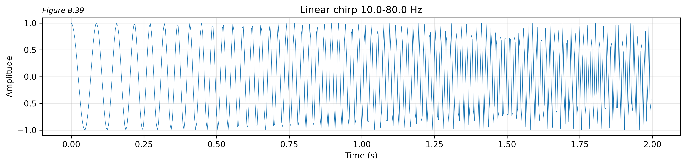

Figure B.40 compares the STFT (left) and WVD (right) in dual-stack (linear top, dB bottom). The STFT shows a thick, blurred diagonal - the Hann window ($M = 64$, 0.256 s) smears the trajectory by $\Delta f = 2 \times 250/64 = 7.8$ Hz. The WVD shows a razor-sharp diagonal tracking the instantaneous frequency $f_{\text{inst}}(t) = 10 + 35t$ Hz exactly. The dB panels reveal the contrast: the STFT has horizontal striping from the window's side lobes; the WVD has only minor ripples near the edges.


**Experiment B - Cross-terms.**

Figure B.41 shows the chirp + tone signal in the time domain.

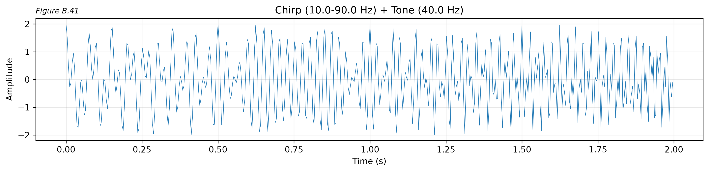

Figure B.42 compares the STFT and WVD. The STFT (left) shows a clean superposition: blurred diagonal (chirp) and horizontal line (tone) with no interference. The WVD (right) shows both components sharply, but with a strong oscillating cross-term at the midpoint frequency:

- **Location:** $f_c(t) = (f_{\text{chirp}}(t) + 40) / 2 = 25 + 20t$ Hz - exactly halfway between chirp and tone
- **Oscillation:** increases in frequency as the chirp moves away from the tone, matching $|f_{\text{chirp}}(t) - 40|$ Hz

The dB panel makes the cross-term's oscillatory structure especially visible - concentric ripples emanating from the midpoint trajectory.


**Experiment C - Real vs analytic signal.**

Figure B.43 shows the 30 Hz tone in the time domain.

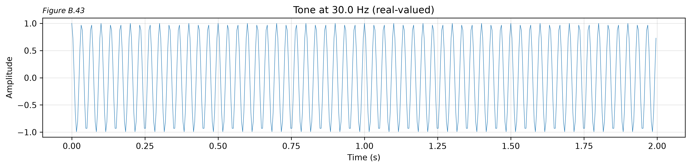

Figure B.44 compares the WVD of the real signal (left) vs the analytic signal (right). The real-signal WVD is corrupted by heavy interference across the entire plane - the DC self-ghost from cross-terms between $+30$ Hz and $-30$ Hz, oscillating at $2 \times 30 = 60$ Hz. The analytic-signal WVD shows a clean horizontal line at 30 Hz with no ghost.


### Verification

**Table B.26 - Lab 7 verification**

| Prediction (Volume A) | Measured | Confirmed? |
| --- | --- | --- |
| WVD of chirp = sharp peak along $f_{\text{inst}}$ (Eq. A.65-A.66) | Razor-sharp diagonal, no blur | Yes |
| Cross-term at midpoint $(f_1+f_2)/2$ (Eq. A.69) | Midpoint trajectory $25 + 20t$ Hz | Yes |
| Cross-term oscillates at $\|f_1 - f_2\|$ (Eq. A.69) | Oscillation frequency increases with distance | Yes |
| Real signal: DC ghost at 0 Hz, oscillating at $2f_0$ (A.7.5) | Heavy 0 Hz band oscillating at 60 Hz | Yes |
| Analytic signal removes DC ghost (Eq. A.70) | Clean 30 Hz line, ghost eliminated | Yes |

### Conclusion

The WVD achieves sub-Heisenberg resolution for a single chirp - the diagonal is razor-sharp where the STFT is blurred. But the moment a second component is added, cross-terms corrupt the representation with oscillating artifacts at the midpoint frequency. The DC self-ghost from real-valued signals is removed by the analytic signal (Hilbert transform), confirming Section A.7.5.

The cross-terms cannot be removed by the analytic signal - they arise from the interaction between two genuine positive-frequency components. To suppress them while preserving the WVD's sharpness, independent smoothing is needed. That is the subject of Lab 8.
## B.8 - Lab 8: The SPWVD and its Tradeoffs  *(↔ A.8)*

### Introduction

Lab 7 showed that the WVD achieves razor-sharp resolution but is unusable for multi-component signals due to cross-terms. The Smoothed Pseudo Wigner-Ville Distribution (Section A.8) addresses this with two independent smoothing windows: a lag window $h[m]$ that smooths in frequency (Equation (A.71)), and a time window $g[p]$ that smooths in time (Equation (A.72)). The PWVD uses only $h$; the SPWVD uses both.

This lab verifies:

- The PWVD suppresses frequency-oscillating ghosts but not time-oscillating ones (A.8.2).
- The SPWVD suppresses both types of ghosts.
- The two windows $h$ and $g$ act as independent knobs, allowing time and frequency resolution to be traded separately (A.8.4).
- The duality from Table A.12: PWVD works for impulse-type ghosts, SPWVD needed for tone-type ghosts.

### Setup

**Duration:** 2.0 s (same as Lab 7 - WVD is O(N²)).

**Experiment A - WVD → PWVD → SPWVD progression.** Same chirp + tone signal from Lab 7 Experiment B (chirp 10-90 Hz, tone at 40 Hz). Cross-terms are time-oscillating (components separated in frequency, per Table A.12).

```python
from src.common import make_chirp, make_tone, wigner_ville, smoothed_pseudo_wigner_ville
from src.common.windows import hann

x_chirp, _, t = make_chirp(10.0, 40.0, A=1.0, duration=2.0)  # 10-90 Hz chirp
x_tone, _, _ = make_tone(40.0, A=1.0, duration=2.0)          # 40 Hz tone
x = x_chirp + x_tone                                         # combined signal

# 1. Raw WVD
wvd_raw, t_wvd, f_wvd = wigner_ville(x, FS, n_fft=512)

# 2. PWVD (lag window only, no time smoothing)
h_lag = hann(51)                                              # lag window: Hann 51 (0.204 s)
g_none = np.array([1.0])                                     # no time smoothing
pwvd, _, _ = smoothed_pseudo_wigner_ville(x, FS, h=h_lag, g=g_none, n_fft=512)

# 3. SPWVD (both windows)
g_time = hann(15)                                            # time window: Hann 15 (0.060 s)
spwvd, t_sp, f_sp = smoothed_pseudo_wigner_ville(x, FS, h=h_lag, g=g_time, n_fft=512)
```

**Experiment B - Two-knob sweep.** Same signal, two extreme SPWVD tunings:

```python
# Case 1: strong frequency smoothing, weak time
h1 = hann(101)                                               # long lag (0.404 s)
g1 = hann(5)                                                 # short time (0.020 s)
spwvd1, _, _ = smoothed_pseudo_wigner_ville(x, FS, h=h1, g=g1, n_fft=512)

# Case 2: weak frequency smoothing, strong time
h2 = hann(25)                                                # short lag (0.100 s)
g2 = hann(31)                                                # long time (0.124 s)
spwvd2, _, _ = smoothed_pseudo_wigner_ville(x, FS, h=h2, g=g2, n_fft=512)
```

**Experiment C - Frequency-oscillating ghosts (two impulses).** Two broadband pulses separated in time produce frequency-oscillating cross-terms (the other half of the duality from Table A.12). The PWVD (lag window only) should suppress these - demonstrating that the PWVD IS useful when the ghosts oscillate in the axis it smooths.

```python
from src.common import make_transient

# Two impulses at t = 0.5 s and t = 1.5 s (Δt = 1.0 s)
x1, _, t = make_transient(int(0.5*FS), int(0.02*FS),        # impulse 1 (baseband)
                           f0=0.0, A=1.0, duration=2.0)
x2, _, _ = make_transient(int(1.5*FS), int(0.02*FS),        # impulse 2 (baseband)
                           f0=0.0, A=1.0, duration=2.0)
x = x1 + x2                                                 # two impulses

# Cross-term: frequency-oscillating at midpoint t_c = 1.0 s
wvd_raw, _, _ = wigner_ville(x, FS, n_fft=512)              # raw WVD: ghost present
pwvd, _, _ = smoothed_pseudo_wigner_ville(x, FS, h=h_lag, g=g_none, n_fft=512)  # PWVD: ghost gone
spwvd, _, _ = smoothed_pseudo_wigner_ville(x, FS, h=h_lag, g=g_time, n_fft=512)  # SPWVD: also gone
```

Full source: `src/lab8_spwvd/lab8.py`.

### Parameters

**Table B.27 - Lab 8 parameters**

| Parameter | Experiment A | Experiment B | Experiment C |
| --- | --- | --- | --- |
| $f_s$ (Hz) | 250 | 250 | 250 |
| Duration (s) | 2.0 | 2.0 | 2.0 |
| Signal | Chirp + tone (Lab 7) | Chirp + tone (Lab 7) | Two impulses |
| Ghost type | Time-oscillating | Time-oscillating | Frequency-oscillating |
| $h$ (lag window) | Hann 51 (0.204 s) | 101/25 (0.404/0.100 s) | Hann 51 (0.204 s) |
| $g$ (time window) | None / Hann 15 (0.060 s) | 5/31 (0.020/0.124 s) | None / Hann 15 (0.060 s) |

### Results

**Experiment A - Progression.**

Figure B.45 shows the chirp + tone signal in the time domain (same as Lab 7 Figure B.41).

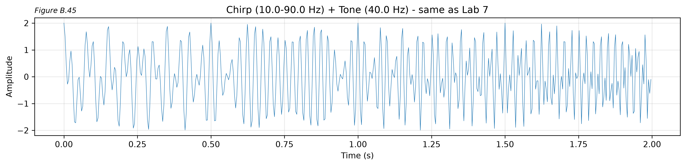

Figure B.46 shows the WVD → PWVD → SPWVD progression in dual-stack (linear left, dB right):


- **Raw WVD (top):** sharp chirp diagonal and tone horizontal line, but the midpoint cross-term dominates - oscillating concentric ripples between the two components.
- **PWVD (middle):** the lag window $h$ = Hann 51 (0.204 s) smooths the frequency axis. The frequency structure is slightly blurred, but the **time-oscillating cross-term survives** - the oscillations along the time axis are still clearly visible. This confirms Section A.8.2: the PWVD smooths only in frequency, so time-oscillating ghosts pass through unaffected.
- **SPWVD (bottom):** the time window $g$ = Hann 15 (0.060 s) smooths the time axis. The time-oscillating cross-term is **suppressed**. The chirp and tone remain sharp and clearly separated. The SPWVD achieves what neither the raw WVD nor the PWVD could: sharp components without cross-term corruption.

**Experiment B - Two-knob sweep.**

Figure B.47 shows two extreme SPWVD tunings:

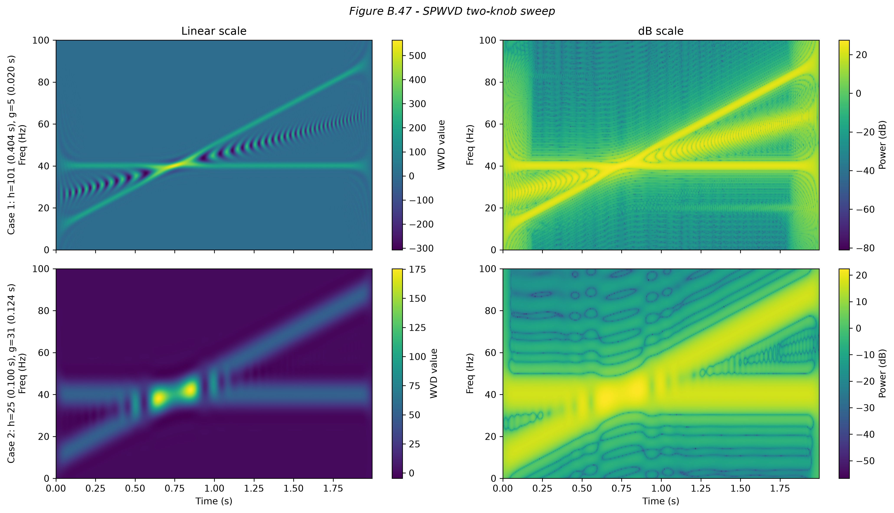

- **Case 1 (h=101, g=5; top):** long lag window provides very high frequency resolution - the 40 Hz tone is a thin line. But the short time window (0.020 s) fails the minimum smoothing rule (Equation (A.73): $T_g \geq 1/\Delta f$). The difference frequency between chirp and tone ranges from 10 to 50 Hz, requiring $T_g \geq 0.10$ s. Since 0.020 s < 0.10 s, time-oscillating cross-terms survive.
- **Case 2 (h=25, g=31; bottom):** long time window (0.124 s > 0.10 s) satisfies the minimum smoothing rule - time-oscillating cross-terms are **fully suppressed**. But the short lag window blurs the frequency axis - the tone is smeared into a thick band.

This demonstrates the independent control: $h$ affects only frequency resolution, $g$ affects only time resolution. Unlike the STFT where one window controls both.

**Experiment C - Frequency-oscillating ghosts.**

Figure B.48 shows two broadband impulses in the time domain at t = 0.5 s and t = 1.5 s.

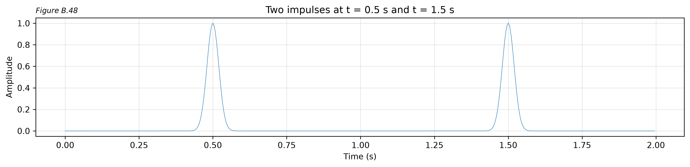

Figure B.49 shows the WVD → PWVD → SPWVD progression for the two-impulse signal:


- **Raw WVD (top):** two vertical stripes (the impulses) with a frequency-oscillating cross-term at the midpoint t = 1.0 s - visible as ripples oscillating across the frequency axis in the dB panel.
- **PWVD (middle):** the lag window $h$ smooths in frequency - the **frequency-oscillating ghost is suppressed**. This is the half of the duality that Experiment A couldn't show: the PWVD DOES work when the ghosts oscillate in the axis it smooths.
- **SPWVD (bottom):** both windows - same clean result as PWVD (the time window has nothing additional to suppress here since there are no time-oscillating ghosts).

This completes the duality from Table A.12:

**Table B.28 - Cross-term duality verified**

| Signal | Ghost type | PWVD (h only) | SPWVD (h + g) |
| --- | --- | --- | --- |
| Chirp + tone (Exp A) | Time-oscillating | Fails - ghost survives | Succeeds - ghost suppressed |
| Two impulses (Exp C) | Frequency-oscillating | Succeeds - ghost suppressed | Succeeds - ghost suppressed |

### Verification

**Table B.29 - Lab 8 verification**

| Prediction (Volume A) | Measured | Confirmed? |
| --- | --- | --- |
| PWVD fails on time-oscillating ghosts (A.8.2) | Chirp+tone cross-term survives PWVD (Fig. B.46 middle) | Yes |
| PWVD succeeds on frequency-oscillating ghosts (A.8.1) | Two-impulse cross-term suppressed by PWVD (Fig. B.49 middle) | Yes |
| SPWVD suppresses both ghost types (A.8.3) | Both signals clean in SPWVD (Figs. B.46, B.49 bottom) | Yes |
| Minimum smoothing rule $T_g \geq 1/\Delta f$ (Eq. A.73) | Case 1 (g=5, 0.020 s) fails; Case 2 (g=31, 0.124 s) succeeds | Yes |
| $h$ and $g$ are independent knobs (A.8.4) | Case 1 vs Case 2 show opposite resolution tradeoffs | Yes |

### Conclusion

The SPWVD is the usable form of the WVD. It suppresses both time-oscillating and frequency-oscillating cross-terms through two independent smoothing windows, while preserving sharper resolution than the STFT. The two knobs - lag window $h$ (frequency axis) and time window $g$ (time axis) - give explicit, independent control over the resolution-ghost tradeoff.

The duality is confirmed: the PWVD alone is sufficient when ghosts oscillate in frequency (impulse-type signals) but fails when they oscillate in time (tone-type signals). The SPWVD handles both, at the cost of choosing window lengths that satisfy the minimum smoothing rule (Equation (A.73)).

This is the final tool in the Volume B progression: DFT → windowed DFT → STFT → autocorrelation → WVD → SPWVD. Volume C applies the SPWVD to a selected clean segment of the neonatal EEG recording, with the window parameters tuned for the delta-band burst structure identified in C.3.

# Appendix B1 - The Symmetric ($M-1$) Window Convention
## AB1.1 The Symmetric Cosine-Sum

In the symmetric convention, the cosine-sum formula divides by $M-1$:

$$
w_{\text{sym}}[n] = \sum_{p=0}^{P} (-1)^p \, a_p \cos\!\left(\frac{2\pi p n}{M-1}\right), \qquad n = 0, 1, \ldots, M-1 \tag{AB1.1}
$$

For Hann ($a_0 = 0.5, a_1 = 0.5$):

$$
w_{\text{sym}}[n] = 0.5 - 0.5\cos\!\left(\frac{2\pi n}{M-1}\right) \tag{AB1.2}
$$

Edge values: $w[0] = 0.5 - 0.5\cos(0) = 0$ and $w[M-1] = 0.5 - 0.5\cos(2\pi) = 0$. Both endpoints are **exactly** zero - the window is symmetric.

## AB1.2 The DFT of the Symmetric Hann Window

Expanding via Euler:

$$
W_{\text{sym}}(\omega) = \sum_{n=0}^{M-1} w_{\text{sym}}[n] \, e^{-j\omega n} = 0.5 \sum_{n=0}^{M-1} e^{-j\omega n} - 0.25 \sum_{n=0}^{M-1} e^{-j(\omega - 2\pi/(M-1)) n} - 0.25 \sum_{n=0}^{M-1} e^{-j(\omega + 2\pi/(M-1)) n} \tag{AB1.3}
$$

Each sum is a geometric series. The shift is $2\pi/(M-1)$, **not** $2\pi/M$.

**The phase simplification.** Each geometric series gives:

$$
S_p = e^{-j(\omega - 2\pi p/(M-1))(M-1)/2} \cdot \frac{\sin((\omega - 2\pi p/(M-1))M/2)}{\sin((\omega - 2\pi p/(M-1))/2)}
$$

The phase exponent for the $p$-shifted term:

$$
\frac{2\pi p}{M-1} \cdot \frac{M-1}{2} = \pi p \qquad \text{(AB1.4)}
$$

This is **exactly** $\pi p$ - an integer multiple of $\pi$. Therefore:

$$
e^{j\pi p} = (-1)^p \qquad \text{(AB1.5)}
$$

No residual phase. The $(-1)^p$ from the phase cancels with the $(-1)^p$ from the cosine-sum alternation in Equation (AB1.1), giving $(-1)^{2p} = 1$. All phase factors vanish.

**The result is purely real:**

$$
W_{\text{sym}}(\omega) = e^{-j\omega(M-1)/2} \left[\frac{0.5\sin(\omega M/2)}{\sin(\omega/2)} + \frac{0.25\sin((\omega - 2\pi/(M-1))M/2)}{\sin((\omega - 2\pi/(M-1))/2)} + \frac{0.25\sin((\omega + 2\pi/(M-1))M/2)}{\sin((\omega + 2\pi/(M-1))/2)}\right] \tag{AB1.6}
$$

The common phase $e^{-j\omega(M-1)/2}$ does not affect the magnitude. The bracket is **entirely real** - a sum of $\sin/\sin$ terms with no complex exponentials.

**The magnitude is simply the absolute value of the bracket:**

$$
\frac{|W_{\text{sym}}(\omega)|}{M} = \frac{1}{M}\left|\frac{0.5\sin(\omega M/2)}{\sin(\omega/2)} + \frac{0.25\sin((\omega - 2\pi/(M-1))M/2)}{\sin((\omega - 2\pi/(M-1))/2)} + \frac{0.25\sin((\omega + 2\pi/(M-1))M/2)}{\sin((\omega + 2\pi/(M-1))/2)}\right| \tag{AB1.7}
$$

This is the formula used in the Desmos verification. No phase approximation, no "magnitude of a complex bracket" - just real numbers inside an absolute value.

**What we lose.** The numerators of the three terms are **not** the same:

- Term 1: $\sin(\omega M/2)$
- Term 2: $\sin((\omega - 2\pi/(M-1))M/2) = \sin(\omega M/2 - \pi M/(M-1))$
- Term 3: $\sin((\omega + 2\pi/(M-1))M/2) = \sin(\omega M/2 + \pi M/(M-1))$

Since $M/(M-1) = 1 + 1/(M-1) \neq 1$ (not an integer), $\sin(\omega M/2 - \pi M/(M-1)) \neq \pm\sin(\omega M/2)$. The shared-numerator factorization from Lab 3 (Equation (B.19c)) does not work. Each term keeps its own numerator.

## AB1.3 Convergence as $M \to \infty$

As $M$ grows:

$$
\frac{M}{M-1} = 1 + \frac{1}{M-1} \xrightarrow{M \to \infty} 1 \tag{AB1.8}
$$

The shift $2\pi/(M-1) \to 2\pi/M$, and the symmetric numerators converge to the periodic ones:

$$
\sin\!\left(\frac{\omega M}{2} - \frac{\pi M}{M-1}\right) \xrightarrow{M \to \infty} \sin\!\left(\frac{\omega M}{2} - \pi\right) = -\sin\!\left(\frac{\omega M}{2}\right) \tag{AB1.9}
$$

In the limit, the shared-numerator factorization becomes exact and the two conventions give identical results.

**Finite-$M$ error.** The difference between the two conventions at finite $M$:

$$
\epsilon = \frac{M}{M-1} - 1 = \frac{1}{M-1} \tag{AB1.10}
$$

**Table AB1.1 - M vs M-1 convergence**

| $M$ | $\epsilon$ | Edge value difference | Peak side-lobe difference |
| --- | --- | --- | --- |
| 32 | 0.0323 | 0.0048 | 0.8 dB |
| 64 | 0.0159 | 0.0024 | 0.4 dB |
| 128 | 0.0079 | 0.0012 | 0.2 dB |
| 256 | 0.0039 | 0.00015 | 0.11 dB |
| 1024 | 0.00098 | 0.000009 | 0.03 dB |

At $M = 256$ (the EEG-typical window length), the difference is 0.11 dB - invisible in any practical measurement. At $M = 1024$, it drops to 0.03 dB.

## AB1.4 Summary

**Table AB1.2 - Convention comparison**

| | Periodic ($M$, Lab 3) | Symmetric ($M-1$, this appendix) |
| --- | --- | --- |
| Edge values | $w[0] = 0$, $w[M-1] \approx 0$ | $w[0] = w[M-1] = 0$ exactly |
| Phase in DFT | Residual $e^{-j\pi p/M}$ per term | All phases cancel to 1 |
| Bracket is | Complex (magnitude computed numerically) | Purely real (absolute value suffices) |
| Shared numerator | Yes - $1 - e^{-j\omega M}$ factors out | No - each term has its own numerator |
| Libraries | `scipy.signal.spectrogram`, `get_window(fftbins=True)` | `numpy.hanning`, `scipy.signal.windows.hann(sym=True)` |
| Convergence | Both converge to the same limit as $M \to \infty$ | |

The two conventions are two finite-sample approximations of the same continuous window, approaching each other as $M$ grows. Lab 3 uses periodic for the shared-numerator factorization and scipy compatibility. This appendix provides the symmetric derivation for completeness and confirms the convergence.

# Appendix B2 - CV of the Six Signal Archetypes

### Introduction

Section A.4.1 established that the coefficient of variation (CV = std / mean) of DFT bin power equals 1.0 for an exponential distribution (white Gaussian noise), and that deterministic signals with concentrated spectral features produce CV >> 1. This appendix computes CV empirically for all six signal archetypes from Appendix A, creating a reference table for interpreting CV values on real EEG data (Volume C, Section C.4).

### Setup

Each archetype is generated at $f_s = 250$ Hz, duration = 60 s, using the standard signal generators from `src/common/signals.py`. The DFT is computed, and CV is calculated from the positive-frequency bin powers:

```python
from src.common import make_tone, make_mixed_tones, make_chirp, make_transient, make_noise

def compute_cv(x, fs=250):
    X = np.fft.fft(x)                                     # full DFT
    freqs = np.fft.fftfreq(len(x), d=1/fs)                # frequency axis
    pos = freqs > 0                                       # positive frequencies (exclude DC)
    power = np.abs(X[pos])**2                              # bin powers |X[k]|²
    cv = np.std(power) / np.mean(power)                    # CV = std / mean
    return cv

# Six archetypes
x_tone, _, _ = make_tone(10.0, A=1.0, duration=60.0)      # single tone
x_mixed, _, _ = make_mixed_tones([10.0, 20.0], duration=60.0)  # mixed tones
x_chirp, _, _ = make_chirp(5.0, 0.333, duration=60.0)     # chirp (5-25 Hz)
x_trans, _, _ = make_transient(int(30*250), int(0.5*250),  # transient (0.5 s burst)
                                f0=10.0, A=3.0, duration=60.0)
x_noise, _, _ = make_noise(sigma=1.0, duration=60.0)       # white noise
x_tn = make_tone(10.0, A=0.5, duration=60.0)[0] + \
       make_noise(sigma=1.0, duration=60.0)[0]              # tone + noise
```

Full source: `src/appendix_b2/cv_archetypes.py`.

### Parameters

**Table AB2.1 - Appendix B2 parameters**

| Parameter | Value |
| --- | --- |
| $f_s$ (Hz) | 250 |
| Duration (s) | 60 |
| $N$ (samples) | 15 000 |
| Tone frequency | 10 Hz (single), 10 + 20 Hz (mixed) |
| Chirp | 5-25 Hz, µ = 0.333 Hz/s |
| Transient | 0.5 s Gaussian burst at 10 Hz, center t = 30 s |
| Noise | σ = 1.0, seed = 42 |
| Tone + noise | A = 0.5 (tone), σ = 1.0 (noise) |

### Results

Figure AB2.1 shows the time domain (left, first 2 seconds) and power spectrum (right, dB) for each archetype:

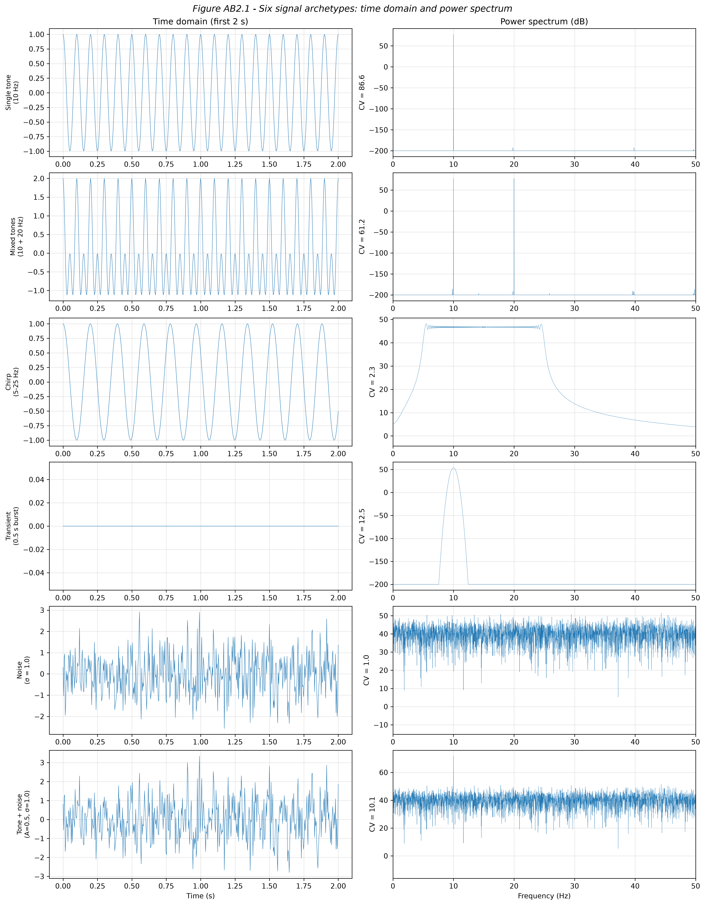

Figure AB2.2 shows the CV values as a bar chart, with the CV = 1.0 reference line (exponential / noise):

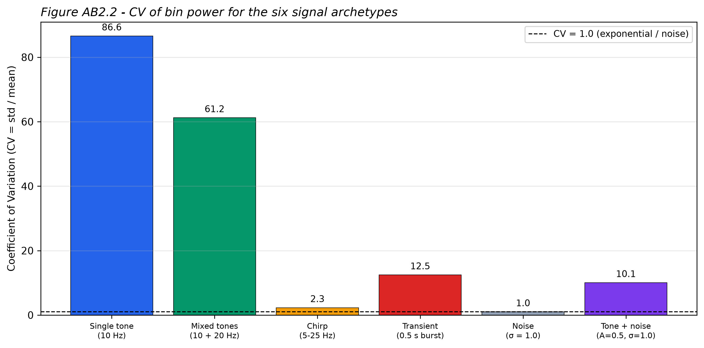

**Table AB2.2 - CV of the six signal archetypes**

| Archetype | CV | Interpretation |
| --- | --- | --- |
| Single tone (10 Hz) | 86.6 | All energy in 1 bin - CV is huge |
| Mixed tones (10 + 20 Hz) | 61.2 | Energy in 2 bins - still very high |
| Chirp (5-25 Hz) | 2.3 | Energy spread across many bins (20 Hz sweep) - moderate |
| Transient (0.5 s burst) | 12.5 | Energy concentrated in time and frequency - high |
| Noise (σ = 1.0) | 1.01 | Energy uniform across all bins - exponential confirmed |
| Tone + noise (A=0.5, σ=1.0) | 10.1 | Mix of concentrated tone and spread noise |

### Verification

| Prediction (Volume A) | Measured | Confirmed? |
| --- | --- | --- |
| Noise: CV = 1.0 (exponential, A.4.1) | CV = 1.01 | Yes |
| Deterministic signals: CV >> 1 (A.4.1) | Tone: 86.6, mixed: 61.2, transient: 12.5 | Yes |
| More concentrated spectrum → higher CV | Tone (1 bin) > mixed (2 bins) > transient > chirp > noise | Yes |

### Conclusion

CV measures **spectral concentration**, not signal presence. It distinguishes narrowband features (energy in a few bins, CV $\gg$ 1) from broadband backgrounds (energy spread across many bins, CV $\approx$ 1). The scale spans two orders of magnitude: from noise (1.0) to a single tone (86.6).

The chirp (CV = 2.3) reveals the limitation: it is a deterministic signal, clearly not noise, but its energy is spread across a 20 Hz sweep rather than concentrated in a few bins. CV cannot distinguish a chirp from slightly non-Gaussian noise. This means CV answers the question "is there a **narrowband oscillation** here?" - not the broader question "is there any signal here?" For EEG, this is the right question: the clinical features of interest (alpha rhythms, sleep spindles, delta oscillations) are narrowband, and CV detects their presence or absence reliably.

This table provides the reference for Volume C, Section C.4: when CV = 1.11 is measured on the alpha band of real EEG, it is closest to noise (1.01) and far from any narrowband archetype (tone: 86.6, transient: 12.5, tone+noise: 10.1). The alpha band contains no narrowband oscillation - consistent with an immature neonatal cortex that has not yet developed alpha rhythms.
