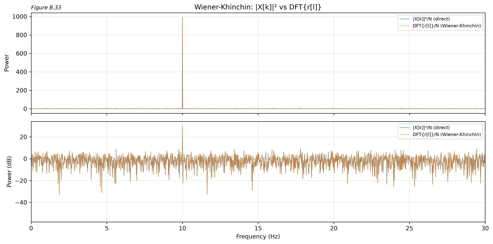

# From the DFT to the SPWVD
## Time-Frequency Analysis Applied to Neonatal EEG

**Authors:** Nguyen Duc Hung - 20233960, Bui Phuong Duy - 23233957, Tran Viet Bach - 23233954

Digital Biosignal Processing - Final Report

---

## Three-Volume Structure

- **Volume A** - Theory: DFT, windowing, STFT, autocorrelation, WVD, SPWVD.
- **Volume B** - Eight laboratories validating each theory section on model signals.
- **Volume C** - Application to real neonatal EEG (19 minutes, 24 channels).

**The arc:** each tool addresses a specific limitation of the previous one.

DFT *(no time)* $\rightarrow$ STFT *(Heisenberg-limited)* $\rightarrow$ WVD *(cross-terms)* $\rightarrow$ SPWVD *(controllable)*

---

## The DFT and Its Frequency Bins

$$X[k] = \sum_{n=0}^{N-1} x[n] \, e^{-j2\pi kn/N} \qquad \text{(A.5)}$$

- The bin spacing $\Delta f = f_s / N$ is fixed by the signal length.
- **On-bin** frequencies ($f$ is a multiple of $\Delta f$) are captured perfectly in one bin.
- **Off-bin** frequencies leak energy across all bins (spectral leakage).
- Zero-padding interpolates the spectrum but **does not improve resolution**.

---

## Windowing and the Dirichlet Kernel

{ width=90% }
**Figure B.14** - Window spectra: Rectangular, Hann, Hamming, Blackman.

- The rectangular window produces the Dirichlet kernel with main lobe width $= 4\pi/M$.
- Cosine-sum windows trade a wider main lobe for suppressed side lobes.
- First side-lobe levels: $-13$ dB (Rect), $-32$ dB (Hann), $-43$ dB (Hamming), $-58$ dB (Blackman).

---

## Spectral Statistics: When Is a Peak Real?

$$P_{fa} = e^{-\gamma} \qquad \text{(A.37)}$$

- The bin power of white noise follows an **exponential distribution** (CV = 1.0).
- A spectral peak is genuine only if it exceeds the noise floor by a threshold set by $P_{fa}$.
- **Welch averaging** reduces variance ($\sigma \propto 1/\sqrt{K}$) at the cost of frequency resolution.
- Not every spectral peak represents a signal. Statistics provide the decision rule.

---

## The STFT and Heisenberg Uncertainty

$$\Delta t \cdot \Delta f \geq \beta \qquad \text{(A.49)}$$

- The STFT adds a **time axis** by windowing the signal before the DFT.
- A short window ($M$ small) provides good time resolution but poor frequency resolution.
- A long window ($M$ large) provides good frequency resolution but poor time resolution.
- **Both cannot be achieved simultaneously.** The window length is the single design knob.
- For the Hann window: $\beta = 2$, so $\Delta t \cdot \Delta f \geq 2$.

---

## The WVD: Perfect Resolution, Fatal Flaw

$$W_x[n, k] = \sum_{m} R_x[n, m] \, e^{-j2\pi km/N_f} \qquad \text{(A.61)}$$

where $R_x[n, m] = z[n+m] \cdot z^*[n-m]$ is the instantaneous autocorrelation.

- A single chirp produces a **razor-sharp diagonal** that bypasses Heisenberg.
- Multiple components generate **cross-terms** at the midpoint between every pair.
- Cross-terms oscillate and can be **as energetic as the real components**.
- The analytic signal (Hilbert transform) removes the DC self-ghost.

---

## The SPWVD: Two Independent Smoothing Knobs

$$\text{SPWVD}_x[n, k] = \sum_m h[m] \left(\sum_p g[p] \, z[n\!+\!p\!+\!m] \, z^*[n\!+\!p\!-\!m]\right) e^{-j2\pi km/N_f} \quad \text{(A.72)}$$

- **Lag window** $h[m]$: smooths the frequency axis, suppressing frequency-oscillating ghosts.
- **Time window** $g[p]$: smooths the time axis, suppressing time-oscillating ghosts.
- Each window trades resolution for ghost suppression **independently**.
- Unlike the STFT, time and frequency resolution are decoupled.

---

## Tool Progression Summary

| Tool | Adds | Costs | Limitation |
|------|------|-------|------------|
| DFT | Global spectrum | No time information | Cannot detect non-stationarity |
| STFT | Time-frequency plane | Heisenberg limit | $\Delta t \cdot \Delta f \geq \beta$ |
| WVD | Sub-Heisenberg sharpness | Cross-terms | Unusable for $\geq 2$ components |
| SPWVD | Controllable smoothing | Some resolution loss | Residual ghosts on complex signals |

**Each tool fixes a specific limitation of the previous one.** This progression is the spine of the report.

---

## Lab 1: DFT Bins in Action

{ width=90% }
**Figure B.8** - Zero-padding applied to 10 + 10.5 Hz: appears resolved but is not (below $\Delta f_{\min}$).

- A 10.5 Hz tone is maximally off-bin, causing energy to smear across all bins.
- Zero-padding adds spectral samples but **cannot create true resolution**.
- Genuine resolution requires a longer signal, not additional zeros.

---

## Lab 3: Window Spectra from First Principles

{ width=90% }
**Figure B.11** - Dirichlet kernel anatomy: main lobe, side lobes, and null spacing.

- All cosine-sum windows share the Dirichlet kernel as their numerator.
- The pure sine form (Equation B.20) derives the full spectrum analytically.
- Decay rates: $-20$ dB/octave (Rectangular, Hamming) versus $-60$ dB/octave (Hann, Blackman).

---

## Lab 4: Heisenberg Uncertainty Is Visible on the Spectrogram

{ width=90% }
**Figure B.18** - Chirp spectrogram: short window (left) versus long window (right).

- The short window tracks the chirp trajectory in time but **frequency is blurred**.
- The long window resolves frequency but **smears the chirp trajectory**.
- The Heisenberg tradeoff is not an abstraction. It is directly visible.

---

## Lab 5: Two-Tone Resolution Confirmed on the Spectrogram

{ width=90% }
**Figure B.28** - Two tones on spectrogram: resolved (top) versus merged (bottom).

- The Hann main-lobe width determines the minimum resolvable frequency separation.
- Tones closer than $2f_s/M$ merge into a single spectral blob.
- Lab 3 predicts this limit theoretically; Lab 5 confirms it experimentally.

---

## Lab 6: Autocorrelation and Phase-Blindness

{ width=90% }
**Figure B.33** - Two signals with different phases produce identical autocorrelations.

- The autocorrelation reveals **periodicity** but discards **phase information**.
- The Wiener-Khinchin theorem: the DFT of the autocorrelation equals the power spectrum.
- The instantaneous autocorrelation is the building block of the WVD (Section A.7).

---

## Lab 7: WVD Sharpness on a Single Chirp

{ width=90% }
**Figure B.40** - STFT (left) versus WVD (right) on a single linear chirp.

- The STFT produces a thick, blurred diagonal (Heisenberg-limited).
- The WVD produces a **razor-sharp line** tracking the instantaneous frequency exactly.
- For a single component, the WVD completely bypasses the Heisenberg limit.

---

## Lab 7: Cross-Terms Corrupt Multi-Component Signals

{ width=90% }
**Figure B.42** - Chirp + tone: clean STFT (left) versus corrupted WVD (right).

- The STFT displays a clean linear superposition of the chirp and tone.
- The WVD shows sharp components **plus an oscillating ghost** at the midpoint frequency.
- The ghost is as energetic as the real components, rendering the WVD unusable.

---

## Lab 8: WVD to PWVD to SPWVD Progression

{ width=90% }
**Figure B.46** - Step-by-step ghost suppression (linear left, dB right).

- **WVD** (top): sharp trajectories with heavy cross-terms.
- **PWVD** (middle): the lag window $h$ smooths frequency; time-oscillating ghosts **survive**.
- **SPWVD** (bottom): the time window $g$ is added; **both ghost types are suppressed**.

---

## Lab 8: The Duality of Ghost Types

{ width=90% }
**Figure B.49** - Two impulses: frequency-oscillating ghosts, suppressed by the PWVD.

- Components separated in **time** produce frequency-oscillating ghosts. The PWVD suppresses them.
- Components separated in **frequency** produce time-oscillating ghosts. The SPWVD is required.
- The SPWVD handles both ghost types; the PWVD handles only one axis.

---

## Lab 8: Two-Knob Sweep

{ width=90% }
**Figure B.47** - SPWVD: strong frequency smoothing (top) versus strong time smoothing (bottom).

- Case 1 ($h$=101, $g$=5): sharp frequency resolution, but time-oscillating ghosts survive.
- Case 2 ($h$=25, $g$=31): ghosts suppressed, but frequency resolution is blurred.
- Unlike the STFT, the two resolution axes are **independently controlled**.

---

## The Dataset: Neonatal EEG

- **Subject:** NORB00055 (neonatal), European Data Format (EDF).
- **Sampling rate:** 200 Hz. **Duration:** 1140 s (19 minutes). **Channels:** 24 (19 EEG + 5 auxiliary).
- **Primary channel:** CZ (vertex), the least regionally biased starting point.
- **No filtering was applied.** Only tools derived in Volumes A and B are used.
- Data loaded via MNE. All amplitudes are reported in $\mu$V.

---

## C.1 Triage: Delta Dominance

{ width=90% }
**Figure C.6** - Band power distribution: 91.8% delta.

- Delta (0.5-4 Hz): **91.8%**, theta: 5.7%, alpha: 1.0%, beta: 1.0%.
- No alpha or beta rhythms are present, consistent with neonatal EEG.
- The burst pattern is whole-brain synchronous across all EEG channels.
- Triage decision: delta-dominated, bursty, non-stationary.

---

## C.2: Is Delta Rhythmic or 1/f?

{ width=90% }
**Figure C.9** - Log-log PSD with 1/f fit (slope = -3.18).

- The PSD follows $1/f^{3.18}$ from 5-40 Hz, steeper than pink noise ($1/f$).
- Delta peaks at 0.4-0.6 Hz sit **below** the 1/f extrapolation.
- The stationary DFT cannot determine whether delta is continuous or bursty.
- The time axis is needed. This motivates C.3 (STFT).

---

## C.3: The STFT Reveals the Burst Pattern

{ width=90% }
**Figure C.12** - Full-recording spectrogram: delta bursts visible as vertical stripes.

- Delta power is **not continuous**. It arrives in bursts.
- 19% of the recording is classified as burst; 81% is quiet (threshold: 2x median).
- The maximum-to-median ratio is 17x. Bursts are highly energetic.
- This answers C.2: **discontinuous delta activity, not continuous oscillation**.

---

## C.3: Burst Detection Quantified

{ width=90% }
**Figure C.16** - Delta power overlaid on the CZ time-domain signal with burst markers.

- Burst threshold: $2 \times$ median delta power = 3479 $\mu$V$^2$.
- Delta-theta correlation: $\rho = 0.33$ (partially independent components).
- The burst structure is the dominant non-stationary feature of this neonatal EEG.

---

## C.4: Is CZ Clean for WVD Analysis?

- **Cross-correlation (Lab 6):** All auxiliary channels show $\rho < 0.03$ versus CZ.
- **EEG inter-channel correlation:** $\rho = 0.47 - 0.78$ (shared brain activity, as expected).
- **Noise floor test (Lab 2):** CV = 1.11 on the alpha band (close to exponential 1.00).
  - The 11% deviation indicates a close but imperfect fit to the exponential model.
- **Verdict:** CZ is clean. No auxiliary contamination was detected.
- Artifacts were **not removed**. C.5 selects a clean segment instead.

---

## C.5: Segment Selection - The Honest Story

{ width=90% }
**Figure C.22** - REJECTED: strongest burst (8.7x median) exhibits amplifier saturation.

- The strongest burst (t = 842.5 s, 15597 $\mu$V$^2$) contains **44 flat samples** (clipping).
- The 75th percentile burst (t = 65.0 s, 5435 $\mu$V$^2$, 3.0x median) is clean.
- The strongest burst in the recording is an **artifact**, not a physiological event.
- Data-driven selection, including the failure, ensures transparent methodology.

---

## C.5: Raw WVD on Real EEG

{ width=90% }
**Figure C.25** - Raw WVD of the clean delta burst: cross-term contamination.

- **49% of all values are negative.** The WVD is not a true power distribution.
- Oscillating cross-terms fill the entire time-frequency plane.
- Even a 2-second segment with approximately three components generates severe contamination.
- This confirms Section A.7.3 and Lab 7: the raw WVD is unusable on real EEG.

---

## C.5: The SPWVD - Payoff and Limit

{ width=90% }
**Figure C.27** - STFT versus WVD versus SPWVD on the same burst segment.

- **STFT** (top): blurred but readable.
- **WVD** (middle): sharp but corrupted by cross-terms.
- **SPWVD** (bottom, linear): the **sharpest readable representation** of the burst.
- The SPWVD dB panel still contains residual circular artifacts (cross-term remnants).

---

## Why Not Filter before the WVD?

- A bandpass filter (0.5-4 Hz) would reduce the number of components entering the WVD, producing fewer cross-terms and a cleaner SPWVD.
- **However:** Volumes A and B did not derive filter theory (no FIR or IIR design).
- Applying a tool without deriving it violates the report's foundational principle.
- **Segment selection** is the only preprocessing available, and it produces a usable result.
- Future work: derive FIR filter design using Lab 3's windows, then bandpass before the WVD.

---

## What Worked

| Tool | Applied to | Finding |
|------|-----------|---------|
| DFT + Welch | Full recording | Delta dominance (91.8%), 1/f slope = -3.18 |
| STFT | Full recording | Burst pattern: 19% burst, 81% quiet |
| Cross-correlation | Auxiliary vs CZ | CZ is clean ($\rho < 0.03$) |
| SPWVD | 2 s burst segment | Sharper burst localization than the STFT |

Each tool addressed a specific limitation of the previous one.

---

## What Did Not Work

- The **raw WVD** was unusable on real EEG (49% negative values, cross-term contamination).
- The **SPWVD dB panel** remained contaminated by residual cross-terms (circular patterns).
- The **exponential noise model** was approximate on real data (CV = 1.11 versus ideal 1.00).
- The **strongest burst** was amplifier saturation, not a physiological event.

These are the method's honest limits, not failures. Reporting them transparently is the point.

---

## Closing Claim

The progression **DFT $\rightarrow$ STFT $\rightarrow$ SPWVD** provides increasingly detailed views of the same neonatal EEG signal.

The SPWVD achieves **sub-Heisenberg resolution** on selected clean segments. Its practical value lies in the **linear-scale representation**. The dB representation is partially compromised by residual cross-terms in the absence of filtering.

The neonatal EEG is consistent with **normal discontinuous neonatal activity**: delta-dominated, bursty, and whole-brain synchronous (Lamblin et al., 1999; Andre et al., 2010).

**No clinical diagnosis is made or implied.** These are signal-processing observations on a single recording.
