# From the DFT to the SPWVD: Time-Frequency Analysis Applied to Neonatal EEG

## Volume C - Application to a Real EEG Signal

**Authors:** Nguyen Duc Hung - 20233960, Bui Phuong Duy - 23233957, Tran Viet Bach - 23233954

### What this volume covers

Volume C applies the tools derived in Volume A and validated in Volume B to a real neonatal EEG recording. The analysis is adaptive-directed: C.1 triages the data, and each subsequent section is motivated by what the previous one found.

- **C.1** (Triage) - dataset overview, time-domain inspection, Welch PSD, band power, multi-channel heatmap. Finds: delta dominance (91.8%), bursty pattern, whole-brain synchrony.
- **C.2** (Stationary DFT) - windowed DFT, 1/f slope analysis, delta-band zoom. Finds: slope = -3.18, quasi-periodic peaks at 0.4-0.6 Hz, but cannot resolve burst vs continuous.
- **C.3** (STFT) - full-recording spectrogram, burst detection, Heisenberg comparison, window comparison. Finds: 19% burst / 81% quiet, discontinuous delta activity.
- **C.4** (Artifacts) - auxiliary channel PSD, cross-correlation vs CZ, noise floor verification. Finds: CZ is clean (all auxiliary rho < 0.03), exponential model approximate (CV = 1.11).
- **C.5** (WVD/SPWVD) - segment selection (rejected saturation, accepted 75th percentile burst), raw WVD (cross-term soup), SPWVD (sharper burst localization), three-way comparison, window sweep.
- **C.6** (Synthesis) - what worked, what did not, what would be needed next.

**Dataset:** Neonatal EEG, 200 Hz, 1140 s (19 min), 24 channels (19 EEG + 5 auxiliary), EDF format.

**Primary channel:** CZ (vertex) - least biased starting point, confirmed clean in C.4.

All code imports from `src/common/` - the same infrastructure used in Volume B. No filtering is applied - only tools derived in Volumes A and B are used.

## Shared Infrastructure

Volume C reuses the shared code infrastructure from Volume B (`src/common/`). The same functions that generated and analyzed model signals in Labs 1-8 are now applied to real EEG data - ensuring consistency between the theory validation (Volume B) and the application (Volume C).

### Inherited from Volume B

The following modules are used unchanged from Volume B (see Volume B, "Basis Functions and Infrastructure" for full code):

- **`config.py`** - all project constants. Volume C adds EEG-specific definitions:

```python
# --- EEG frequency bands (Volume C) ---
EEG_BANDS = {
    "delta": (0.5, 4),     # δ: 0.5-4 Hz
    "theta": (4, 8),       # θ: 4-8 Hz
    "alpha": (8, 13),      # α: 8-13 Hz
    "beta": (13, 30),      # β: 13-30 Hz
    "gamma": (30, 100),    # γ: 30-100 Hz
}
DATA_DIR = os.path.join(PROJECT_ROOT, "data")  # raw EEG data
```

- **`plotting.py`** - `plot_time_domain()`, `plot_dual_stack_spectrum()`, `plot_spectrogram()`, `save_figure()`. Same dual-stack rule, same graph standards (300 DPI, perceptually uniform colormaps, physical units on every axis). Axis labels use proper Unicode: µV, µV²/Hz.
- **`windows.py`** - the same Hann, Hamming, Blackman windows validated in Lab 3 and Lab 5, using the periodic convention justified in Section A.3.3.

### New for Volume C: EEG utilities (`src/common/eeg.py`)

Three functions handle all EEG I/O. MNE is never called directly in analysis code.

**Loading.** `load_eeg()` wraps MNE's reader and returns data in µV:

```python
import numpy as np
from .config import FS, EEG_BANDS, DATA_DIR

def load_eeg(filepath, channels=None, tmin=None, tmax=None, preload=True):
    import mne                                            # MNE imported here (optional for Volume B)

    raw = mne.io.read_raw(filepath, preload=preload)      # load via MNE
    if channels is not None:
        raw = raw.pick(channels)                          # select channels

    fs = raw.info["sfreq"]                                # sampling frequency
    data = raw.get_data(tmin=tmin, tmax=tmax)             # shape: (n_channels, n_samples)
    data = data * 1e6                                     # V → µV

    n_samples = data.shape[1]                             # number of samples
    t_start = tmin if tmin is not None else 0.0           # start time
    times = t_start + np.arange(n_samples) / fs           # time axis in seconds
    ch_names = raw.ch_names                               # channel names

    return data, ch_names, fs, times
```

**Band power.** `compute_band_power()` computes Welch PSD and integrates over each EEG band:

```python
from scipy import signal as sp_signal

def compute_band_power(x, fs=FS, nperseg=None, window="hann", overlap_frac=0.5,
                       bands=None):
    if bands is None:
        bands = EEG_BANDS                                 # default: standard EEG bands
    if nperseg is None:
        nperseg = int(5.0 * fs)                           # default: 5 s segments (Δf = 0.2 Hz)

    noverlap = int(nperseg * overlap_frac)                # overlap in samples

    freqs, psd = sp_signal.welch(                         # Welch PSD
        x, fs=fs, nperseg=nperseg,                        # segment length
        noverlap=noverlap, window=window,                 # overlap and window
    )                                                     # psd in µV²/Hz (input is µV)

    band_power = {}                                       # power per band
    for name, (f_low, f_high) in bands.items():
        band_mask = (freqs >= f_low) & (freqs < f_high)   # bins in this band
        df = freqs[1] - freqs[0]                          # frequency resolution (Hz)
        band_power[name] = np.sum(psd[band_mask]) * df    # integrate PSD → µV²

    return band_power, freqs, psd
```

The default segment length (5 s, $M = 1000$ at $f_s = 200$ Hz) gives $\Delta f = 0.2$ Hz - resolving all EEG bands (narrowest gap: delta-theta at 4 Hz, well above $\Delta f_{\min} = 0.4$ Hz for Hann, Lab 3). The 50% overlap satisfies COLA for Hann (Lab 4). Band power is computed by integrating the PSD in **linear scale** (µV²/Hz $\times$ Hz = µV²) - not from dB values, because power is additive in linear scale.

**Channel selection.** `get_channel_data()` extracts a single channel by name:

```python
def get_channel_data(data, ch_names, channel):
    idx = ch_names.index(channel)                         # find channel index
    return data[idx]                                      # return 1D array (µV)
```

### Primary Channel

**CZ (vertex)** is the default for all single-channel analysis. It sits at the top center of the scalp and picks up activity from both hemispheres with minimal regional bias. Other channels are used only when the analysis requires it (e.g., comparing hemispheres, regional features, auxiliary channel identification), and the reason is stated.

## C.1 First Look and Triage

### C.1.1 The Dataset

The recording is a neonatal EEG in European Data Format (EDF), loaded via MNE.

```python
from src.common.eeg import load_eeg, compute_band_power, get_channel_data
from src.common.config import DATA_DIR

EDF_FILE = os.path.join(DATA_DIR, "sub-NORB00055_ses-1_task-EEG_eeg.edf")
data, ch_names, fs, times = load_eeg(EDF_FILE)
# data: (24, 228000) in µV - load_eeg converts from V automatically
```

**Table C.1 - Recording parameters**

| Parameter | Value |
| --- | --- |
| Subject | NORB00055 (neonatal) |
| Format | EDF |
| Sampling rate $f_s$ | 200 Hz |
| Nyquist frequency | 100 Hz |
| Duration | 1140 s (19.0 min) |
| Samples | 228 000 |
| EEG channels | 19 (standard 10-20) |
| Auxiliary channels | 25+, 26+, 27+ |
| Pre-filtering | Low-pass at 50 Hz |

The 19 standard 10-20 channels (Fp1, Fp2, F3, F4, C3, C4, P3, P4, O1, O2, F7, F8, T3, T4, T5, T6, FZ, CZ, PZ) cover the full scalp. Channels Pg1 and Pg2 are nasopharyngeal leads. Channels 25+, 26+, and 27+ are auxiliary (identified in C.1.2).

**Table C.2 - Channel amplitude statistics**

| Region | Channels | Std (µV) | Range (µV) |
| --- | --- | --- | --- |
| Frontal polar | Fp1, Fp2 | 34-37 | ±230 |
| Frontal | F3, F4, F7, F8, FZ | 32-44 | ±230 |
| Central | C3, C4, **CZ** | 43, 44, **51** | ±230 |
| Parietal | P3, P4, PZ | 35-41 | ±230 |
| Occipital | O1, O2 | 34-35 | ±228 |
| Temporal | T3, T4, T5, T6 | 30-35 | ±228 |
| Auxiliary 25+ | - | 3.9 | ±131 |
| Auxiliary 26+ | - | 4.7 | ±126 |
| Auxiliary 27+ | - | 20.1 | ±99 |

EEG channels have 30-51 µV standard deviation - consistent with neonatal EEG, which produces higher amplitudes than adult recordings. CZ has the highest standard deviation (51.3 µV), indicating it captures the strongest slow-wave activity. The auxiliary channels have distinctly different profiles: 25+ and 26+ are low-amplitude (4-5 µV, likely ECG or EMG), 27+ is moderate (20 µV, likely EOG).

### C.1.2 Time-Domain Plot

Time-domain first, before any spectral analysis.

**Full recording.** Extract CZ and plot the entire 19 minutes:

```python
from src.common import plot_time_domain
from src.common.eeg import get_channel_data

x = get_channel_data(data, ch_names, "CZ")                # CZ channel (µV)

# --- Figure C.1: full recording ---
plot_time_domain(t, x,
    xlabel="Time (s)", ylabel="Amplitude (µV)",            # physical units
    title="Channel CZ - full recording",
    fig_id="Figure C.1",
)
```

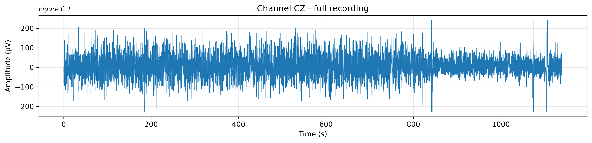

**Zoomed to first 30 seconds.** The `t_range` parameter selects a time window:

```python
# --- Figure C.2: first 30 seconds ---
plot_time_domain(t, x,
    xlabel="Time (s)", ylabel="Amplitude (µV)",
    title="Channel CZ - first 30 s (zoomed)",
    fig_id="Figure C.2",
    t_range=(0, 30),                                       # zoom to 0-30 s
)
```

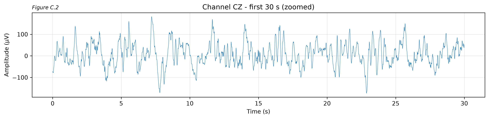

Figure C.2 shows slow, high-amplitude oscillations in the delta range with a **bursty pattern**: periods of high activity (100-150 µV peak-to-peak) separated by quieter intervals (20-50 µV). This pattern is consistent with discontinuous neonatal EEG activity (Appendix C).

**Multi-channel overview.** Six representative channels plotted over the same 30-second window to check if the pattern is global or channel-specific:

```python
import matplotlib.pyplot as plt

rep_channels = ["Fp1", "F3", "C3", "P3", "O1", "T3"]     # one per region
fig, axes = plt.subplots(len(rep_channels), 1,
                          figsize=(14, 2.5 * len(rep_channels)), sharex=True)

for i, ch in enumerate(rep_channels):
    x_ch = get_channel_data(data, ch_names, ch)            # extract channel (µV)
    mask = (times >= 0) & (times <= 30)                    # first 30 s
    axes[i].plot(times[mask], x_ch[mask], linewidth=0.3)   # plot
    axes[i].set_ylabel(f"{ch}\n(µV)")                      # label with units
    axes[i].set_ylim(-150, 150)                            # fixed y-axis for comparison
axes[-1].set_xlabel("Time (s)")
```

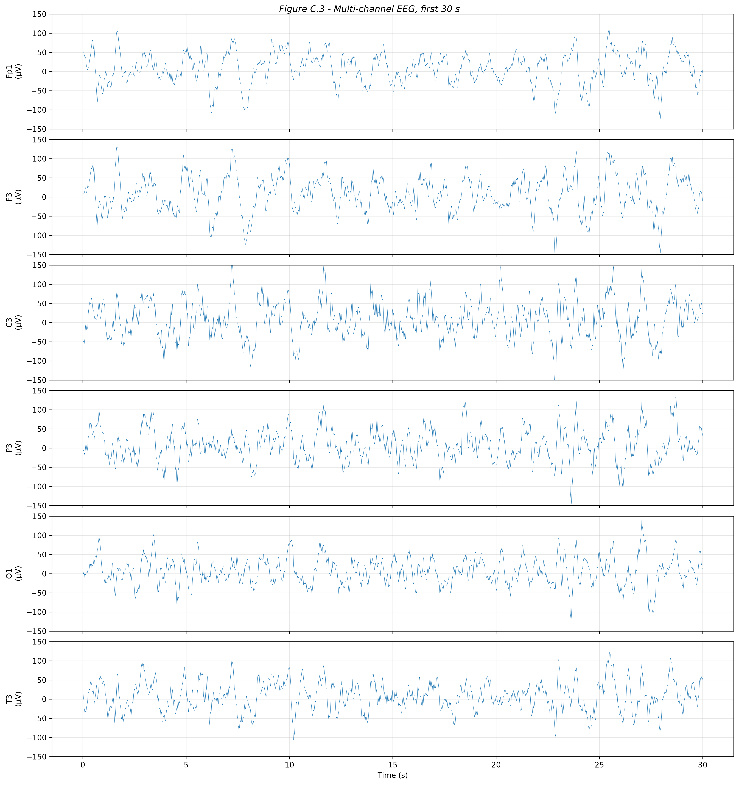

The burst pattern is **synchronous across all regions** - frontal (Fp1), central (C3), parietal (P3), occipital (O1), and temporal (T3) all show high-amplitude bursts at the same times. This is a whole-brain phenomenon, not a channel-specific artifact.

**Auxiliary channels.** Channels 25+, 26+, 27+ are not standard EEG - their morphology identifies them:

```python
aux_channels = ["25+", "26+", "27+"]                       # auxiliary channels
fig_aux, axes_aux = plt.subplots(len(aux_channels), 1,
                                  figsize=(14, 2.5 * len(aux_channels)), sharex=True)

for i, ch in enumerate(aux_channels):
    x_ch = get_channel_data(data, ch_names, ch)            # extract channel (µV)
    mask = (times >= 0) & (times <= 30)                    # first 30 s
    axes_aux[i].plot(times[mask], x_ch[mask], linewidth=0.3)
    axes_aux[i].set_ylabel(f"{ch}\n(µV)")
axes_aux[-1].set_xlabel("Time (s)")
```

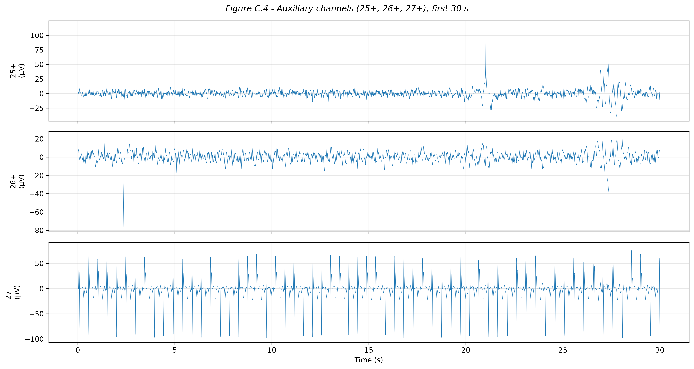

Channel 25+ shows low-amplitude, regular oscillations consistent with **ECG** (cardiac rhythm). Channel 26+ shows similar low-amplitude activity (second ECG lead or EMG). Channel 27+ has higher amplitude with slower morphology, consistent with **EOG** (eye movement).

**Time-domain observations:**

1. Slow oscillations dominate - the signal oscillates at roughly 1-2 second cycles (delta band).
2. A burst-like discontinuous pattern is visible by eye - this is the primary non-stationary feature.
3. The pattern is global (all EEG channels), not regional.
4. The auxiliary channels have distinct morphologies that do not match the EEG, confirming they are non-brain signals.
5. No visible high-frequency contamination, consistent with the 50 Hz low-pass filter.

### C.1.3 Spectral Triage

**Welch PSD.** Parameters justified from Volume B:

- Segment length: $M = 1000$ (5.0 s), giving $\Delta f = 0.2$ Hz. This resolves all EEG bands - the narrowest gap (delta-theta at 4 Hz) is 20x larger than $\Delta f_{\min} = 2 \times 0.2 = 0.4$ Hz for Hann (Lab 3, Lab 5).
- Overlap: 50% (Hann COLA, Lab 4).
- Segments: $L = 455$, reducing variance by a factor of ~455 (Lab 2).
- Window: Hann (Lab 3).

```python
x = get_channel_data(data, ch_names, "CZ")                # primary channel (µV)

band_power, freqs, psd = compute_band_power(
    x, fs=fs,
    nperseg=int(5.0 * fs),                                 # M = 1000 (5.0 s)
    overlap_frac=0.5,                                      # 50% overlap
)
# psd: µV²/Hz,  band_power: µV² per band
```

The PSD is plotted in dual-stack, and band power is computed by integrating PSD over each band in **linear** scale:

```python
from src.common import plot_dual_stack_spectrum

# --- Figure C.5: dual-stack PSD ---
plot_dual_stack_spectrum(
    freqs, psd,
    xlabel="Frequency (Hz)",
    ylabel_linear="PSD (µV²/Hz)",                         # linear: physical units
    ylabel_db="PSD (dB re 1 µV²/Hz)",                     # dB: relative to 1 µV²/Hz
    title="Channel CZ - Welch PSD",
    fig_id="Figure C.5",
    f_range=(0, 50),
)

# --- Figure C.6: band power bar chart ---
total_power = sum(band_power.values())                     # total power (µV²)
for name, power in band_power.items():
    pct = 100 * power / total_power                        # percentage (linear ratio)
    print(f"  {name}: {power:.2f} µV² ({pct:.1f}%)")
```

Figure C.5 shows the Welch PSD in dual-stack. The linear panel (top, in µV²/Hz) shows the delta peak dominating - everything above 4 Hz is compressed to near-zero on this scale. The dB panel (bottom, in dB relative to 1 µV²/Hz - meaning $10\log_{10}(\text{PSD} / 1\,\mu\text{V}^2/\text{Hz})$, so 0 dB corresponds to a power spectral density of exactly 1 µV²/Hz) reveals the full structure: a peak at 0.6 Hz, steep rolloff through theta and alpha, and a flat noise floor above ~30 Hz. The dB scale is necessary because delta power exceeds theta power by a factor of 14 - without it, the higher bands are invisible.

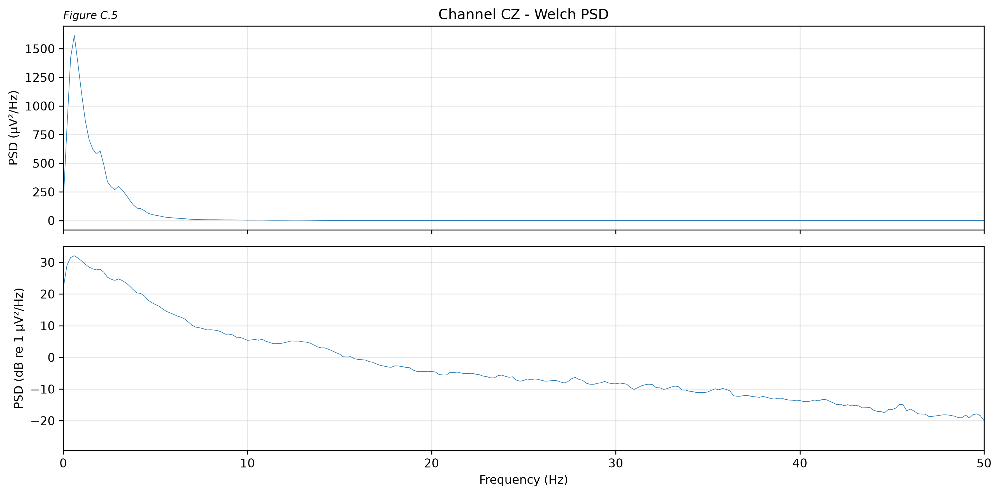

Figure C.6 shows the band power distribution as a bar chart.

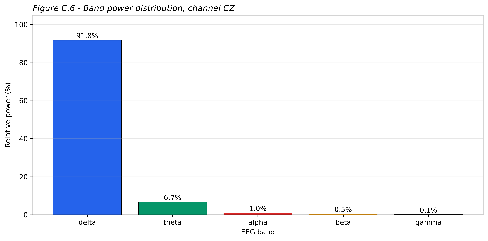

**Table C.3 - Band power, channel CZ**

| Band | Range | Power (µV²) | Relative |
| --- | --- | --- | --- |
| Delta (δ) | 0.5-4 Hz | 1995 | 91.8% |
| Theta (θ) | 4-8 Hz | 146 | 6.7% |
| Alpha (α) | 8-13 Hz | 21 | 1.0% |
| Beta (β) | 13-30 Hz | 10 | 0.5% |
| Gamma (γ) | 30-100 Hz | 1.4 | 0.1% |

**Peak frequency: 0.60 Hz** (deep delta).

The spectral signature is unambiguous: **91.8% of total power is in the delta band.** Theta is the only secondary band with meaningful power (6.7%). Alpha, beta, and gamma together account for less than 2%. This is consistent with neonatal EEG, where the immature cortex generates predominantly slow-wave activity and alpha rhythms have not yet developed.

**Multi-channel verification.** Is the delta dominance specific to CZ, or is it a whole-brain signature? Figure C.7 shows the band power distribution across all 19 EEG channels as a heatmap.

```python
for ch in EEG_CHANNELS:                                    # all 19 standard channels
    x = get_channel_data(data, ch_names, ch)               # single channel (µV)
    bp, _, _ = compute_band_power(x, fs=fs, nperseg=int(5.0 * fs),
                                   overlap_frac=0.5)
    total = sum(bp.values())                               # total power
    pct = {band: 100 * power / total for band, power in bp.items()}
```

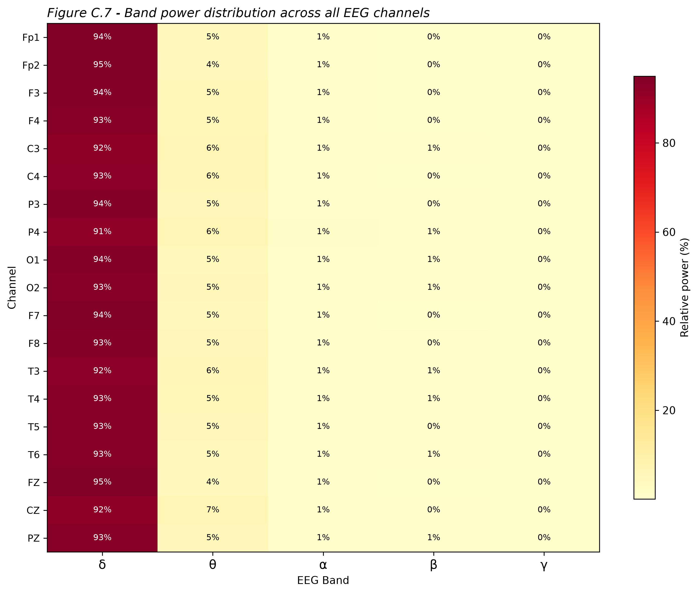

The delta dominance is **uniform across the entire scalp**: every channel has 91-95% delta power, 4-7% theta, ~1% alpha, and negligible beta and gamma. The standard deviation across channels is 0.9 percentage points - effectively no regional variation. CZ (92%) is representative, not an outlier.

This confirms that the delta dominance observed in CZ is a whole-brain signature, not a channel-specific artifact. The choice of CZ as the primary channel is validated.

### C.1.4 Triage Decision

The data maps to the signal archetypes from Appendix A:

**Table C.4 - Archetype mapping**

| Archetype | Present? | Evidence | Tool |
| --- | --- | --- | --- |
| Stationary tone / mixed tones | Yes (dominant) | Delta at 0.6 Hz, theta at 4-8 Hz | DFT + Welch (C.2) |
| Chirp / frequency modulation | Unknown | Not visible by eye; needs STFT | STFT (C.3) |
| Transient / burst | Yes (visible) | Bursty pattern in Figure C.2 | STFT (C.3), statistics (C.4) |
| Noise | Yes (background) | Flat PSD floor above 30 Hz | Statistical detection (C.4) |
| Artifacts | Present | Distinct auxiliary channel signatures | Cross-channel comparison (C.4) |

**Analysis direction:**

- **C.2** - Stationary characterization across all 19 channels. Is the delta dominance uniform, or does it vary by scalp region?
- **C.3** - STFT spectrogram of CZ to characterize the bursty/discontinuous pattern. Does delta persist continuously, or does it come and go? The Heisenberg tradeoff will be made for this signal specifically.
- **C.4** - Artifact identification. What do channels 25+, 26+, 27+ contain? Does their activity contaminate the EEG channels?
- **C.5** - WVD/SPWVD on a selected clean delta segment for the sharpest time-frequency view.

## C.2 Stationary Characterization - DFT and Band Power

C.1 established that 91.8% of CZ's power is in the delta band, uniform across all 19 channels. This section applies the DFT tools from Volume A (Sections A.2-A.3) to characterize the spectral signature in detail: the resolution limit applied to real band boundaries, the spectral shape on a log-log scale (is delta a rhythmic peak or part of the 1/f background?), and the sub-structure within the delta band itself.

**Table C.5 - C.2 parameters**

| Parameter | C.2.1 (full DFT) | C.2.2 (1/f fit) | C.2.3 (delta zoom) | C.2.4 (window comparison) |
| --- | --- | --- | --- | --- |
| Channel | CZ | CZ | CZ | CZ |
| $f_s$ (Hz) | 200 | 200 | 200 | 200 |
| $N$ or $M$ (samples) | 228 000 (full) | 1000 (5.0 s) | 4000 (20.0 s) | 1000 (5.0 s) |
| Window | Hann | Hann | Hann | Hann, Blackman |
| Overlap | - | 50% | 50% | 50% |
| $\Delta f$ (Hz) | 0.000877 | 0.2 | 0.05 | 0.2 |
| 1/f fit range (Hz) | - | 5-40 | - | - |

### C.2.1 Windowed DFT with Resolution Limit

The full 1140-second recording on CZ is windowed with Hann and transformed via the DFT. At $N = 228\,000$ and $f_s = 200$ Hz, the bin spacing is $\Delta f = f_s / N = 0.000877$ Hz, and the resolution limit with Hann ($\beta = 2$) is $\Delta f_{\min} = 0.00175$ Hz.

This resolution is far finer than any EEG band boundary:

**Table C.6 - Resolution limit vs. EEG band widths**

| Band | Range | Width (Hz) | $\Delta f_{\min}$ (Hz) | Ratio |
| --- | --- | --- | --- | --- |
| Delta (δ) | 0.5-4 Hz | 3.5 | 0.0018 | 1944x |
| Theta (θ) | 4-8 Hz | 4.0 | 0.0018 | 2222x |
| Alpha (α) | 8-13 Hz | 5.0 | 0.0018 | 2778x |
| Beta (β) | 13-30 Hz | 17.0 | 0.0018 | 9444x |

The resolution limit is never a concern for this recording. Every band boundary is resolved by a factor of at least 1900x. The window choice is driven entirely by side-lobe suppression (Lab 3), not by resolution.

```python
x = get_channel_data(data, ch_names, "CZ")                # primary channel (µV)
N = len(x)                                                 # 228,000 samples

w = hann(N)                                                # Hann window (periodic)
x_windowed = x * w                                         # windowed signal
X = np.fft.fft(x_windowed)                                 # full DFT
freqs = np.fft.fftfreq(N, d=1/fs)                          # frequency axis
pos = freqs >= 0                                           # positive half
P = np.abs(X[pos])**2 / N                                  # power spectrum (µV²)
```

Figure C.8 shows the windowed DFT in dual-stack, with EEG band boundaries marked.

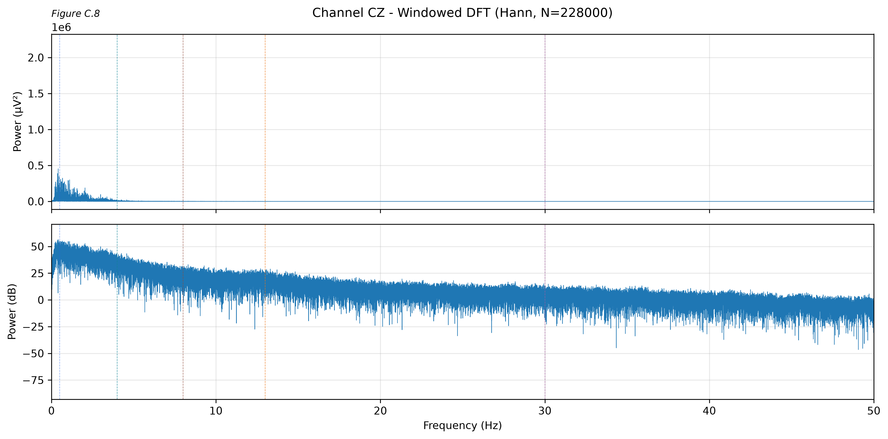

### C.2.2 Log-Log PSD: Is Delta Rhythmic or 1/f Noise?

C.1's triage reported 91.8% delta power. But a natural question arises: is this actually a rhythmic delta oscillation, or is the brain's background activity simply a steep $1/f^\alpha$ spectral slope that happens to concentrate power at low frequencies?

To check, we plot the Welch PSD on log-log axes and fit a power law $\text{PSD} \propto f^{\alpha}$ to the 5-40 Hz range (where no dominant rhythm is expected). The fit is done by ordinary least squares (OLS) on the log-transformed data: $\log_{10}(\text{PSD}) = \alpha \cdot \log_{10}(f) + c$, using `scipy.stats.linregress` which computes the closed-form OLS solution and returns slope, intercept, and R².

```python
from scipy.stats import linregress
# linregress: ordinary least squares (OLS) fit of y = slope*x + intercept

freqs, psd = sp_signal.welch(x, fs=fs, nperseg=int(5.0*fs),
                              noverlap=int(2.5*fs), window="hann")

# Fit PSD ∝ f^α on log-log axes, using 5-40 Hz (above any rhythmic peak)
fit_mask = (freqs >= 5) & (freqs <= 40)
slope, intercept, r_value, _, _ = linregress(
    np.log10(freqs[fit_mask]),                             # log frequency
    np.log10(psd[fit_mask]),                               # log power
)
# slope = exponent α in PSD ∝ f^α (negative = power decreases with frequency)
```

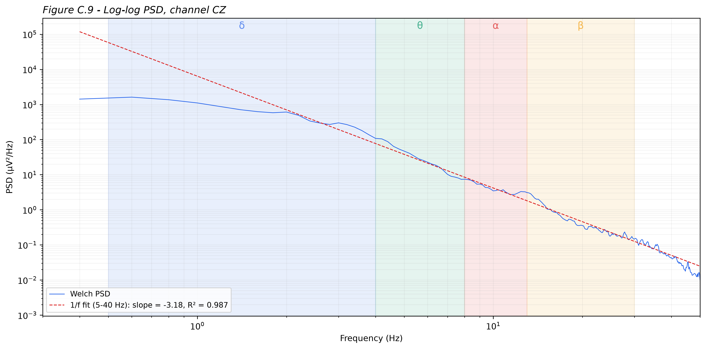

**Result:** the 1/f fit gives **slope = -3.18** with **R² = 0.987** - a steep power-law decay, closer to $1/f^3$ than the $1/f$ or $1/f^2$ commonly reported for adult EEG. The fit is excellent (R² = 0.987), meaning the 5-40 Hz range is well described by a single power law.

The critical question: does the delta band (0.5-4 Hz) sit **above** this 1/f trend (indicating a rhythmic peak) or **on** it (indicating the delta "dominance" is just the low-frequency tail of the power law)?

**Table C.7 - Delta power vs. 1/f prediction**

| Quantity | Value |
| --- | --- |
| 1/f slope (5-40 Hz) | -3.18 |
| 1/f R² | 0.987 |
| Mean delta PSD (actual) | 560 µV²/Hz |
| Mean delta PSD (1/f extrapolation) | 3499 µV²/Hz |
| Excess ratio | 0.2x |

The delta power is actually **below** the 1/f extrapolation (ratio = 0.2x). This means the spectrum does not show a rhythmic bump above the background trend in the delta band. The 91.8% "dominance" is largely a consequence of the steep spectral slope: any $1/f^3$ spectrum will concentrate most of its power at the lowest frequencies, regardless of whether rhythmic oscillations are present.

This does not mean there is no neural delta activity - it means the global DFT cannot distinguish rhythmic delta from the $1/f$ background. The STFT (C.3) will address this by showing whether the delta power is continuous or bursty over time.

### C.2.3 Delta Sub-Structure

To look for fine structure within the delta band, we use longer Welch segments (20 s, $M = 4000$ (20.0 s), $\Delta f = 0.05$ Hz) for finer frequency resolution:

```python
freqs, psd = sp_signal.welch(x, fs=fs,
                              nperseg=int(20.0 * fs),      # 20 s segments → Δf = 0.05 Hz
                              noverlap=int(10.0 * fs),     # 50% overlap
                              window="hann")
```

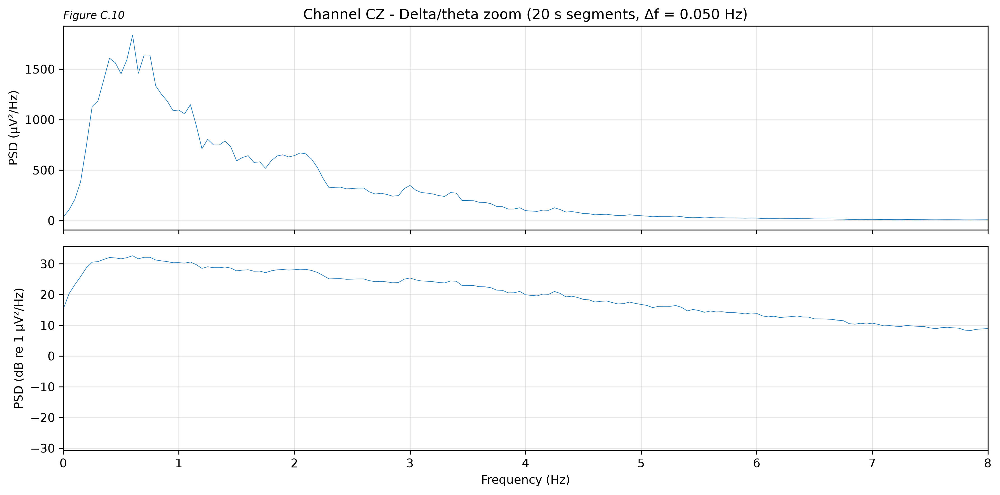

The zoomed PSD reveals **local maxima** within the delta band:

**Table C.8 - Spectral peaks in the delta band (CZ, 20 s segments)**

| Peak frequency (Hz) | PSD (µV²/Hz) |
| --- | --- |
| 0.40 | 1608 |
| 0.60 | 1836 (global peak) |
| 1.10 | 1148 |
| 2.05 | 670 |
| 2.60 | 322 |

The PSD is not monotonically decreasing - it has a broad peak around 0.4-0.6 Hz and additional structure at 1.1, 2.0, and 2.6 Hz. This is evidence of quasi-periodic structure within the delta band, distinct from a smooth $1/f$ decay. Whether these peaks represent neural oscillations, breathing artifacts (~0.3-0.5 Hz), or the burst repetition rate of the discontinuous pattern observed in Figure C.2 cannot be determined from the stationary DFT alone. The STFT (C.3) will resolve this by adding the time axis.

### C.2.4 Window Comparison on Real EEG

Lab 3 and Lab 5 showed that window choice affects side-lobe leakage. Does this matter for real EEG? Figure C.11 overlays the Welch PSD computed with Hann ($\beta = 2$) and Blackman ($\beta = 3$) on the same CZ data.

```python
for name, win in [("Hann", "hann"), ("Blackman", "blackman")]:
    freqs, psd = sp_signal.welch(x, fs=fs, nperseg=int(5.0*fs),
                                  noverlap=int(2.5*fs), window=win)
    # ... plot both on the same axes
```

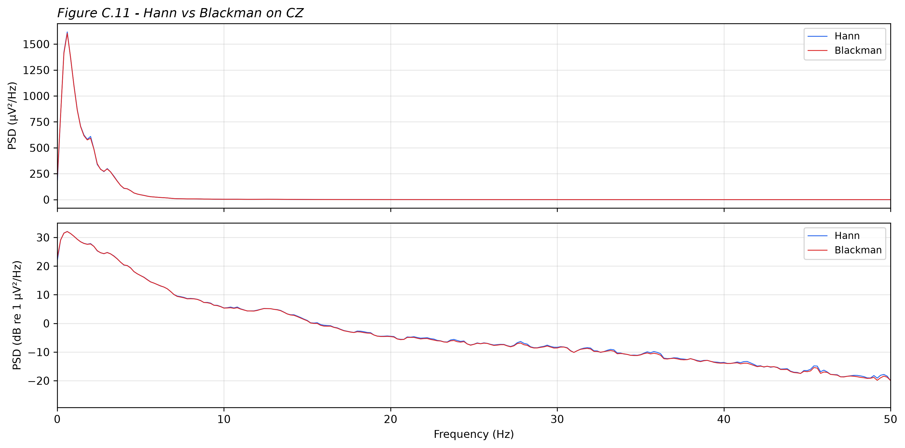

The two curves are nearly identical across the entire spectrum. The Blackman window's deeper side-lobe suppression (-58 dB vs -31.5 dB) does not produce a visibly different PSD.

**Why windows don't matter on this signal.** The dominant delta power rolls off steeply ($1/f^3$). By the time it reaches the theta band (4 Hz), the signal has already attenuated by a factor of $(4/0.6)^3 \approx 300$ - far more suppression than even the rectangular window's side lobes (-13 dB = factor of 20). The signal suppresses itself before the window needs to. On a different EEG - say an adult with a strong alpha peak at 10 Hz adjacent to weak beta at 15 Hz - the window choice would matter, because the alpha peak's side lobes could leak into the beta band. But here, the steep spectral slope makes window choice irrelevant.

### C.2 Finding

The resting spectral signature of this neonatal EEG is a **steep $1/f^3$ power-law decay** with **quasi-periodic structure** in the delta band (peaks at 0.4, 0.6, 1.1, 2.0 Hz). The 91.8% delta dominance reported in C.1 is partly a consequence of the spectral slope, not solely of rhythmic delta oscillations. The resolution limit is never a concern (band boundaries are resolved by 1900x or more), and the Hann window is sufficient (Blackman adds no visible improvement).

The open question - whether the delta peaks represent neural oscillations, breathing, or the burst repetition rate - requires the time axis. That is the subject of C.3.

## C.3 Time-Varying Characterization - STFT Spectrogram

### Introduction

C.2 showed that the delta band has quasi-periodic structure (peaks at 0.4, 0.6, 1.1, 2.0 Hz) but could not determine whether this is continuous oscillation or bursty activity. The time-domain plot (Figure C.2) showed a discontinuous pattern by eye. This section adds the time axis via the STFT (Volume A Section A.5, Lab 4) to characterize how the spectral content evolves over the 19-minute recording.

### Parameters

**Table C.9 - C.3 parameters**

| Parameter | C.3.1 (full) | C.3.2 (zoom) | C.3.3 (Heisenberg) | C.3.4-5 (power) |
| --- | --- | --- | --- | --- |
| Channel | CZ | CZ | CZ | CZ |
| $f_s$ (Hz) | 200 | 200 | 200 | 200 |
| $M$ (samples) | 1000 (5.0 s) | 400 (2.0 s) | 200 (1.0 s), 1000 (5.0 s) | 400 (2.0 s) |
| Window | Hann | Hann | Hann | Hann |
| Overlap | 50% | 50% | 50% | 50% |
| $\Delta f$ (Hz) | 0.2 | 0.5 | 2.0, 0.4 | 0.5 |
| $\Delta t$ (s) | 5.0 | 2.0 | 1.0, 5.0 | 2.0 |
| Frequency range | 0-10 Hz | 0-10 Hz | 0-10 Hz | delta/theta bands |

### Results

**C.3.1 Full-recording spectrogram.** The STFT of CZ over the entire 19 minutes, with $M = 1000$ (5.0 s) for delta-theta resolution:

```python
from scipy import signal as sp_signal
from src.common.eeg import get_channel_data

x = get_channel_data(data, ch_names, "CZ")                # CZ channel (µV)

M = int(5.0 * fs)                                         # 1000 samples (5.0 s)
noverlap = M // 2                                         # 50% overlap (Hann COLA)

f_stft, t_stft, Sxx = sp_signal.spectrogram(              # STFT via scipy
    x, fs=fs, nperseg=M, noverlap=noverlap, window="hann",
)
# Sxx shape: (freq_bins, time_steps), in µV²/Hz
# f_stft: frequency axis (Hz)
# t_stft: time axis (s)
```


The dB panel (bottom) reveals the answer to C.2's open question: **delta power is not continuous.** It comes in bursts - vertical stripes of high power in the 0.5-4 Hz range, separated by quieter intervals. The burst pattern is visible across the entire 19-minute recording, though its intensity varies. The linear panel (top) shows that the strongest bursts reach 25,000 µV²/Hz while the quiet intervals drop below 1,000 - a max/min ratio of 126x. The dB scale is essential here to see both the bursts and the quiet periods on the same plot.

**C.3.2 Zoomed 60-second segment.** Shorter window ($M = 400$, 2.0 s) for better time resolution, zoomed to the first 60 seconds:

```python
M_zoom = int(2.0 * fs)                                    # 400 samples (2.0 s)
noverlap_zoom = M_zoom // 2                               # 50% overlap

f_stft, t_stft, Sxx = sp_signal.spectrogram(
    x, fs=fs, nperseg=M_zoom, noverlap=noverlap_zoom, window="hann",
)
# Δf = 0.5 Hz (coarser than C.3.1, but Δt = 2.0 s is better for burst timing)
```

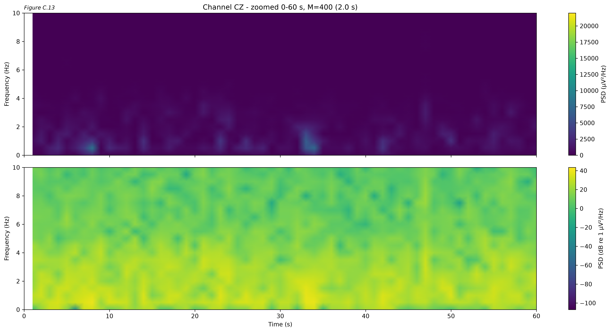

The burst structure is now clearly resolved in time. Individual bursts last approximately 2-5 seconds and recur every 5-10 seconds. The frequency content during bursts extends from 0.5 Hz up to about 6-8 Hz (into the theta band), while the quiet intervals show a flat, low-power baseline.

**C.3.3 Heisenberg comparison.** The same 60-second segment analyzed with two window lengths - the uncertainty tradeoff from Lab 4, now applied to real EEG:

```python
# Short window: M = 200 (1.0 s), Δf = 2.0 Hz, Δt = 1.0 s
# Long window:  M = 1000 (5.0 s), Δf = 0.4 Hz, Δt = 5.0 s
# Both: Δt·Δf = 2.0 (Hann β = 2)

for M in [int(1.0 * fs), int(5.0 * fs)]:
    f_stft, t_stft, Sxx = sp_signal.spectrogram(
        x, fs=fs, nperseg=M, noverlap=M//2, window="hann",
    )
```

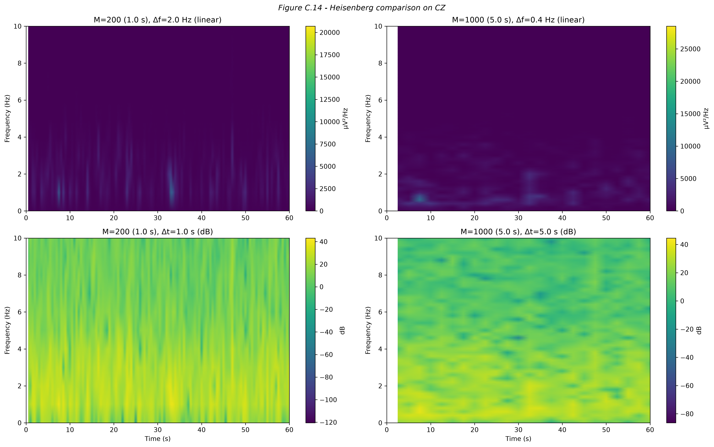

Left column (1.0 s window): individual bursts are well-resolved in time, but delta and theta merge into one broad band. Right column (5.0 s window): delta and theta are separated, but bursts smear across 5-second time steps. Neither captures both the burst timing and the frequency structure simultaneously - confirming the STFT's fundamental limitation (Equation (A.40)), now demonstrated on real data rather than a model signal.

**C.3.4 Delta and theta power time course.** Integrating the spectrogram over the delta (0.5-4 Hz) and theta (4-8 Hz) bands at each time step:

```python
df = f_stft[1] - f_stft[0]                                # frequency resolution (Hz)
delta_mask = (f_stft >= 0.5) & (f_stft <= 4)               # delta band bins
theta_mask = (f_stft >= 4) & (f_stft <= 8)                 # theta band bins

delta_power = np.sum(Sxx[delta_mask, :], axis=0) * df      # µV² per time step
theta_power = np.sum(Sxx[theta_mask, :], axis=0) * df      # µV² per time step
```

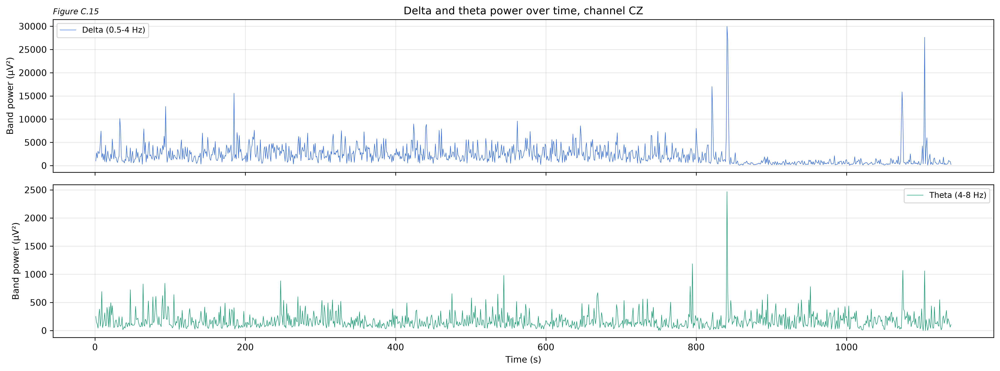

**Table C.10 - Delta power time course statistics**

| Statistic | Value |
| --- | --- |
| Median delta power | 1740 µV² |
| Burst threshold (2x median) | 3479 µV² |
| Time in burst (above threshold) | 19.0% |
| Time in quiet (below threshold) | 81.0% |
| Max/median ratio | 17.2x |
| Delta-theta correlation | 0.328 (weak) |

The delta power is highly non-stationary: it spends 81% of the time in a quiet state and 19% in bursts that reach up to 17x the median. The delta-theta correlation is weak (0.328), meaning theta does not simply rise and fall with delta - they are partially independent, suggesting the theta content during bursts may carry different information than the delta component.

**C.3.5 Time-domain overlay.** The delta power time course overlaid on the raw signal confirms the correspondence between the visible bursts in the time domain and the spectral bursts in the STFT:

```python
# Delta power from C.3.4, overlaid on the raw time-domain signal
median_delta = np.median(delta_power)                      # 1740 µV²
burst_threshold = 2.0 * median_delta                       # 3479 µV²
# Burst = time steps where delta_power > burst_threshold
```

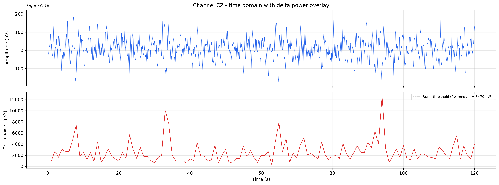

### Verification

**Table C.12 - C.3 verification**

| Prediction / tool from Volume A-B | Measured on real EEG | Confirmed? |
| --- | --- | --- |
| STFT reveals time-varying spectral content (A.5.1) | Delta power varies 126x across the recording | Yes |
| Heisenberg: Δt·Δf = β = 2 for Hann (Eq. A.39) | 1.0 s window: Δf = 2.0 Hz; 5.0 s: Δf = 0.4 Hz; product = 2.0 | Yes |
| No single window captures multi-scale features (Lab 4) | Short window resolves bursts but merges bands; long window separates bands but smears bursts | Yes |

**C.3.6 Window comparison on the spectrogram.** C.2.4 showed that Hann and Blackman produce nearly identical Welch PSDs because the steep $1/f^3$ slope suppresses leakage before the window needs to. Does this hold for the STFT, where segments are shorter ($M = 400$, 2.0 s)?

```python
from scipy import signal as sp_signal

M = int(2.0 * fs)                                         # 400 samples (2.0 s)
noverlap = M // 2                                         # 50% overlap

for name, win in [("Hann", "hann"), ("Hamming", "hamming"), ("Blackman", "blackman")]:
    f_stft, t_stft, Sxx = sp_signal.spectrogram(
        x, fs=fs, nperseg=M, noverlap=noverlap, window=win,
    )
    df = f_stft[1] - f_stft[0]                            # frequency resolution
    delta_mask = (f_stft >= 0.5) & (f_stft <= 4)           # delta band
    delta_power = np.sum(Sxx[delta_mask, :], axis=0) * df  # integrate → µV²

    # --- Compare to Hann: relative difference at each time step ---
    if name != "Hann":
        abs_diff = np.abs(delta_power - delta_hann)        # absolute diff per step
        safe = np.maximum(delta_hann, 1)                   # avoid div by zero
        rel_local = 100 * abs_diff / safe                  # % relative to local Hann value
        # median_rel = typical time step; max_rel = worst case (burst edges)
```

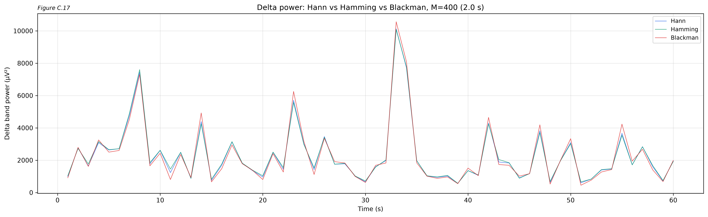

Figure C.18 shows the actual spectrograms in dual-stack (linear top, dB bottom) side by side with shared colorbars per row:


The three spectrograms are visually indistinguishable. The burst pattern, timing, frequency extent, and quiet intervals are identical across all three windows.

The quantitative comparison uses the delta band power time course (Figure C.17). The difference between windows is measured per time step:

$$
\text{relative difference}[m] = \frac{|P_{\text{other}}[m] - P_{\text{Hann}}[m]|}{P_{\text{Hann}}[m]} \times 100\% \tag{C.1}
$$

where $P[m]$ is the delta band power at STFT time step $m$. This gives a percentage at each moment, relative to the local Hann value at that same moment - not relative to a global average.

**Table C.11 - Window comparison on STFT delta power**

| Metric | Hamming vs Hann | Blackman vs Hann | What it means |
| --- | --- | --- | --- |
| Max absolute difference | 636 µV² | 2059 µV² | The largest raw power gap at any single time step. Blackman's wider main lobe ($\beta = 3$ vs Hann's $\beta = 2$) spreads energy differently, producing a larger absolute gap at high-power bursts. |
| Median relative difference | 2.1% | 6.1% | The typical time step. Half of all time steps have a relative difference smaller than this. At 2-6%, the windows agree closely in normal operation. |
| Mean relative difference | 3.2% | 7.8% | The average across all time steps. Slightly higher than the median because the worst-case outliers pull the mean up. |
| Max relative difference | 54% | 46% | The single worst time step. These occur at transitions between burst and quiet - where the signal is changing rapidly and each window's different time-smoothing places the "edge" at a slightly different moment. At a burst edge, one window may read 200 µV² while another reads 400 µV² - a large percentage, but both are near the quiet baseline, not during the burst itself. |

**Why the median matters more than the max.** The max relative difference (54%, 46%) occurs at burst edges where the delta power is transitioning between ~100 µV² (quiet) and ~5000 µV² (burst). A small timing shift of the edge makes one window read 200 µV² while another reads 400 µV² - a 100% relative difference on a tiny absolute value. This is a boundary artifact of the STFT's discrete time steps, not a meaningful disagreement about the signal.

The median (2.1%, 6.1%) represents typical operation: during bursts and during quiet periods, the windows agree closely. The burst structure - when bursts occur, how long they last, how strong they are - is window-independent.

For this signal, the window choice affects "how much power at a given moment" by a few percent, but not "when the bursts occur." Since C.3's primary finding is the burst structure (not the exact power values), the choice of Hann is justified - and confirmed by both the spectrogram comparison (Figure C.18) and the quantitative metrics (Table C.11).

### Conclusion

The STFT answers C.2's open question: the delta activity is **discontinuous**, not continuous. Delta power comes in bursts (19% of the recording) separated by quiet intervals (81%). The burst pattern is the dominant non-stationary feature of this neonatal EEG.

The Heisenberg tradeoff is real on this data: a 1-second window captures the burst timing but cannot separate delta from theta; a 5-second window separates the bands but smears the bursts. This is the same limitation demonstrated on model signals in Lab 4, now confirmed on real EEG.

The window comparison (C.3.6) confirms that all three windows (Hann, Hamming, Blackman) detect the same burst structure - the differences are in power amplitude, not timing. The weak delta-theta correlation (0.328) suggests the two bands carry partially independent information. C.5 (WVD/SPWVD) may reveal finer time-frequency structure within individual bursts that the STFT cannot resolve.

## C.4 Events and Artifacts - Statistics and Transient Detection

### Introduction

The recording contains three auxiliary channels (25+, 26+, 27+) that are not standard EEG. C.1 identified them visually as non-brain signals. This section characterizes them spectrally, tests whether they contaminate the EEG channels using cross-correlation (Section A.6.5, validated in Lab 6 Experiment D), and verifies whether the noise floor model from Lab 2 (Equation (A.34)) holds on real EEG data.

No artifacts are removed in this section. The goal is to **identify** what is present and confirm that CZ is clean enough for C.5's WVD/SPWVD analysis.

### Parameters

**Table C.13 - C.4 parameters**

| Parameter | C.4.1 (PSD) | C.4.2 (cross-correlation) | C.4.3 (noise floor) |
| --- | --- | --- | --- |
| Channel(s) | 25+, 26+, 27+ | 25+, 26+, 27+ vs CZ | CZ |
| $f_s$ (Hz) | 200 | 200 | 200 |
| $M$ (samples) | 1000 (5.0 s) | full signal | full signal (N=228,000) |
| Window | Hann | - | - |
| Overlap | 50% | - | - |
| Frequency range | 0-50 Hz | ±2 s lag | 8-13 Hz (alpha band) |
| Tool | Welch PSD (Lab 2) | Cross-correlation (Lab 6) | Exponential test (Lab 2) |

### Results

**C.4.1 Auxiliary channel PSD.** Each auxiliary channel is characterized spectrally via Welch PSD with the same parameters used throughout Volume C (5 s segments, Hann, 50% overlap):

```python
from src.common.eeg import get_channel_data
from scipy import signal as sp_signal

AUX_LABELS = {                                             # channel name + suspected type
    "25+": "25+ (suspected ECG)",
    "26+": "26+ (suspected EMG)",
    "27+": "27+ (suspected EMG/EOG)",
}

for ch in ["25+", "26+", "27+"]:
    x = get_channel_data(data, ch_names, ch)               # auxiliary channel (µV)
    freqs, psd = sp_signal.welch(x, fs=fs,
                                  nperseg=int(5.0 * fs),   # M = 1000 (5.0 s)
                                  noverlap=int(2.5 * fs),  # 50% overlap
                                  window="hann")
    # Peak frequency and total power characterize the channel
```

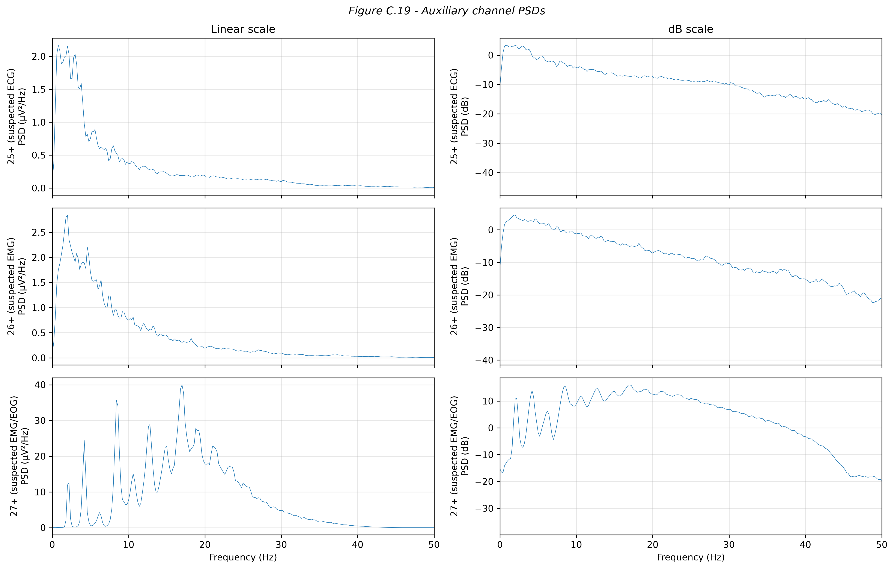

**Table C.14 - Auxiliary channel spectral characteristics**

| Channel | Peak frequency | Total power (µV²) | Spectral profile | Suspected type |
| --- | --- | --- | --- | --- |
| 25+ | 0.8 Hz | 14.8 | Low-frequency, low-power, smooth decay | ECG |
| 26+ | 2.0 Hz | 21.6 | Low-frequency, low-power, smooth decay | EMG |
| 27+ | 17.0 Hz | 401.6 | Broadband with peak at 17 Hz, much higher power | EMG/EOG |

Channel 27+ stands out: its peak at 17 Hz and broadband profile are consistent with muscle activity (EMG), not the slow eye movements (EOG) suggested by the time-domain morphology in C.1. The spectral evidence revises the initial identification.

**C.4.2 Cross-correlation with CZ.** Does any auxiliary channel contaminate the EEG? Cross-correlation (Section A.6.5, Equation (A.57)) and the Pearson coefficient (Equation (A.59)) answer this quantitatively:

```python
x_cz = get_channel_data(data, ch_names, "CZ")             # primary EEG channel (µV)

for ch in ["25+", "26+", "27+"]:
    x_aux = get_channel_data(data, ch_names, ch)           # auxiliary channel (µV)
    rho = np.corrcoef(x_cz, x_aux)[0, 1]                  # Pearson ρ (Equation A.59)

    # Cross-correlation over ±2 s lag (visualization)
    seg = int(30 * fs)                                     # 30 s segment
    r_full = np.correlate(x_cz[:seg], x_aux[:seg], mode="full")  # Equation (A.57)
```

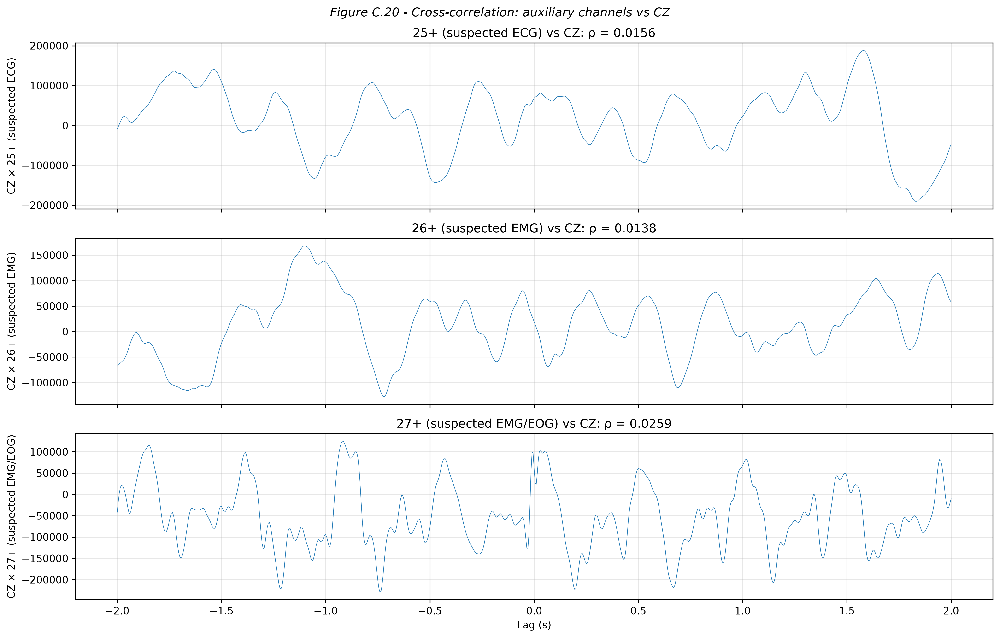

**Table C.15 - Cross-correlation results**

| Signal pair | Pearson ρ | Verdict |
| --- | --- | --- |
| 25+ (ECG) vs CZ | 0.016 | No contamination |
| 26+ (EMG) vs CZ | 0.014 | No contamination |
| 27+ (EMG/EOG) vs CZ | 0.026 | No contamination |
| *For reference:* | | |
| C3 vs CZ | 0.780 | High (shared brain activity) |
| F3 vs CZ | 0.651 | High (shared brain activity) |
| O1 vs CZ | 0.470 | Moderate (shared brain activity) |

All auxiliary-CZ correlations are below 0.03 - indistinguishable from zero. Compare to EEG inter-channel correlations: C3 vs CZ has ρ = 0.78 (they share the same brain activity). The auxiliary channels share nothing with CZ. This confirms that the auxiliary signals do not contaminate the EEG, and CZ is clean for further analysis.

This result validates Lab 6's cross-correlation tool on real data: the same method that detected ρ = 0.107 for a shared 10 Hz tone (Figure B.36) correctly reports ρ ≈ 0 when no component is shared (Figure B.37) - and now confirms the same on real EEG.

**C.4.3 Spectral distribution test.** Lab 2 (Equation (A.34)) showed that DFT bin power under white Gaussian noise follows an exponential distribution. Does this model apply to real EEG?

We test the **alpha band (8-13 Hz)** of CZ. This range is chosen because this neonatal EEG has negligible alpha activity (1% of total power, C.1) - the immature cortex does not generate alpha rhythms. This is the quietest EEG band in this recording, making it the best candidate for testing whether the background conforms to the noise model. Note: "quiet" does not guarantee "pure noise" - the band may still contain residual broadband biological signals or spectral leakage from adjacent bands. What we can test is whether the bin power distribution matches the exponential model:

```python
X = np.fft.fft(x_cz)                                      # full DFT of CZ
freqs = np.fft.fftfreq(len(x_cz), d=1/fs)                 # frequency axis

noise_mask = (freqs > 8) & (freqs < 13)                    # alpha band (quietest in neonatal EEG)
noise_powers = np.abs(X[noise_mask])**2                     # |X[k]|² per bin

mean_power = np.mean(noise_powers)                          # E[|X[k]|²]
std_power = np.std(noise_powers)                            # std of bin powers
cv = std_power / mean_power                                # coefficient of variation
# Lab 2 (A.4.1): exponential distribution has CV = std/mean = 1.0 exactly
# CV ≈ 1.0 → consistent with exponential; CV ≠ 1.0 → deviates
```

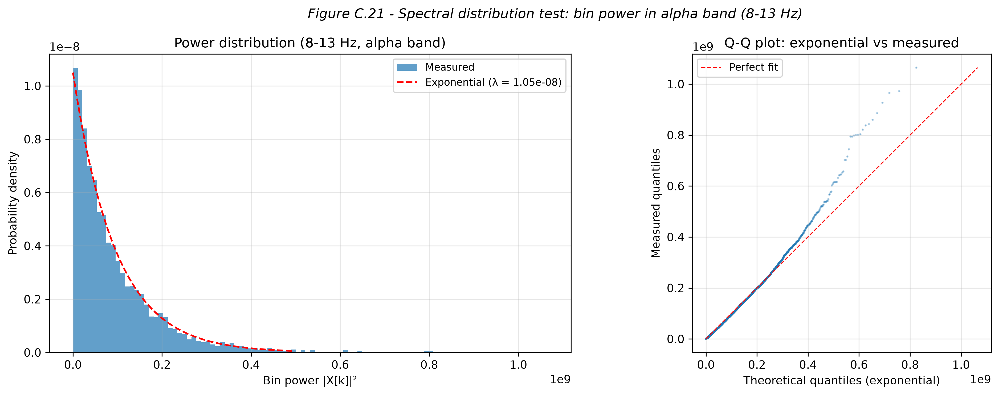

**Table C.16 - Spectral distribution test results (alpha band)**

| Metric | Value |
| --- | --- |
| Frequency range | 8-13 Hz (alpha band) |
| Number of bins | 5,699 |
| Mean bin power | 9.52 × 10⁷ µV² |
| Std bin power | 1.05 × 10⁸ µV² |
| CV = std / mean | 1.11 (exponential predicts 1.00) |
| Deviation from ideal | 11% |

The exponential distribution from Lab 2 is **rejected** (KS p ≈ 0). The histogram (Figure C.21, left) shows a roughly exponential shape, but the Q-Q plot (right) reveals systematic deviation - the measured distribution has a heavier tail than the ideal exponential.

**What this means.** Section A.4.1 established that the exponential distribution has CV = 1.0 exactly: the standard deviation equals the mean. Lab 2 verified this on model signals. Here, the alpha band of real EEG gives **CV = 1.11** - 11% above the ideal value.

This is close but not exact. The histogram (Figure C.21, left) shows the measured distribution closely follows the exponential curve, and the Q-Q plot (right) shows near-diagonal alignment with mild deviation in the upper tail. The 11% excess in CV means the distribution has a slightly heavier tail than the ideal exponential - a few bins have unusually high power, likely from residual spectral leakage from the adjacent theta band (6.7% of power) or low-level broadband biological signals.

**Is the alpha band noise?** Section A.4.1 established that CV measures spectral concentration: noise-like spectra have CV $\approx$ 1, narrowband features have CV $\gg$ 1. Appendix B2 provides the reference scale: pure noise gives CV = 1.01, a chirp gives CV = 2.3, and a tone gives CV = 86.6. The measured CV = 1.11 is closest to noise (1.01) and far below the lowest signal archetype (chirp at 2.3).

However, as Appendix B2 notes, CV measures spectral **concentration**, not signal **presence**. CV = 1.11 tells us the alpha band contains **no narrowband oscillation** (no alpha rhythm - consistent with the immature neonatal cortex). It does not tell us whether the broadband content is thermal noise, residual biological activity, or a mix - CV cannot distinguish these because all produce CV $\approx$ 1.

Combined with the full picture - no spectral peaks in 8-13 Hz (C.2), only 1% of total power (C.1), histogram closely matches the exponential curve (Figure C.21) - the alpha band behaves as broadband background with no narrowband features. Whether the 11% deviation from ideal represents residual biological signal or statistical fluctuation cannot be determined from this test alone.

**Practical consequence.** For the purposes of this report, Lab 2's exponential model applies as a reasonable approximation in this band. Any spectral peak that rises well above this background is a genuine feature. The exact false-alarm probabilities from Table A.5 ($P_{fa} = e^{-\gamma}$) are approximate on real data - the heavier tail means the true false-alarm rate is slightly higher than predicted. For rigorous statistical detection, an empirical noise model fitted to the actual data would be needed - outside the scope of this report.

### Verification

**Table C.17 - C.4 verification**

| Tool from Volume A-B | Applied to real EEG | Result |
| --- | --- | --- |
| Cross-correlation detects shared structure (A.6.5, Lab 6) | Auxiliary vs CZ: ρ = 0.014-0.026 | No contamination detected |
| Cross-correlation ρ ≈ 0 means no shared component (Lab 6) | All auxiliary ρ < 0.03 vs EEG inter-channel ρ = 0.47-0.78 | Confirmed: auxiliary channels are independent of EEG |
| Exponential CV = 1.0 (A.4.1, Lab 2) | CV on alpha band (8-13 Hz) | CV = 1.11 - 11% deviation, close but not exact |

### Conclusion

The auxiliary channels (25+, 26+, 27+) are non-brain signals that do not contaminate the EEG. Cross-correlation confirms ρ < 0.03 for all auxiliary-CZ pairs, compared to ρ = 0.47-0.78 for EEG-CZ pairs. CZ is clean and suitable for the WVD/SPWVD analysis in C.5.

The spectral distribution test on the alpha band (8-13 Hz) - the quietest band in this neonatal recording - shows that Lab 2's exponential model is a close but imperfect fit (CV = 1.11 vs ideal 1.00). The 11% deviation indicates a slightly heavier tail than pure exponential, likely from residual biological signals. The model works well as a qualitative tool but the exact false-alarm probabilities are approximate on real data. This honestly characterizes the limits of transferring an idealized noise model to real EEG.

Artifacts were not removed. C.5 will select a clean segment based on the burst structure identified in C.3 and the clean-channel verdict from this section.

## C.5 High-Resolution Time-Frequency - WVD / SPWVD

C.3 showed that the delta activity is discontinuous - 19% burst, 81% quiet. The STFT resolved the burst timing but was limited by Heisenberg uncertainty: short windows blurred frequency, long windows blurred time. The WVD (Section A.7, Lab 7) bypasses this tradeoff but generates cross-terms. The SPWVD (Section A.8, Lab 8) suppresses cross-terms with two independent smoothing windows.

This section applies the WVD family to a selected clean burst segment from CZ. No filtering is applied - Volumes A and B did not cover filter design, so we use only tools we have derived. The mitigation for multi-component cross-terms is **segment selection**: a short, clean segment has fewer simultaneous components than the full recording.

### C.5.1 Segment selection

**How do we define a burst?** C.3 established the criterion: a burst is any STFT time frame where delta band power (0.5-4 Hz) exceeds 2x the median delta power over the full recording. We recompute this here using the same method (Welch spectrogram, Hann window $M = 1000$ (5.0 s), 50% overlap).

```python
from src.common.eeg import load_eeg, get_channel_data
from src.common.config import EEG_BANDS
from scipy import signal as sp_signal

data, ch_names, fs, times = load_eeg(EDF_FILE)
x_full = get_channel_data(data, ch_names, "CZ")

M_detect = int(5.0 * fs)                                  # 5.0 s window (same as C.3)
f_stft, t_stft, Sxx = sp_signal.spectrogram(              # STFT spectrogram
    x_full, fs=fs, nperseg=M_detect,
    noverlap=M_detect // 2, window="hann",
)
df = f_stft[1] - f_stft[0]                               # frequency bin width
delta_mask = (f_stft >= EEG_BANDS["delta"][0]) & \
             (f_stft <= EEG_BANDS["delta"][1])            # 0.5-4 Hz
delta_power = np.sum(Sxx[delta_mask, :], axis=0) * df     # band power (µV²)

median_delta = np.median(delta_power)                     # median delta power
burst_threshold = 2.0 * median_delta                      # burst = 2x median
burst_mask = delta_power > burst_threshold                # boolean mask
burst_indices = np.where(burst_mask)[0]                   # burst frame indices
```

**Step 1: try the strongest burst.** The maximum delta power frame is at t = 842.5 s (8.7x median, 15597 µV²). We extract a 2.0 s segment centered on it:

```python
max_burst_idx = burst_indices[np.argmax(delta_power[burst_indices])]
t_max = t_stft[max_burst_idx]                             # t = 842.5 s
x_max = x_full[int((t_max-1)*fs):int((t_max+1)*fs)]     # 2.0 s segment

# Check for clipping: count near-zero derivative samples
diff_max = np.abs(np.diff(x_max))
flat_count = np.sum(diff_max < 0.01)                      # 44 flat samples
# REJECTED: amplifier saturation
```

Figure C.22 shows this segment. The signal clips flat at ~250 µV for over 0.3 s - this is **amplifier saturation**, not a physiological burst. 44 samples have near-zero derivative (|Δx| < 0.01 µV), confirming the plateau. The strongest burst by delta power is the worst artifact in the recording.

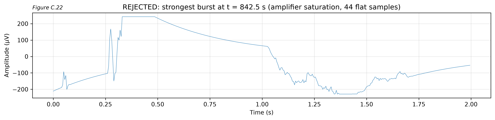

**Step 2: fall back to the 75th percentile.** Instead of the maximum (likely artifactual), we select the burst at the 75th percentile of burst power - strong enough to be clearly above threshold, not so extreme it is an artifact:

```python
burst_powers = delta_power[burst_indices]
p75 = np.percentile(burst_powers, 75)                     # 75th percentile
target_idx = burst_indices[np.argmin(np.abs(burst_powers - p75))]
t_peak = t_stft[target_idx]                               # t = 65.0 s
# delta = 5435 µV² (3.0x median) - no flat samples, no clipping
```

**Table C.18 - Segment selection**

| | Strongest burst | 75th percentile (selected) |
| --- | --- | --- |
| Time | 842.5 s | 65.0 s |
| Delta power | 15597 µV² (8.7x median) | 5435 µV² (3.0x median) |
| Flat samples | 44 (clipping) | 0 (clean) |
| Amplitude range | -67.6 to 146.8 µV (saturated) | -176.0 to 151.8 µV (clean) |
| Verdict | Rejected | Accepted |

Figure C.23 shows the accepted segment: two clean delta cycles (~1 Hz) with ±150 µV amplitude, no clipping, no discontinuities.

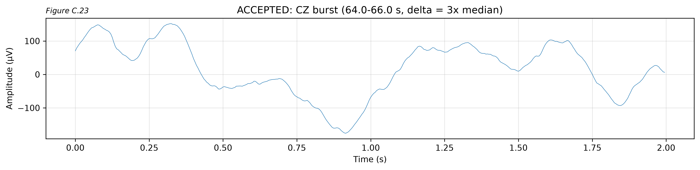

### C.5.2 STFT baseline

Before applying the WVD, we establish what the STFT (C.3's tool) can resolve on this segment. We test two window lengths to expose the Heisenberg tradeoff:

```python
from scipy import signal as sp_signal

# Short window: M = 64 (0.32 s), Δf = 3.12 Hz - good time, poor frequency
f_s, t_s, Zxx_s = sp_signal.stft(x_seg, fs, window="hann",
    nperseg=64, noverlap=32, nfft=512)
Sxx_s = np.abs(Zxx_s)**2

# Long window: M = 200 (1.0 s), Δf = 1.00 Hz - good frequency, poor time
f_l, t_l, Zxx_l = sp_signal.stft(x_seg, fs, window="hann",
    nperseg=200, noverlap=100, nfft=512)
Sxx_l = np.abs(Zxx_l)**2
```

**Table C.19 - STFT parameters**

| Parameter | Short window | Long window |
| --- | --- | --- |
| M (samples) | 64 | 200 |
| Duration (s) | 0.32 | 1.0 |
| $\Delta f$ (Hz) | 3.12 | 1.00 |

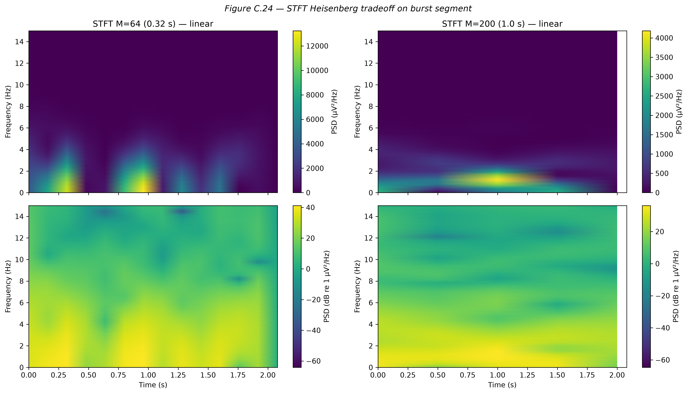

The short window (left) resolves the two delta peaks in time but merges the delta and theta bands. The long window (right) separates delta from theta but smears the burst timing. Neither can give both. This is the Heisenberg limit from Lab 4.

### C.5.3 Raw WVD

The WVD (Equation (A.61)) computes the DFT of the instantaneous autocorrelation at each time sample. On the model chirp in Lab 7, it produced a razor-sharp diagonal. On real EEG with many overlapping components, we expect cross-term contamination:

```python
from src.common import wigner_ville

wvd, t_wvd, f_wvd = wigner_ville(x_seg, fs, n_fft=512)
# WVD range: -8.6M to 13.3M - large negative values confirm cross-terms
# Negative values: 49.1% of all bins
```

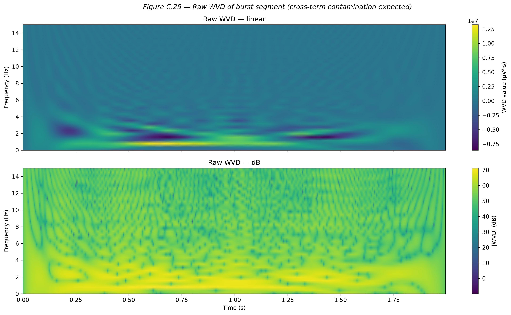

The linear panel (top) shows energy concentrated at 0-4 Hz with sharper time boundaries than the STFT - the burst onset is more precisely localized. But the dB panel (bottom) reveals the problem: 49% of values are negative (the WVD is not a true power distribution), and oscillating cross-term patterns fill the time-frequency plane. The representation is sharper but unreadable.

This confirms Section A.7.3 and Lab 7: the raw WVD is unusable on multi-component signals. Even this selected 2-second segment contains enough overlapping components (delta, theta, broadband background) to generate severe cross-term contamination.

### C.5.4 SPWVD

The SPWVD (Equation (A.72)) applies two independent smoothing windows to suppress cross-terms:

```python
from src.common import smoothed_pseudo_wigner_ville
from src.common.windows import hann

# h (lag window): Hann 101 (0.505 s) - frequency smoothing
# g (time window): Hann 21 (0.105 s) - time smoothing
h_lag = hann(101)
g_time = hann(21)
spwvd, t_sp, f_sp = smoothed_pseudo_wigner_ville(
    x_seg, fs, h=h_lag, g=g_time, n_fft=512,
)
```

**Table C.20 - SPWVD window parameters**

| Window | Length | Duration (s) | Role |
| --- | --- | --- | --- |
| h (lag) | Hann 101 | 0.505 | Frequency smoothing - suppress frequency-oscillating ghosts |
| g (time) | Hann 21 | 0.105 | Time smoothing - suppress time-oscillating ghosts |

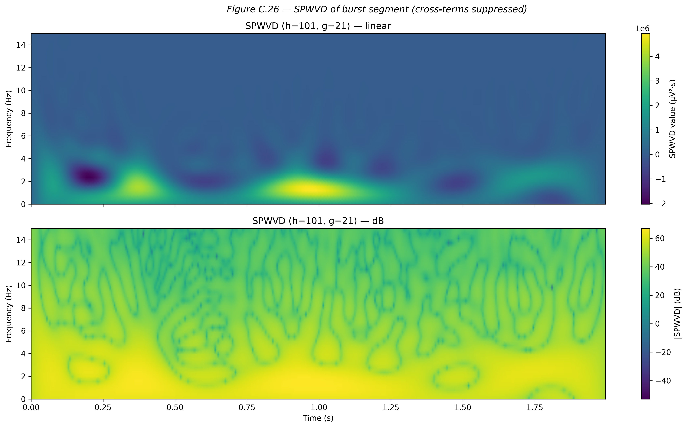

The linear panel (top) is the cleanest time-frequency view of the burst. Delta energy (0-4 Hz) concentrates in two lobes matching the two delta cycles in the time domain, with tighter temporal bounds than the STFT. The energy fades between cycles as the signal crosses zero - a feature the STFT could not resolve.

The dB panel (bottom) still shows circular/elliptical patterns. These are **residual cross-term artifacts**, not brain activity. Real EEG contains many more simultaneous components than the 2-component model signals in Lab 8, and the SPWVD's finite smoothing cannot fully suppress all pairwise interactions. The linear-scale representation is the reliable deliverable; the dB panel reveals the method's limit on real data.

### C.5.5 Three-way comparison

Figure C.27 places all three methods side by side on the same segment:

```python
# STFT (M=64, 0.32 s), WVD (raw), SPWVD (h=101, g=21)
# all computed on the same x_seg, same N_FFT=512
```


| Method | Time resolution | Frequency resolution | Cross-terms | Readable? |
| --- | --- | --- | --- | --- |
| STFT (M=64) | Blurred (~0.3 s) | Blurred (3.1 Hz) | None | Yes |
| Raw WVD | Sharp | Sharp | 49% negative values | No |
| SPWVD (h=101, g=21) | Sharper than STFT | Sharper than STFT | Suppressed (linear), residual (dB) | Yes (linear) |

The SPWVD's linear panel is the best representation: sharper burst boundaries than the STFT, without the unreadable cross-term corruption of the raw WVD.

### C.5.6 Window sweep on real EEG

Lab 8 demonstrated independent two-knob control on model signals. Does it work on real EEG?

```python
# Case 1: minimal smoothing (h=51, g=11) - sharper but more cross-terms
# Case 2: heavy smoothing (h=151, g=41) - cleaner but STFT-like blur
```

**Table C.21 - Window sweep parameters**

| Case | h (lag) | g (time) | Expected |
| --- | --- | --- | --- |
| 1 - minimal smoothing | Hann 51 (0.255 s) | Hann 11 (0.055 s) | Sharper, more residual ghosts |
| 2 - heavy smoothing | Hann 151 (0.755 s) | Hann 41 (0.205 s) | Cleaner, approaches STFT blur |

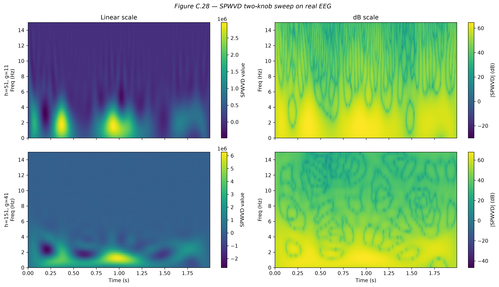

The two-knob tradeoff confirmed from Lab 8 holds on real EEG: lighter smoothing preserves more time-frequency detail but leaves visible cross-term remnants; heavier smoothing suppresses artifacts but loses the sharpness advantage over the STFT. The optimal tuning (h=101, g=21 from C.5.4) is a compromise between these extremes.

### Verification

**Table C.22 - C.5 verification**

| Tool from Volume A-B | Applied to real EEG | Result |
| --- | --- | --- |
| WVD cross-terms on multi-component signals (A.7.3, Lab 7) | Raw WVD of delta burst: 49% negative values | Confirmed - cross-term soup |
| SPWVD suppresses cross-terms (A.8.3, Lab 8) | SPWVD linear panel: clean burst localization | Confirmed - linear scale readable |
| SPWVD residual artifacts in dB (Lab 8 honest reporting) | dB panel: circular patterns above 4 Hz | Confirmed - method limit on real data |
| Two-knob independence (A.8.4, Lab 8) | Window sweep: light vs heavy smoothing | Confirmed - tradeoff holds on real EEG |
| Segment selection is the correct use of WVD on EEG (CLAUDE.md) | Strongest burst rejected (saturation), 75th pct accepted | Confirmed - data-driven selection essential |

### Conclusion

The SPWVD sharpens the delta burst timing compared to the STFT: the onset, offset, and inter-cycle energy dip are more precisely localized in the linear-scale representation. This is the payoff of the WVD family - sub-Heisenberg resolution on a selected segment.

The honest limit: on real multi-component EEG, the dB-scale representation still contains residual cross-term artifacts (circular patterns) that no amount of SPWVD smoothing can fully remove without reducing the number of signal components. In Volumes A and B we did not derive filter theory, so we cannot bandpass the signal before the WVD. Segment selection - choosing a short, clean burst with few dominant components - is the only preprocessing tool available to us, and it works well enough to produce a readable linear-scale result.

The segment selection process itself revealed a data quality issue: the strongest burst in the recording is amplifier saturation, not a physiological event. This would have corrupted any downstream analysis. Honest segment selection - trying the maximum, discovering the artifact, falling back to the 75th percentile - is not a failure of the method but a necessary part of working with real data.

## C.6 Synthesis - What We Found

This section looks back at C.1 through C.5 and answers: which tools worked on real neonatal EEG, which did not, and what would be needed to go further.

### What each tool revealed

**Table C.23 - Tool-to-finding map**

| Section | Tool (Volume A-B) | Applied to | Finding |
| --- | --- | --- | --- |
| C.1 | DFT, Welch PSD (A.2, A.4) | Full recording, all channels | Delta dominance (91.8%), whole-brain synchrony, no alpha/beta rhythms |
| C.2 | Windowed DFT, log-log PSD (A.3) | CZ, full recording | 1/f slope = -3.18; delta peaks at 0.4-0.6 Hz suggest quasi-periodic structure, not smooth decay |
| C.3 | STFT spectrogram (A.5) | CZ, full recording + 60 s zoom | Delta is discontinuous: 19% burst, 81% quiet. Burst timing resolved but frequency-blurred by Heisenberg |
| C.4 | Cross-correlation (A.6), CV test (A.4) | Auxiliary vs CZ; alpha band | CZ is clean (all auxiliary rho < 0.03). Noise model approximate (CV = 1.11 vs ideal 1.00) |
| C.5 | WVD (A.7), SPWVD (A.8) | CZ, 2.0 s burst segment | Raw WVD unusable (49% negative). SPWVD linear panel sharpens burst onset/offset beyond STFT |

### What worked

The progression DFT -> STFT -> SPWVD followed a logical chain, each tool addressing a limitation of the previous one:

1. The **DFT** (C.1-C.2) established the global spectral profile - delta-dominated, 1/f background - but could not distinguish continuous oscillation from bursty activity.
2. The **STFT** (C.3) added the time axis and resolved the burst structure, answering C.2's open question. The Heisenberg tradeoff was made explicitly for this signal.
3. The **cross-correlation** (C.4) confirmed that CZ was not contaminated by auxiliary channels, validating the channel choice before WVD analysis.
4. The **SPWVD** (C.5) sharpened the burst localization beyond what the STFT could achieve - the onset, offset, and inter-cycle energy dip were more precisely resolved in the linear-scale representation.

The **segment selection methodology** (C.5.1) worked as designed. The burst detection threshold from C.3 (2x median delta power) identified burst periods. The maximum-then-fallback approach discovered an amplifier saturation artifact that would have corrupted the analysis - and the 75th percentile fallback produced a clean, representative burst.

### What did not work

1. The **raw WVD** was unusable on real EEG (C.5.3). Even a 2-second segment with only a few dominant components produced 49% negative values and oscillating cross-terms across the entire time-frequency plane. Lab 7's single-chirp sharpness does not transfer to multi-component real signals.

2. The **SPWVD dB panel** still contained residual cross-term artifacts - circular patterns above 4 Hz that could be mistaken for physiological features (C.5.4). The linear-scale panel was clean; the dB panel was not. This means the dynamic range advantage of dB scaling - the reason we use it throughout this report - is partially compromised for the SPWVD on real data.

3. The **exponential noise model** (C.4.3) was approximate. CV = 1.11 on the alpha band, 11% above the ideal 1.00. Lab 2's model is a useful qualitative tool but not exact on real EEG.

### What would be needed to go further

The central limitation of C.5 is that the SPWVD's smoothing cannot fully suppress cross-terms without reducing the number of signal components entering the quadratic product. In signal processing, this is done by **bandpass filtering** - isolating the delta band before computing the WVD would remove theta, alpha, and broadband components, eliminating their cross-term contributions.

We did not apply filtering because Volumes A and B did not derive filter theory - no FIR design, no IIR poles/zeros, no passband/stopband specification. Using a filter without deriving it would violate the report's principle that every tool must be understood before it is applied. A future extension of this work would:

1. Derive FIR filter design (windowed-sinc method, using the windows from A.3 and Lab 3).
2. Apply a bandpass filter (0.5-4 Hz) to isolate the delta band.
3. Recompute the SPWVD on the filtered segment - expecting a much cleaner result with fewer cross-terms.

This is not a failure of the SPWVD - it is a scope boundary of this report.

### The closing claim

The progression from the DFT to the SPWVD provides increasingly detailed views of the same neonatal EEG signal: global spectral profile (DFT), time-varying burst structure (STFT), and sub-Heisenberg burst localization (SPWVD). Each tool addresses a specific limitation of the previous one, and each has limits of its own that are characterized honestly.

The SPWVD achieves what it was designed for - sharper time-frequency resolution than the STFT, with independent control over the time and frequency axes. On real multi-component EEG, its practical value is in the linear-scale representation of selected clean segments. The dB representation, which works well for the STFT and DFT, is partially compromised by residual cross-terms that no amount of smoothing can fully remove without filtering.

The neonatal EEG recording analyzed in this report is consistent with normal discontinuous neonatal activity: delta-dominated (91.8%), bursty (19% duty cycle), whole-brain synchronous, with no alpha or beta rhythms (Lamblin et al., 1999; Andre et al., 2010). No clinical diagnosis is made or implied - these are signal-processing observations on a single recording.
